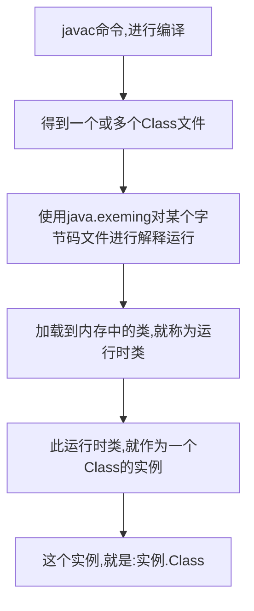

# sdcfc	weRFEWClass    类的理解

>   反射的源头

## Class类的加载过程



*   Class 的实例,就对应着 一个运行时的类
*   加载到内存中的运行时类,**会先放入缓存区,缓存一段时间**
*   此时可以通过不同的方式获取运行时类

### 程序主动使用类

>   如果没有加载到某个类当中,系统就会:
>
>   ```mermaid
>   graph LR
>   类加载 --> 类的连接 --> 类的初始化
>   	类加载 --> 将程.Class文件读取到内存,并为之创建一个Class对象,由类加载器完成
>   	类的连接 --> 将类文件合并到JRE当中
>   	类的初始化 --> JVM负责对类进行初始化
>   ```

## 获取 Class 实例的方式	

>   **不管哪种获取方式,获取到的都是同一个对象**
>
>   1.  通过 .class 属性获取
>
>   ```java
>   Class clazz = Persons.class;
>   ```
>
>   2.  通过 对象的 getClass()
>
>   ```java
>   Persons p2 = new Persons();
>   Class clazz2 = p2.getClass();
>   ```
>
>   3.  通过静态方法 Class.forName("URL");
>
>   ```java
>   Class clazz3 = Class.forName("cn.how2j._03Java高级._02反射._02Class类.Persons");
>   ```
>
>   4.  使用类加载器,getClassLoader()
>
>   ```java
>   ClassLoader classLoader = Tests.class.getClassLoader();
>   Class clazz4 = classLoader.loadClass("cn.how2j._03Java高级._02反				射._02Class类.Persons");
>   ```

## Class 结构

>   所有的实例都可以,**包括 返回值 void**
>
>   *   数组**只要是同纬度,同类型,也是同样的 .class**

