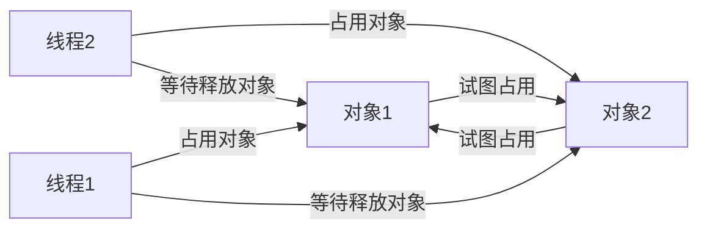

# 死锁

>   业务逻辑比较复杂的石油,可能产生死锁

## 出现死锁举例



1.  线程1持有对象1的锁,试图占用对象2
2.  线程2持有对象2的锁,试图占用对象1
3.  线程1等待线程2释放对象2
4.  线程2等待线程1释放对象1
5.  一直等待

```java
package cn.how2j._02java中级._06多线程._05死锁;

import java.util.concurrent.TimeUnit;

/**
 * 测试死锁
 *
 * @author TrueNine
 * @version 1.0
 * @time 2020/4/3
 */
public class Test {
    public static void main(String[] args) {
        String lockOne = "one";
        String lockTwo = "two";

        // 声明两条线程,互相死锁
        new Thread(() -> {
            // 锁住对象1
            synchronized (lockOne) {
                // 等待 3秒
                try {
                    System.out.println(
                            Thread.currentThread().getName()
                    + "正在占有对象1");
                    TimeUnit.SECONDS.sleep(3);
                } catch (InterruptedException e) {
                    e.printStackTrace();
                }
                // 占有对象2,在拥有对象1的同时
                synchronized (lockTwo) {
                    System.out.println("获取了对象2");
                }
            }
        },"线程1").start();

        // 开启第二条线程,占有对象2,获取对象1
        new Thread(() -> {
            // 占有对象2
            synchronized (lockTwo) {
                try {
                    System.out.println(
                            Thread.currentThread().getName()
                                    + "正在占有对象 2");
                    // 暂停 3 秒
                    TimeUnit.SECONDS.sleep(3);
                } catch (InterruptedException e) {
                    e.printStackTrace();
                }
                // 占有对象1,在拥有对象2的同时
                synchronized (lockOne) {
                    System.out.println("获得了对象1");
                }
            }
        },"线程2").start();
    }
}
```

# 练习 死锁

```text
3个同步对象a, b, c
3个线程 t1,t2,t3

故意设计场景，使这3个线程彼此死锁 
```

## 答案

```java
package cn.how2j._02java中级._06多线程._05死锁.Exercise;

import java.util.concurrent.TimeUnit;

/**
 * 练习: 死锁
 * 错误: 之前想的是,获取单把锁,环形获取
 * 但是这样锁不住,所以要一个线程,持有两把锁
 *
 * @author TrueNine
 * @version 1.0
 * @time 2020/4/3
 */
public class Lock {
    public static void main(String[] args) {
        // 创建三把锁
        String one = "";
        String two = "";
        String three = "";

        // 循环死锁
        // a 死锁,拿到 one ,获取 two
        new Thread(() -> {
            synchronized (one) {
                try {
                    TimeUnit.SECONDS.sleep(2);
                } catch (InterruptedException e) {
                    e.printStackTrace();
                }
                synchronized (two) {
                    synchronized (three) {
                        System.out.println();
                    }
                }
            }
        }).start();

        // b 死锁 拿到 two 获取 three
        new Thread(() -> {
            synchronized (two) {
                try {
                    TimeUnit.SECONDS.sleep(2);
                } catch (InterruptedException e) {
                    e.printStackTrace();
                }
                synchronized (three) {
                    synchronized (one) {
                        System.out.println();
                    }
                }
            }
        }).start();

        // c 死锁 拿到 three 获取 one
        new Thread(() -> {
            synchronized (three) {
                try {
                    TimeUnit.SECONDS.sleep(2);
                } catch (InterruptedException e) {
                    e.printStackTrace();
                }
                synchronized (one) {
                    synchronized (two) {
                        System.out.println();
                    }
                }
            }
        }).start();
    }
}
```

