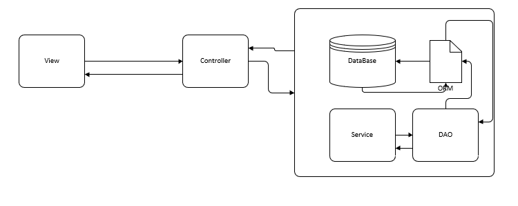

# MVC

**M**odel  **V**iew  **C**ontroller  (模型,视图,控制器)

## web阶段的MVC

*   View: 展示数据
*   Controller: 接受用户请求,交由业务逻辑
*   Model: 操作数据,提供链接,发起请求
    *   Service: 业务逻辑
    *   数据持久层: 存储数据
        *   DAO: CRUD
        *   ORM: 映射数据
        *   DateBase: 数据库