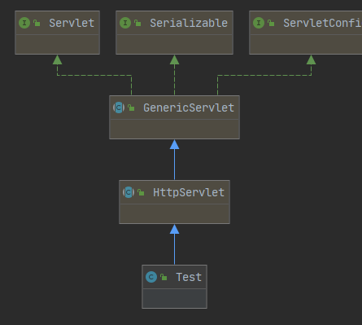
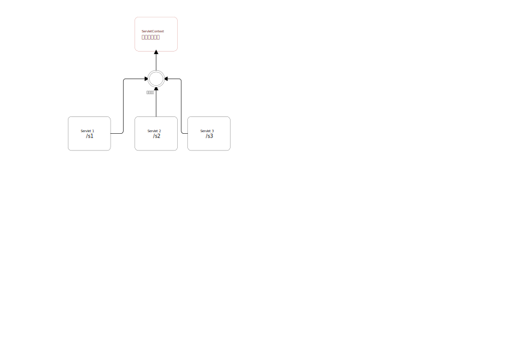

# 继承关系



# ServletContext

>   web 容器在启动的时候,它会为每个 servlet 程序创建一个对应的Servlet对象,代表当前web应用

*   共享数据
    *   在当前servlet中的数据,别的servlet可以拿到



>   经验证,所有的浏览器访问不管多少遍,都是一个上下文对象
>
>   证明这个是单例的

# 请求与转发


# Response

>   响应协议
>
>   **web服务器** 收到客户端请求,针对此请求,分别创建Request 和 Response

# URLEncoder(非必要)

>   使用此类进行UTF-8 编码,可以使得中文可以正确显示
>
>   *   调用此方法的 ```encode(String);```

# 重定向

>   让客户端去取另一个资源,浏览器地址会发生改变
>
>   *   编码为 302

## 与转发的区别

1.  转发不会改变地址,而重定向会
2.  都会进行页面跳转

# HttpServletRequest

>   代表客户端的一个请求,代表客户端访问服务器的请求,http协议,
>
>   *   与 **Response** 相对应

## 获取前端参数

```java
@Override
protected void doPost(HttpServletRequest req, HttpServletResponse resp) throws ServletException, IOException {
    // 设置编码
    req.setCharacterEncoding("UTF-8");
    resp.setCharacterEncoding("UTF-8");

    // 获取一个指定的值
    String username = req.getParameter("username");
    String password = req.getParameter("password");
    // 获取同一个参数的多个值
    String[] cs = req.getParameterValues("c");

    System.out.println("================================");
    System.out.println("username = " + username);
    System.out.println("password = " + password);
    System.out.println("Arrays.toString(cs) = " + Arrays.toString(cs));
    System.out.println("================================");

    // 设置客户端编码为UTF-8
    // 进行转发
    // 此处的 / 代表当前 web 应用
    req.getRequestDispatcher("success.jsp").forward(req, resp);
}
```

## 请求与转发的区别

1.  转发传参: ```getRequestDispatcher(String)```其参数 中的 **/** 代表当前web应用
2.  转发不会进行地址跳转
3.  编码为 307

# Cookie

>   是一种客户端技术
>
>   *   通过相应发送给客户端
>   *   通过请求拿取Cookie

## 常用的一些方法

```java
// 向响应添加 Cookie
resp.addCookie(cookie);

// 从请求获得 Cookie 数组
req.getCookies();

// 获得 Cookie 的名称
cookie.getName();

// 获得 Cookie 的值
cookie.getValue(String name);

// 设置 Cookie 的有效时间 / 秒单位
cookie.setMaxAge(int second)
```

>   一个 Cookie 只能保存一个信息
>
>   **一个 web 站点可以给浏览器发送多个 Cookie**
>
>   浏览器上线为 **300** 个 Cookie
>
>   Cookie 上限为 4KB

## 删除 Cookie

1.  不设置有效期,关闭浏览器即自动失效
2.  设置有效期为 **0**,也会立即没有,**手动删除效率比较高**

## 中文问题

>   尽量使用编码

# Session

>   服务器技术,**会话**
>
>   ```text
>   服务器会为每一个用户(浏览器)创建一个 Session对象
>   
>   一个 Session 独占一个浏览器,只要客户端没有关闭,Session 就存在
>   
>   用户登录之后,整个网站都可以访问
>   
>   主要用于保存信息
>   ```
>
>   *   可以保存用户会话信息
>   *   可以把信息和数据放进 Session

## 与 Cookie 的区别

| Cookie                        | Session                       |
| ----------------------------- | ----------------------------- |
| 数据写给用户浏览器,浏览器保存 | 写到用户独占数据中,服务器保存 |
| 可以保存多个                  | 保存重要信息,**减少浪费**     |
| 客户端保存                    | 由服务器创建                  |

## Session 常用使用场景

1.  用户登录信息
2.  购物车信息
3.  在整个网站中,经常会使用的数据

## Session 常用方法

```java
// 得到 Session
req.getSession();

// 得到指定属性
session.getAttribute(String key);

// 移出指定属性
session.remove(String name);

// 注销 Session
session.invalidate();
```

### 配置 Session 过期时间(以分钟为单位)

```xml
<!--尝试设置 Session 的 存留时间  以 分钟为单位-->
<session-config>
    <session-timeout>1</session-timeout>
</session-config>
```

# web.xml

```xml
<!-- servlet 定义 -->
<servlet>
        <servlet-name>ErrorHandler</servlet-name>
        <servlet-class>ErrorHandler</servlet-class>
</servlet>
<!-- servlet 映射 -->
<servlet-mapping>
        <servlet-name>ErrorHandler</servlet-name>
        <url-pattern>/ErrorHandler</url-pattern>
</servlet-mapping>

<!-- error-code 相关的错误页面 -->
<error-page>
    <error-code>404</error-code>
    <location>/ErrorHandler</location>
</error-page>
<error-page>
    <error-code>403</error-code>
    <location>/ErrorHandler</location>
</error-page>

<!-- exception-type 相关的错误页面 -->
<error-page>
    <exception-type>
          javax.servlet.ServletException
    </exception-type >
    <location>/ErrorHandler</location>
</error-page>
<error-page>
    <exception-type>java.io.IOException</exception-type >
    <location>/ErrorHandler</location>
</error-page>
```


# web.xml 4.0约束

```xml
<?xml version="1.0" encoding="UTF-8"?>
<web-app xmlns="http://xmlns.jcp.org/xml/ns/javaee"
         xmlns:xsi="http://www.w3.org/2001/XMLSchema-instance"
         xsi:schemaLocation="http://xmlns.jcp.org/xml/ns/javaee
          http://xmlns.jcp.org/xml/ns/javaee/web-app_4_0.xsd"
         version="4.0">
</web-app>
```

