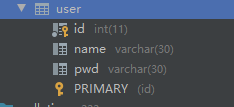
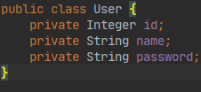
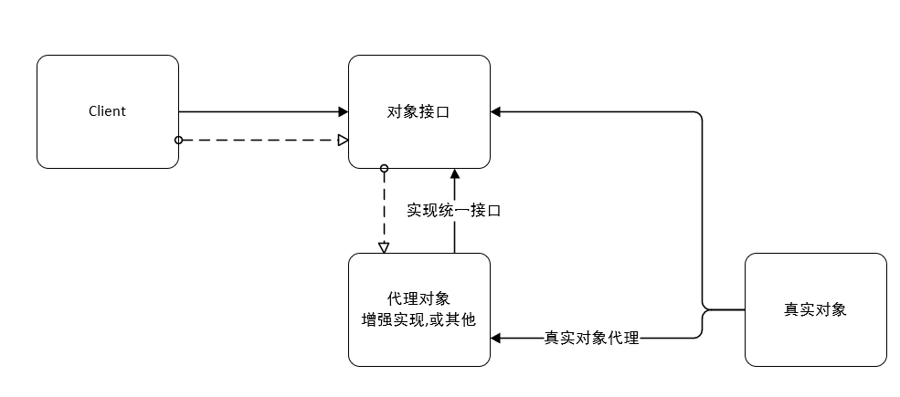
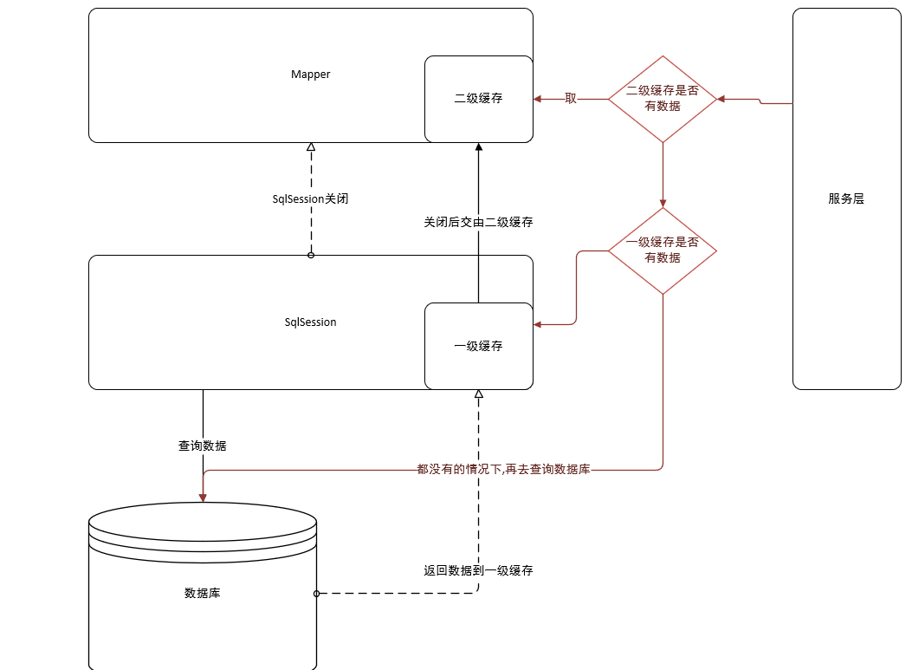

# 1 概述以及框架搭建

>   Mybatis 是一个优秀的持久层框架

## 框架环境搭建流程

>   *   配置和库个 mybatis 数据库
>
>   *   在库内创建一张 user 表
>
>   ```mysql
>   CREATE TABLE `user` (
>   	`id` INT NOT NULL PRIMARY KEY,
>   	`name` VARCHAR(30) DEFAULT NULL,
>   	`pwd` VARCHAR(30) DEFAULT NULL
>   )ENGINE=INNODB DEFAULT CHARSET=utf8;
>   ```
>
>   *   插入一些数据
>
>   >   inser into ....
>
>   *   编写 Mybatis 配置文件
>
>   ```xml
>   <?xml version="1.0" encoding="UTF-8" ?>
>   <!DOCTYPE configuration
>           PUBLIC "-//mybatis.org//DTD Config 3.0/EN"
>           "http://mybatis.org/dtd/mybatis-3-config.dtd">
>   <!--核心配置文件-->
>   <configuration>
>       <!--环境 default默认环境-->
>       <environments default="development">
>           <!--开发用环境-->
>           <environment id="development">
>               <!--事务管理 类型是 JDBC-->
>               <transactionManager type="JDBC"/>
>               <!---->
>               <dataSource type="POOLED">
>                   <!--连接数据库需要的属性-->
>                   <property name="driver" value="com.mysql.jdbc.Driver"/>
>                   <property name="url"
>                             value="jdbc:mysql://localhost:3306/mybatis?useSSL=false&amp;useUnicode=true&amp;characterEncoding=utf8"/>
>                   <property name="username" value="root"/>
>                   <property name="password" value="root"/>
>   
>               </dataSource>
>           </environment>
>       </environments>
>       <!--绑定Mapper-->
>       <mappers>
>           <!--使用源文件路径绑定-->
>           <mapper resource="mapper/UserMapper.xml"/>
>       </mappers>
>   </configuration>
>   ```
>
>   
>
>   *   编写 Mybatis 工具类,配置 Mapper映射
>
>   ```java
>   package com.TrueNine.dao.utils;
>   
>   import org.apache.ibatis.io.Resources;
>   import org.apache.ibatis.session.SqlSession;
>   import org.apache.ibatis.session.SqlSessionFactory;
>   import org.apache.ibatis.session.SqlSessionFactoryBuilder;
>   
>   import java.io.IOException;
>   import java.io.InputStream;
>   
>   /**
>    * mybatis的工具类
>    *
>    * @author TrueNine
>    * @version 1.0
>    * @date 2020/6/18
>    */
>   public class MybatisUtils {
>   
>       private static SqlSessionFactory sqlSessionFactory;
>   
>       /*
>       使用 mybatis 获取 SqlSessionFactory对象
>        */
>       static {
>           try {
>               String resource = "mybatis-config.xml";
>               InputStream is = Resources.getResourceAsStream(resource);
>               sqlSessionFactory = new SqlSessionFactoryBuilder().build(is);
>           } catch (IOException e) {
>               e.printStackTrace();
>           }
>       }
>   
>       /**
>        * 用于获取 Mybatis 的 SqlSession对象
>        * 通过 SqlSessionFactory.openSession();
>        *
>        * @return SqlSession 接口对象
>        */
>       public static SqlSession getSqlSession() {
>           return sqlSessionFactory.openSession();
>       }
>   }
>   
>   ```
>
>   *   编写代码
>
>       *   实体类
>       *   DAO(Mapper)接口
>       *   **接口实现类由DAOImpl转换为 Mapper.xml 配置文件**
>
>       ```xml
>       <?xml version="1.0" encoding="UTF-8" ?>
>       <!DOCTYPE mapper
>               PUBLIC "-//mybatis.org/DTD Mapper 3.0//EN"
>               "http://mybatis.org/dtd/mybatis-3-mapper.dtd">
>       <!-- namespace 绑定一个对应的命名空间/ DAO/Mapper接口-->
>       <mapper namespace="com.TrueNine.dao.UserDAO">
>           <!--查询语句 id 为实现方法,resultType 为结果对象类型 -->
>           <select id="getUserList" resultType="com.TrueNine.pojo.User">
>               select * from `user`;
>           </select>
>       </mapper>
>       ```
>
>       *   编写测试类
>
>       ```java
>       package com.TrueNine.dao;
>       
>       import com.TrueNine.dao.utils.MybatisUtils;
>       import com.TrueNine.pojo.User;
>       import org.apache.ibatis.session.SqlSession;
>       import org.junit.Test;
>       
>       import java.util.List;
>       
>       /**
>        * 用于测试连接
>        *
>        * @author TrueNine
>        * @version 1.0
>        * @date 2020/6/18
>        */
>       public class UserDAOTest {
>           @Test
>           public void test() {
>               // 使用 try with resource 确保关闭,SqlSession 继承 了 Closable
>               try (SqlSession sqlSession = MybatisUtils.getSqlSession()) {
>                   // 获取SqlSession 对象
>       
>                   // 方式1
>                   UserDAO mapper = sqlSession.getMapper(UserDAO.class);
>                   List<User> userList = mapper.getUserList();
>                   for (User user : userList) {
>                       System.out.println(user);
>                   }
>       
>                   // 方式2,不推荐的方式
>                   /*
>                   可读性差,不好维护
>                    */
>                   List<User> objects = sqlSession.selectList("com.TrueNine.dao.UserDAO.getUserList");
>                   for (User object : objects) {
>                       System.out.println(object);
>                   }
>               }
>           }
>       }
>       ```
>
>       

### 异常

>   每个 Mybatis Mapper 都需要在 mybatis-config.xml 进行注册

```java
org.apache.ibatis.binding.BindingException: Type interface com.TrueNine.dao.UserDAO is not known to the MapperRegistry.
```

### Maven 设置编译携带文件	

```xml
<build>
    <resources>
        <resource>
            <directory>src/main/resources</directory>
            <includes>
                <include>**/*.properties</include>
                <include>**/*.xml</include>
            </includes>
            <filtering>true</filtering>
        </resource>
        <resource>
            <directory>src/main/java</directory>
            <includes>
                <include>**/*.properties</include>
                <include>**/*.xml</include>
            </includes>
            <filtering>true</filtering>
        </resource>
    </resources>
</build>
```

## 注意

>   每次查询完,都必须进行关闭操作

# 2 CRUD

*   namespace: 命名空间,和包名类名一致

## select

*   id  namespace 中的方法名
*   resultType  SQL 执行的返回ORM映射对象,返回值
*   parameterType  参数类型

## update

>注意事务的提交操作,SqlSession 也提供了如同 Connection 般的commit
>
>所以进行完操作,**一定进行 commit 提交??**,**同时也提供了 rollback 回滚操作**

## 常见问题总结

1.  resource 绑定 mapper 需要路径绑定,(以 / 分隔)
2.  配置文件优于乱码导致的各种问题,(尽量统一编码)

# 3 map设置结果集

假设实体类字段过多,可以使用 Map 的方式进行设置字段

```java
try (SqlSession sqlSession = MybatisUtils.getSqlSession()) {
    UserMapper mapper = sqlSession.getMapper(UserMapper.class);
    // 构造一个map
    Map<String, Object> map = new HashMap<>();
    map.putIfAbsent("userId", 8);
    map.putIfAbsent("userName", "老八");
    map.putIfAbsent("userPwd", "12345");

    int i = mapper.addUserByMapTwo(map);

    sqlSession.commit();
    System.out.println("i = " + i);

    List<User> userList = mapper.getUserList();
    for (User user : userList) {
        System.out.println("user = " + user);
    }
}
```

Map 传递参数,直接在SQL中取 key 即可 ```parameterType="map"```

对象传递参数,直接在SQL中取对象的属性  ```parameterType="Object"```

只有一个基本类型参数的情况下,可以直接在SQL中取到   ```可以不写```

**多个参数,使用Map,或者注解**

# 4 模糊查询的SQL注入风险

>   在模糊查询中,需出现 **%** 字样以达到拼接模糊查询的效果
>
>   假设出现了如下语句,是极度危险的
>
>   ```xml
>   <!--测试模糊查询-->
>   <!--存在SQL注入风险的SQL-->
>   <!--单独的参数可以不填写参数类型???-->
>   <select id="getUserLike" resultType="com.TrueNine.pojo.User">
>       select *
>       from mybatis.`user`
>       where `name` like "%"#{value}"%";
>   </select>
>   ```
>
>   目前的解决方式是:  **直接在代码层面写死**
>
>   不仅仅是此处SQL注入

# 5 Mybatis 配置解析

MyBatis 的配置文件包含了会深深影响 MyBatis 行为的设置和属性信息。 配置文档的顶层结构如下：

```markdown
configuration（配置）
*   [properties（属性）](https://mybatis.org/mybatis-3/zh/configuration.html#properties)
*   [settings（设置）](https://mybatis.org/mybatis-3/zh/configuration.html#settings)
*   [typeAliases（类型别名）](https://mybatis.org/mybatis-3/zh/configuration.html#typeAliases)
*   [typeHandlers（类型处理器）](https://mybatis.org/mybatis-3/zh/configuration.html#typeHandlers)
*   [objectFactory（对象工厂）](https://mybatis.org/mybatis-3/zh/configuration.html#objectFactory)
*   [plugins（插件）](https://mybatis.org/mybatis-3/zh/configuration.html#plugins)
*   environments（环境配置）
*   environment（环境变量）
*   transactionManager（事务管理器）
*   dataSource（数据源）
*   [databaseIdProvider（数据库厂商标识）](https://mybatis.org/mybatis-3/zh/configuration.html#databaseIdProvider)
*   [mappers（映射器）](https://mybatis.org/mybatis-3/zh/configuration.html#mappers)
```

## environments 环境配置

>   *   mybatis 可以使用 **default** 切换多套环境,但 **同时只能存在一套环境**
>   *   Mybatis 默认事务管理 **(transactionManager)** 是**JDBC**,还有一种 MANAGED
>   *   dataSource:  为连接数据库的信息:
>       *   type  连接实现

## properties 属性

可以通过 properties 实现引用配置文件,**如果存在配置文件,优先使用配置文件**

1.  编写 properties 配置文件

```properties
driver=com.mysql.jdbc.Driver
url=jdbc:mysql://localhost:3306/mybatis?useSSL=false&useUnicode=true&characterEncoding=utf8
username=root
password=root
```

2.  在核心配置文件中引入 **文件层级按照 / 分隔**

```xml
<properties resource="db.properties"/>
```

3.  通过 property 在 dataSource 中引入

```xml
<dataSource type="POOLED">
    <property name="driver" value="${driver}"/>
    <property name="url" value="${url}"/>
    <property name="username" value="${username}"/>
    <property name="password" value="${password}"/>
</dataSource>
```

# 6 类型别名

>   用以减少完全类名的冗余
>
>   举例说明: 在如下的 配置中 parameterType 使用了冗长的完全类名
>
>   可以使用别名来解决这种问题
>
>   ```xml
>   <insert id="addUser" parameterType="cn.TrueNine.pojo.User">
>       insert into mybatis.`user`(`id`, `name`, `pwd`)
>       values (#{id}, #{name}, #{pwd});
>   </insert>
>   ```

## typeAliases

>   在核心配置文件的 configuration 下声明别名
>
>   ```xml
>   <!--为Java完全类名书写的别名-->
>   <typeAliases>
>      <typeAlias type="cn.TrueNine.pojo.User" alias="User"/>
>   </typeAliases>
>   ```
>
>   如此即可使用别名
>
>   ```xml
>   <insert id="addUser" parameterType="user">
>      insert into mybatis.`user`(`id`, `name`, `pwd`)
>      values (#{id}, #{name}, #{pwd});
>   </insert>
>   ```
>
>   **也可以扫描指定包名**,Mybatis会在指定的包下扫描需要的 javaBean
>
>   >   默认别名为这个包下的实体类的类名,**别名建议以小写开头**
>
>   如果存在注解 ```@Alias("value")``` 则以注解名为准
>
>   >   一个包下实体类少,则使用typeAlias,可以自定义名称
>   >
>   >   一个包下实体类较多,则使用 package,不能自定义名称,**非要自定义可以使用注解**

## 内置简写别名

>   一些内置的简写别名,一些基本的类型如 int,byte,double......
>
>   举例说明:
>
>   _int = int,int = Integer
>
>   其他的一些基本类型还包括:
>
>   String,map,hashmap,collection,list,compilertor

下面是一些为常见的 Java 类型内建的类型别名。它们都是不区分大小写的，注意，为了应对原始类型的命名重复，采取了特殊的命名风格。

| 别名       | 映射的类型 |
| :--------- | :--------- |
| _byte      | byte       |
| _long      | long       |
| _short     | short      |
| _int       | int        |
| _integer   | int        |
| _double    | double     |
| _float     | float      |
| _boolean   | boolean    |
| string     | String     |
| byte       | Byte       |
| long       | Long       |
| short      | Short      |
| int        | Integer    |
| integer    | Integer    |
| double     | Double     |
| float      | Float      |
| boolean    | Boolean    |
| date       | Date       |
| decimal    | BigDecimal |
| bigdecimal | BigDecimal |
| object     | Object     |
| map        | Map        |
| hashmap    | HashMap    |
| list       | List       |
| arraylist  | ArrayList  |
| collection | Collection |
| iterator   | Iterator   |

# 7 声明周期和作用域

>   至关重要???,**错误使用会导致严重的并发问题**

## SqlSessionFactoryBuilder

*   一旦创建了 SqlSession ,就不再需要
    *   局部变量

## SqlSessionFactory

*   类似于数据库连接池,==一旦创建就一直存在,不需要再去创建另一个实例,或者丢弃本实例==,建议使用单例模式提供
    *   全局作用域

## SqlSession

*   连接到 "连接池??" 的一个请求,请求完成需要关闭请求,**不是线程安全的,不能被共享**
    *   局部作用域

# 8 ResultMap

>   解决属性名,和字段名不一致的问题
>
>   **数据库**
>
>   
>
>   **Java类**
>
>   

## 解决方式 1

>   如同 JDBC 时期一样地,为每个查询出来的字段取别名
>
>   ==但这样似乎有些侮辱 Mybatis 的意思==
>
>   

## 解决方式 2 ResultMap

>   结果集映射
>
>   ```xml
>   <mapper namespace="cn.TrueNine.mapper.UserMapper">
>   
>       <!--结果集映射-->
>       <resultMap id="UserMap" type="cn.TrueNine.pojo.User">
>           <result column="id" property="id"/>
>           <result column="name" property="name"/>
>           <!--在此处进行修改-->
>           <result column="pwd" property="password"/>
>       </resultMap>
>   
>       <!--此处则使用 resultMap-->   
>       <select id="getUserOneLine" resultMap="UserMap">
>           select *
>           from mybatis.`user`
>           where id = #{id};
>       </select>
>   </mapper>
>   ```
>
>   **以上不需要转义的字段,==可以不显式声明==**

# 9 日志

## 日志工厂

>   如果一个数据库操作出现了异常,需要排查错误,==日志可能可以帮到些什么==
>
>   **曾经的方式:**  sout输出,但==无法输出Mybatis的SQL==
>
>   **日志工厂实现**
>
>   Mybatis 通过使用内置的日志工厂提供日志功能。内置日志工厂将会把日志工作委托给下面的实现之一：
>
>   *   ​          SLF4J        
>   *   ​          Apache Commons Logging        
>   *   ​          Log4j 2        
>   *   ​          ==Log4j==
>   *   ​          JDK logging       
>   *   ​         COMMONS_LOGGING 
>   *   ​         ==STDOUT_LOGGING==
>   *   ​        NO_LOGGING  "没有日志"

在 Mybatis 中,具体使用哪个日志,由设置/配置决定

## 使用默认日志

1.  在核心配置文件引入日志,使用自带的 ==STDOUT_LOGGING==

```xml
<!--配置设置文件-->
<settings>
    <setting name="logImpl" value="STDOUT_LOGGING"/>
</settings>
```

### 日志信息

```ini
# 打开 JDBC 连接
Opening JDBC Connection
# 创建 JDBC 连接
Created connection 1392906938.
# 设置 自动提交关闭 的 JDBC 连接  MySQL的 JDBC 对象
Setting autocommit to false on JDBC Connection [com.mysql.jdbc.JDBC4Connection@530612ba]
# 预编译的SQL
==>  Preparing: select * from mybatis.`user` where id = ?;
# 参数  值(类型)
==> Parameters: 1(Integer)
# SQL列名称?
<==    Columns: id, name, pwd
# 返回的行
<==        Row: 1, 老八, 1233
<==      Total: 1
# 设置 自动提交开 的 JDBCC连接 MySQL对象
Resetting autocommit to true on JDBC Connection [com.mysql.jdbc.JDBC4Connection@530612ba]
# 关闭 JDBC 连接 MYSQL对象
Closing JDBC Connection [com.mysql.jdbc.JDBC4Connection@530612ba]
# 交还入连接池
Returned connection 1392906938 to pool.
```

## Log4j

```text
Log4j是Apache的一个开源项目，通过使用Log4j，我们可以控制日志信息输送的目的地是控制台、文件、GUI组件，甚至是套接口服务器、NT的事件记录器、UNIX Syslog守护进程等；我们也可以控制每一条日志的输出格式；通过定义每一条日志信息的级别，我们能够更加细致地控制日志的生成过程。最令人感兴趣的就是，这些可以通过一个配置文件来灵活地进行配置，而不需要修改应用的代码。
```

1.  引入log4j,将 核心配置文件的日志输出==替换为LOG4J==

```xml
<setting name="logImpl" value="LOG4J"/>
```


1.  书写配置文件 log4j.properties(==名称必须一致,放置于类路径的根路径==)

```properties
### 配置根 ###
log4j.rootLogger=debug,console ,fileAppender
# ,dailyRollingFile,ROLLING_FILE,MAIL,DATABASE
### 设置输出sql的级别，其中logger后面的内容全部为jar包中所包含的包名 ###
log4j.logger.org.apache=debug
log4j.logger.java.sql.Connection=debug
log4j.logger.java.sql.Statement=debug
log4j.logger.java.sql.PreparedStatement=debug
log4j.logger.java.sql.ResultSet=debug
### 配置输出到控制台 ###
log4j.appender.console=org.apache.log4j.ConsoleAppender
log4j.appender.console.Target=System.out
log4j.appender.console.layout=org.apache.log4j.PatternLayout
log4j.appender.console.layout.ConversionPattern=[%p]:---:[%c]:---: %m :---:[%d]===[%t]===[%l]%n
### 配置输出到文件 ###
log4j.appender.fileAppender=org.apache.log4j.FileAppender
log4j.appender.fileAppender.File=logs/fileLog.log
log4j.appender.fileAppender.Append=true
log4j.appender.fileAppender.Threshold=DEBUG
log4j.appender.fileAppender.layout=org.apache.log4j.PatternLayout
log4j.appender.fileAppender.layout.ConversionPattern=[%p]:---:[%c]:---: %m :---:[%d]===[%t]===[%l]%n
### 配置输出到文件，并且每天都创建一个文件 ###
log4j.appender.dailyRollingFile=org.apache.log4j.DailyRollingFileAppender
log4j.appender.dailyRollingFile.File=logs/daysFileLog.log
log4j.appender.dailyRollingFile.Append=true
log4j.appender.dailyRollingFile.Threshold=DEBUG
log4j.appender.dailyRollingFile.layout=org.apache.log4j.PatternLayout
log4j.appender.dailyRollingFile.layout.ConversionPattern=[%p]:---:[%c]:---: %m :---:[%d]===[%t]===[%l]%n
### 配置输出到文件，且大小到达指定尺寸的时候产生一个新的文件 ###
log4j.appender.ROLLING_FILE=org.apache.log4j.RollingFileAppender
log4j.appender.ROLLING_FILE.Threshold=ERROR
log4j.appender.ROLLING_FILE.File=addFileLog.log
log4j.appender.ROLLING_FILE.Append=true
log4j.appender.ROLLING_FILE.MaxFileSize=10KB
log4j.appender.ROLLING_FILE.MaxBackupIndex=1
log4j.appender.ROLLING_FILE.layout=org.apache.log4j.PatternLayout
log4j.appender.ROLLING_FILE.layout.ConversionPattern=[framework] [%p]:---:[%c]:---: %m :---:[%d]===[%t]===[%l]%n
#### 配置输出到邮件 ###
#log4j.appender.MAIL=org.apache.log4j.net.SMTPAppender
#log4j.appender.MAIL.Threshold=FATAL
#log4j.appender.MAIL.BufferSize=10
#log4j.appender.MAIL.From=chenyl@yeqiangwei.com
#log4j.appender.MAIL.SMTPHost=mail.hollycrm.com
#log4j.appender.MAIL.Subject=Log4J Message
#log4j.appender.MAIL.To=chenyl@yeqiangwei.com
#log4j.appender.MAIL.layout=org.apache.log4j.PatternLayout
#log4j.appender.MAIL.layout.ConversionPattern=[framework] %d - %c -%-4r [%t] %-5p %c %x - %m%n
#### 配置输出到数据库 ###
#log4j.appender.DATABASE=org.apache.log4j.jdbc.JDBCAppender
#log4j.appender.DATABASE.URL=jdbc:mysql://localhost:3306/test
#log4j.appender.DATABASE.driver=com.mysql.jdbc.Driver
#log4j.appender.DATABASE.user=root
#log4j.appender.DATABASE.password=
#log4j.appender.DATABASE.sql=INSERT INTO LOG4J (Message) VALUES ('[framework] %d - %c -%-4r [%t] %-5p %c %x - %m%n')
#log4j.appender.DATABASE.layout=org.apache.log4j.PatternLayout
#log4j.appender.DATABASE.layout.ConversionPattern=[framework] %d - %c -%-4r [%t] %-5p %c %x - %m%n
#log4j.appender.A1=org.apache.log4j.DailyRollingFileAppender
#log4j.appender.A1.File=SampleMessages.log4j
#log4j.appender.A1.DatePattern=yyyyMMdd-HH'.log4j'
#log4j.appender.A1.layout=org.apache.log4j.xml.XMLLayout
```

## log4j使用

1.  生成一个全局私有常量以便使用

```java
private static final Logger logger = Logger.getLogger(TestMapper.class);
```

2.  随后就可以在方法的任意位置进行输出

```java
logger.info("普通消息");
logger.debug("调试");
logger.error("错误");
logger.warn("警告");
logger.trace("测试跟踪信息");
```

# 10 分页

>   limit... 分页可以减少数据的处理量,进而提升效率

## 使用数据库进行分页

```sql
SELECT *
FROM mybatis.`user`
ORDER BY `id` DESC
LIMIT 2,2;
```

>   上语句 从 2 开始,每页显示 2个
>
>   **如果只有一个值,则代表,==从 0到n==**

## 使用 Mybatis 实现分页

1.  接口

```java
List<User> getUserByLimit(Map<String, Integer> map);
```


1.  Mapper.xml

```xml
<!--测试分页查询-->
<select id="getUserByLimit" parameterType="map" resultMap="UserMap">
    select *
    from mybatis.`user`
    order by `id` desc
    limit #{startIndex},#{pageSize};
</select>
```


1.  测试

```java
/**
     * 测试分页查询
     * 测试通过
     */
@Test
public void test3() {
    try (SqlSession sqlSession = MybatisUtils.getSqlSession()) {
        UserMapper mapper = sqlSession.getMapper(UserMapper.class);
        Map<String, Integer> map = new HashMap<>();
        map.put("startIndex", 0);
        map.put("pageSize", 2);
        List<User> userByLimit = mapper.getUserByLimit(map);
        for (User user : userByLimit) {
            logger.info(user);
        }
    }
}
```

## RowBounds分页

>   不推荐使用此方式,并非在SQL层面实现分页

## 分页插件

>   可能底层还是 limit???

# 11 使用注解开发

1.  注解在接口上实现

```java
public interface UserMapper {
    @Select("select * from mybatis.`user`;")
    List<User> getUserList();
}
```

2.  在核心配置文件中绑定接口

```xml
<!--配置文件绑定接口-->
<mappers>
    <mapper class="cn.TrueNine.mapper.UserMapper"/>
</mappers>
```

3.  测试

```java
try (SqlSession sqlSession = MybatisUtils.getSqlSession()) {
    UserMapper mapper = sqlSession.getMapper(UserMapper.class);
    List<User> userList = mapper.getUserList();
    for (User user : userList) {
        logger.info(user);
    }
}
```

>   本质是反射机制的实现,==底层使用动态代理==,



## CRUD

>   可以实现在工具类创建时,自动提交事务
>
>   ```java
>   private static final SqlSession sqlSession;
>   
>   static {
>       String resourcePath = "mybatis-config.xml";
>       InputStream is = ClassLoader.getSystemResourceAsStream(resourcePath);
>       System.out.println(is);
>       SqlSessionFactory build = new SqlSessionFactoryBuilder().build(is);
>       // 使得自动提交事务
>       sqlSession = build.openSession(true);
>   }
>   ```

使用注解实现

```java
/**
     * 方法存在多个参数,必须加上 @Param 参数名
     *
     * @param id   id
     * @param name name
     * @return 映射对象
     */
@Select("select * from mybatis.`user` where id = #{id} and name = #{name};")
User getUserById(@Param("id") Integer id, @Param("name") String name);
```

## 关于 @Param() 注解

>   基本类型的参数,如: (String,Integer)需要加上注解,==引用类型不需要==
>
>   如果只有一个基本类型,可以忽略,但是建议还是加上
>
>   在SQL 中引用的,就是 注解中设定的参数

## #{} 与 ${} 的区别

*   #{} 是预编译的,能最大程度防止SQL注入
*   ${} 会直接进行拼接

# 12 Mybatis简单执行流程

>   对Mybatis作点单的执行流程描述

1.  Resources 读取全局配置文件
2.  实例化 SqlSessionFactoryBuilder
3.  解析文件流XML ConfigBuilder
    1.  返回所有的 Configuration 配置信息
4.  实例化 SqlSessionFactory
5.  transaactional 事务管理器
6.  ==创建 executor 执行器==
7.  创建 SqlSession
    1.  实现 CRUD
        1.  回滚或提交事务
    2.  提交事务
    3.  关闭

# 13 lombok

```xml
@Getter and @Setter
@FieldNameConstants
@ToString
@EqualsAndHashCode
@AllArgsConstructor, @RequiredArgsConstructor and @NoArgsConstructor
@Log, @Log4j, @Log4j2, @Slf4j, @XSlf4j, @CommonsLog, @JBossLog, @Flogger, @CustomLog
@Data
@Builder
@SuperBuilder
@Singular
@Delegate
@Value
@Accessors
@Wither
@With
@SneakyThrows
@val
@var
experimental @var
@UtilityClass
Lombok config system
Code inspections
Refactoring actions (lombok and delombok)
```

# 14 一对多和多对一

## 环境搭建

1.  搭建SQL

```sql
USE mybatis;

CREATE TABLE `teacher`
(
    `id`   INT(10) NOT NULL,
    `name` VARCHAR(30) DEFAULT NULL,
    PRIMARY KEY (`id`)
) ENGINE = INNODB
  DEFAULT CHARSET = utf8;

CREATE TABLE `student`
(
    `id`   INT(10) NOT NULL,
    `namw` VARCHAR(30) DEFAULT NULL,
    `tid`  INT(10)     DEFAULT NULL,
    PRIMARY KEY (`id`),
    KEY `fktid` (`tid`),
    CONSTRAINT `fktid` FOREIGN KEY (`tid`) REFERENCES `teacher` (`id`)
) ENGINE = INNODB
  DEFAULT CHARSET = utf8;

INSERT INTO mybatis.`teacher` (`id`, `name`)
VALUES (1, '张三');

INSERT INTO mybatis.`student` (id, namw, tid)
VALUES (1, '小明', 1);
INSERT INTO mybatis.`student` (id, namw, tid)
VALUES (2, '小李', 1);
INSERT INTO mybatis.`student` (id, namw, tid)
VALUES (3, '小红', 1);
INSERT INTO mybatis.`student` (id, namw, tid)
VALUES (4, '小张', 1);
INSERT INTO mybatis.`student` (id, namw, tid)
VALUES (5, '小王', 1);
```

## 多对一处理

### 按照查询嵌套处理

```xml
<!--尝试配置多对一Map映射-->
<resultMap id="StudentTeacher" type="student">
    <result column="id" property="id"/>
    <result column="name" property="name"/>
    <!--映射对象查询,进行嵌套处理-->
    <!--
        property 映射对象属性名
        column 数据库列字段名
        javaType 映射的对象类型
        select 另一个查询语句
        -->
    <association property="teacher" column="tid" javaType="cn.TrueNine.pojo.Teacher" select="getTeacher"/>
</resultMap>
<select id="getStudent" resultMap="StudentTeacher">
```
```sql
SELECT *
FROM mybatis.`student`;
```

```xml
</select>
<select id="getTeacher" resultType="teacher">
```
```sql
    SELECT *
    FROM mybatis.`teacher`
    WHERE id = #{id};
```
```xml
</select>
```

### 按照结果嵌套处理

```xml
<!--按照结果嵌套处理-->
<resultMap id="StudentTeacher2" type="student">
    <result column="id" property="id"/>
    <result column="name" property="name"/>
    <!--此处的 javaType 可以使用别名-->
    <!--
        column 数据库列字段
        property 映射对象属性名
        javaType 映射对象
            映射对象嵌套结果
        -->
    <association column="tname" property="teacher" javaType="teacher">
        <result column="tid" property="id"/>
        <result column="tname" property="name"/>
    </association>
</resultMap>
<!--SQL语句-->
<select id="getStudent2" resultMap="StudentTeacher2">
```

```sql
    SELECT s.`id`   AS `id`,
        s.`name` AS `name`,
        t.`id`   AS `tid`,
        t.`name` AS `tname`
        FROM mybatis.`student` AS s,
        mybatis.`teacher` AS t
        WHERE s.`tid` = t.`id`;
```

```xml
</select>
```

## 一对多处理

### 按结果嵌套处理

```xml
<resultMap id="teacherStudent" type="teacher">
    <result column="tid" property="id"/>
    <result column="tname" property="name"/>
    <!--集合中的泛型,使用 ofType 获取-->
    <collection property="students" ofType="student">
        <result column="sid" property="id"/>
        <result column="sname" property="name"/>
        <result column="stid" property="tid"/>
    </collection>
</resultMap>
<select id="getTeacherAndStudent" resultMap="teacherStudent">
```

```sql
SELECT t.`id`   AS `tid`,
    t.`name` AS `tname`,
    s.`id`   AS `sid`,
    s.`name` AS `sname`,
    s.`tid`  AS `stid`
    FROM mybatis.`student` AS `s`,
    mybatis.`teacher` AS `t`
    WHERE t.`id` = s.`tid`;
```

```xml
</select>
```

### 按查询嵌套处理

```xml
<resultMap id="teacherStudent2" type="teacher">
    <!--相同部分省略...-->
    <collection column="id" property="students" javaType="list" ofType="student" select="getStudentById"/>
</resultMap>
<select id="getTeacherAndStudent2" resultMap="teacherStudent2">
    SELECT *
    FROM mybatis.`teacher`
    WHERE `teacher`.`id` = #{tid};
</select>
<select id="getStudentById" resultType="student">
    SELECT *
    FROM mybatis.`student`
    WHERE `tid` = #{tid};
</select>
```

## 总结

*   关联 ==association==  处理多对一
*   集合 ==collection== 处理一对多
*   javaType & ofType
    *   javaType  实体类中的属性
    *   ofType 映射到 list 或 map 中的泛型类型

 ## 建议

尽量使用 ==能走索引,能优化SQL的方式==

# 15 动态SQL

>   根据不同的条件生成不同的脚尖语句

## 环境构建

### SQL

```sql
USE mybatis;

CREATE TABLE `blog`
(
    `id`          VARCHAR(50)  NOT NULL COMMENT '博客id',
    `title`       VARCHAR(100) NOT NULL COMMENT '博客标题',
    `author`      VARCHAR(30)  NOT NULL COMMENT '博客作者',
    `create_time` DATETIME     NOT NULL COMMENT '创建时间',
    `views`       INT(30)      NOT NULL COMMENT '浏览量'
) ENGINE = INNODB
  DEFAULT CHARSET = utf8;

-- 可以不添加
  ALTER TABLE mybatis.`blog`
    ADD PRIMARY KEY (`id`);

  ALTER TABLE mybatis.blog
    MODIFY COLUMN `id` INT(30);

--貌似好像不需要主键和 int
ALTER TABLE mybatis.`blog`
	MODIFY COLUMN `id` VARCHAR(50);

ALTER TABLE mybatis.`blog`
    DROP PRIMARY KEY;
```

### 编写获取随机ID工具类

```java
public static String getUUID() {
    return UUID.randomUUID().toString().replaceAll("-", "");
}
```

## 常用标签

### if

>   在SQL中写条件判断,注意处理其中的==特殊符号==

```xml
<!--进行动态SQL 测试-->
<select id="queryBlogIf" parameterType="map" resultType="blog">
    SELECT *
    FROM mybatis.`blog`
    WHERE TRUE
    <if test="(title != null) &amp;&amp; !(&quot;&quot;.equals(title))">
        AND title = #{title}
    </if>
    <if test="(author != null) &amp;&amp; !(&quot;&quot;.equals(author))">
        AND author = #{author}
    </if>
    ORDER BY mybatis.`blog`.id DESC;
</select>
```

### choose (when,otherwise)

>   类似于Java中的 switch case default
>
>   **一个条件成立,==其他条件就会略过,同时只会成立一个条件==**
>
>   ```xml
>   <select id="queryBlogChoose" parameterType="map" resultType="blog">
>       SELECT *
>       FROM mybatis.`blog`
>       <where>
>           <choose>
>               <when test="title != null and &quot;&quot;.equals(title)">
>                   `title` = #{title}
>               </when>
>               <when test="author != null and &quot;&quot;.equals(author)">
>                   AND `author` = #{author}
>               </when>
>               <otherwise>
>                   AND `views` = #{views}
>               </otherwise>
>           </choose>
>       </where>
>       ORDER BY `id` DESC;
>   </select>
>   ```
>
>   

### trim(where,set)

#### trim

>   可以百度一波,用以覆盖前缀后缀

#### where

>   只会在至少有一个子元素返回SQL时,才进行 拼接 where,==如果开头为 AND 或者 OR...,会将其抹除==
>
>   **上 if 改造如下**
>
>   ```xml
>   <select id="queryBlogIf" parameterType="map" resultType="blog">
>       SELECT *
>       FROM mybatis.`blog`
>       <where>
>           <if test="(title != null) &amp;&amp; !(&quot;&quot;.equals(title))">
>               AND title = #{title}
>           </if>
>           <if test="(author != null) &amp;&amp; !(&quot;&quot;.equals(author))">
>               AND author = #{author}
>           </if>
>       </where>
>       ORDER BY mybatis.`blog`.id DESC;
>   </select>
>   ```

#### set

>   帮助==填写 SET== 随后的参数,如果存在冗余逗号,则直接干掉

```xml
<!--测试 set 语句-->
<update id="updateBlogTestSet" parameterType="map">
    UPDATE mybatis.`blog`
    <set>
        <if test="title != null">`title` = #{title},</if>
        <if test="author != null">`author` = #{author},</if>
    </set>
    WHERE `id` = #{id};
</update>
```

### foreach

>   如同循环一样,遍历拼接

```xml
<!--测试 for each-->
<!--foreach 属性说明
        collection 指定要取出的集合
        item 每次循环取出的结果
        index 当前的索引,本次没有使用
        open 开始拼接
        separator 分隔符
        close 结束拼接
    -->
<select id="queryBlogForEach" parameterType="map" resultType="blog">
    SELECT *
    FROM mybatis.`blog`
    <where>
        <foreach collection="ids"
                 item="id"
                 index="index"
                 open="AND ("
                 separator=" OR "
                 close=")">
            `id` = #{id}
        </foreach>
    </where>
    ;
</select>
```


## SQL片段

>   将一些复用的SQL片段抽离,以便复用

1.  声明一段SQL片段

```xml
<sql id="if_test_sql">
    <where>
        <if test="(title != null) &amp;&amp; !(&quot;&quot;.equals(title))">
            AND title = #{title}
        </if>
        <if test="(author != null) &amp;&amp; !(&quot;&quot;.equals(author))">
            AND author = #{author}
        </if>
    </where>
</sql>
```

2.  在SQL中引用

```xml
<!--进行动态SQL 测试-->
<select id="queryBlogIf" parameterType="map" resultType="blog">
    SELECT *
    FROM mybatis.`blog`
    <include refid="if_test_sql"/>
    ORDER BY mybatis.`blog`.id DESC;
</select>
```


## 总结

>   动态SQL,本质还是SQL,可以在SQL层面,进行一些拼接

# 16 缓存

>   缓存 (cache),==内存==中的临时数据,将用户数暂存到内存中,用户==不直接从关系型数据库中查询数据==,从而提升效率,解决部分并发问题
>
>   1.  用户不经常修改但经常查询的数据,适合使用缓存

## Mybatis 缓存

>   mybatis 默认定义了良级缓存
>
>   *   一级缓存:  默认情况下,只有一级缓存开启,(SqlSession缓存,本地缓存)
>   *   二级缓存: 需要手动开启,基于namespace级别的缓存
>   *   mybatis定义了缓存接口,可以通过实现缓存接口,来实现自定义缓存接口

## 一级缓存

>   本地缓存:  SqlSession,默认开启,无法关闭
>
>   只在一次SqlSession中有效,==拿到连接到关闭连接的区间==
>
>   *   与数据库痛一次连接,查询的数据会缓存到本地
>       *   再次查询相同数据可以直从缓存中拿取

## 缓存失效情况

1.  查询不同的结果
2.  增删改可能会修改原有的数据,所以必定会刷新缓存
3.  查询不同的 mapper.xml
4.  手动清理缓存 ```clearCache();```

```java
@Override
public Object invoke(Object proxy, Method method, Object[] args) throws Throwable {
    try {
        if (Object.class.equals(method.getDeclaringClass())) {
            return method.invoke(this, args);
        } else {
            return cachedInvoker(method).invoke(proxy, method, args, sqlSession);
        }
    } catch (Throwable t) {
        throw ExceptionUtil.unwrapThrowable(t);
    }
}
```

## 二级缓存

>   全局缓存,一级缓存作用域太低,所以产生了二级缓存,基于 namespace 级别的缓存,一个名称空间,对应一个二级缓存
>
>   **工作原理**
>
>   由于由于开启了二级缓存,一级缓存查询的数据,会保存到二级缓存中

### 开启

1.  显式提供二级缓存

```xml
<!--显式开启二级缓存-->
<setting name="cacheEnabled" value="true"/>
```

2.  为要使用二级缓存的 mapper.xml 配置缓存,下为自定义参数,也可空标签

```xml
<!--在当前mapper.xml 使用开启二级缓存-->
<!--
    eviction  缓存策略
    flushInterval 缓存刷新时间
    size 最大缓存数
    readOnly 是否只读
    -->
<cache eviction="FIFO"
       flushInterval="6000"
       size="512"
       readOnly="true"/>

```

3.  为需要的查询设置缓存

```xml
<select id="queryUserById" resultType="user" useCache="true">
    SELECT *
    FROM mybatis.`user`
    WHERE `id` = #{id};
</select>
```

3.  设置了缓存策略,就需要将==实体类序列化==

### 总结

>   只要开启了二级缓存,在同一个mapper有效
>
>   所有的数据都会放置于一级缓存,当会话提交,或者关闭才会提交到二级缓存

## 简析缓存原理




# Mybatisconfig 头文件

```xml
<?xml version="1.0" encoding="UTF-8" ?>
<!DOCTYPE configuration
        PUBLIC "-//mybatis.org//DTD Config 3.0/EN"
        "http://mybatis.org/dtd/mybatis-3-config.dtd">
```

# mapper 头文件

```xml
<?xml version="1.0" encoding="UTF-8" ?>
<!DOCTYPE mapper
        PUBLIC "-//mybatis.org/DTD Mapper 3.0/EN"
        "http://mybatis.org/dtd/mybatis-3-mapper.dtd">
```

# log4j 配置

```properties
### 配置根 ###
log4j.rootLogger=debug,console ,fileAppender
# ,dailyRollingFile,ROLLING_FILE,MAIL,DATABASE
### 设置输出sql的级别，其中logger后面的内容全部为jar包中所包含的包名 ###
log4j.logger.org.apache=debug
log4j.logger.java.sql.Connection=debug
log4j.logger.java.sql.Statement=debug
log4j.logger.java.sql.PreparedStatement=debug
log4j.logger.java.sql.ResultSet=debug
### 配置输出到控制台 ###
log4j.appender.console=org.apache.log4j.ConsoleAppender
log4j.appender.console.Target=System.out
log4j.appender.console.layout=org.apache.log4j.PatternLayout
log4j.appender.console.layout.ConversionPattern=[%p]:---:[%c]:---: %m :---:[%d]===[%t]===[%l]%n
### 配置输出到文件 ###
log4j.appender.fileAppender=org.apache.log4j.FileAppender
log4j.appender.fileAppender.File=logs/fileLog.log
log4j.appender.fileAppender.Append=true
log4j.appender.fileAppender.Threshold=DEBUG
log4j.appender.fileAppender.layout=org.apache.log4j.PatternLayout
log4j.appender.fileAppender.layout.ConversionPattern=[%p]:---:[%c]:---: %m :---:[%d]===[%t]===[%l]%n
### 配置输出到文件，并且每天都创建一个文件 ###
log4j.appender.dailyRollingFile=org.apache.log4j.DailyRollingFileAppender
log4j.appender.dailyRollingFile.File=logs/daysFileLog.log
log4j.appender.dailyRollingFile.Append=true
log4j.appender.dailyRollingFile.Threshold=DEBUG
log4j.appender.dailyRollingFile.layout=org.apache.log4j.PatternLayout
log4j.appender.dailyRollingFile.layout.ConversionPattern=[%p]:---:[%c]:---: %m :---:[%d]===[%t]===[%l]%n
### 配置输出到文件，且大小到达指定尺寸的时候产生一个新的文件 ###
log4j.appender.ROLLING_FILE=org.apache.log4j.RollingFileAppender
log4j.appender.ROLLING_FILE.Threshold=ERROR
log4j.appender.ROLLING_FILE.File=addFileLog.log
log4j.appender.ROLLING_FILE.Append=true
log4j.appender.ROLLING_FILE.MaxFileSize=10KB
log4j.appender.ROLLING_FILE.MaxBackupIndex=1
log4j.appender.ROLLING_FILE.layout=org.apache.log4j.PatternLayout
log4j.appender.ROLLING_FILE.layout.ConversionPattern=[framework] [%p]:---:[%c]:---: %m :---:[%d]===[%t]===[%l]%n
#### 配置输出到邮件 ###
#log4j.appender.MAIL=org.apache.log4j.net.SMTPAppender
#log4j.appender.MAIL.Threshold=FATAL
#log4j.appender.MAIL.BufferSize=10
#log4j.appender.MAIL.From=chenyl@yeqiangwei.com
#log4j.appender.MAIL.SMTPHost=mail.hollycrm.com
#log4j.appender.MAIL.Subject=Log4J Message
#log4j.appender.MAIL.To=chenyl@yeqiangwei.com
#log4j.appender.MAIL.layout=org.apache.log4j.PatternLayout
#log4j.appender.MAIL.layout.ConversionPattern=[framework] %d - %c -%-4r [%t] %-5p %c %x - %m%n
#### 配置输出到数据库 ###
#log4j.appender.DATABASE=org.apache.log4j.jdbc.JDBCAppender
#log4j.appender.DATABASE.URL=jdbc:mysql://localhost:3306/test
#log4j.appender.DATABASE.driver=com.mysql.jdbc.Driver
#log4j.appender.DATABASE.user=root
#log4j.appender.DATABASE.password=
#log4j.appender.DATABASE.sql=INSERT INTO LOG4J (Message) VALUES ('[framework] %d - %c -%-4r [%t] %-5p %c %x - %m%n')
#log4j.appender.DATABASE.layout=org.apache.log4j.PatternLayout
#log4j.appender.DATABASE.layout.ConversionPattern=[framework] %d - %c -%-4r [%t] %-5p %c %x - %m%n
#log4j.appender.A1=org.apache.log4j.DailyRollingFileAppender
#log4j.appender.A1.File=SampleMessages.log4j
#log4j.appender.A1.DatePattern=yyyyMMdd-HH'.log4j'
#log4j.appender.A1.layout=org.apache.log4j.xml.XMLLayout
```

