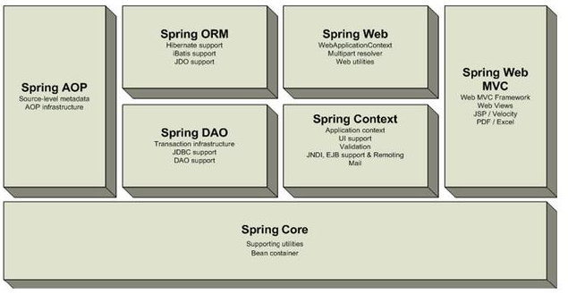
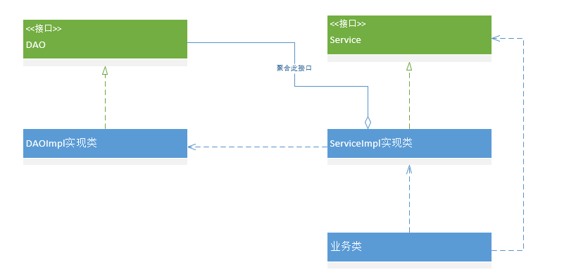

# spring

>   2002,首次推出了spring框架的雏形,==interface21==
>
>   3月24发布了1.0版本
>
>   为了让企业级开发变得更容易
>
>   一个开源的,免费的,==容器==
>
>   轻量级的,==非入侵式的==
>
>   支持事务处理,对框架整合支持
>
>   ==控制反转(IOC),面向切面(AOP)==

## Rood Johnson

>   Spring Framework创始人，著名作者。 Rod在[悉尼大学](https://baike.baidu.com/item/悉尼大学/1700805)不仅获得了计算机学位，同时还获得了音乐学位。更令人吃惊的是在回到软件开发领域之前，他还获得了音乐学的博士学位。 有着相当丰富的C/[C++](https://baike.baidu.com/item/C%2B%2B)技术背景的Rod早在1996年就开始了对Java服务器端技术的研究。他是一个在保险、电子商务和金融行业有着丰富经验的技术顾问，同时也是[JSR](https://baike.baidu.com/item/JSR)-154（[Servlet](https://baike.baidu.com/item/Servlet)2.4）和[JDO](https://baike.baidu.com/item/JDO)2.0的规范专家、[JCP](https://baike.baidu.com/item/JCP)的积极成员，是Java development community中的杰出人物。

## spring 七大模块



# 1 IOC

## 普通的业务模式



>   以上的形式,如果要改业务实现方式,就需要在 Service 实现类改变实现方式

## 加入 set 注入

>   如果需要别的实现类,直接传入新的实现类即可
>
>   

```java
private UserDAO userDAO;

/**
 * 利用 set实现动态值的注入
 *
 * @param userDAO 实现类
 */
public void setUserDAO(UserDAO userDAO) {
    this.userDAO = userDAO;
}
```

*   如此一来,创建对象,就交由业务层来进行???,==由主动创建对象,改为被动接受对象==

*   假设再次进行扩展,只需要传入不同的实现即可
*   ==程序员不再关注创建对象==
*   系统的==耦合性大大降低==,可以==专注地在业务的实现上==

## DI 依赖注入

>   **dependency injection**,==是实现 IOC 的一种方式==,

# 2 Hello Spring

1.  创建 Maven 工程,引入相应 jar

>   jar 使用
>
>   ```xml
>   <dependencies>
>       <!--一个 spring 大礼包-->
>       <dependency>
>           <groupId>org.springframework</groupId>
>           <artifactId>spring-webmvc</artifactId>
>           <version>5.2.7.RELEASE</version>
>       </dependency>
>       <!--可能学习到最后会用到-->
>       <dependency>
>           <groupId>org.springframework</groupId>
>           <artifactId>spring-jdbc</artifactId>
>           <version>5.2.7.RELEASE</version>
>       </dependency>
>       <!--偷懒使用-->
>       <dependency>
>           <groupId>org.projectlombok</groupId>
>           <artifactId>lombok</artifactId>
>           <version>1.18.12</version>
>       </dependency>
>       <!--测试使用-->
>       <dependency>
>           <groupId>junit</groupId>
>           <artifactId>junit</artifactId>
>           <version>4.13</version>
>           <scope>test</scope>
>       </dependency>
>   </dependencies>
>   ```

2.  书写一个测试用的需要托管的类

>   必须提供 set值的方法,否则不能正常获取到值
>
>   ==spring 中 的 property 通过 set 获取到值

```java
package cn.TrueNine.pojo;

import lombok.AllArgsConstructor;
import lombok.Builder;
import lombok.Data;
import lombok.NoArgsConstructor;

/**
 * 需要创建的实体类
 *
 * @author TrueNine
 * @version 1.0
 * @date 2020/6/27
 */
@Data
@NoArgsConstructor
@AllArgsConstructor
@Builder
public class Pojo {
    private String str;
}
```


2.  书写 ==ApplicationContext.xml==,将类引入???

```xml
<?xml version="1.0" encoding="UTF-8" ?>
<beans xmlns="http://www.springframework.org/schema/beans"
       xmlns:xsf="http://www.w3.org/2001/XMLSchema-instance"
       xsf:schemaLocation="http://www.springframework.org/schema/beans
                           http://www.springframework.org/schema/beans/spring-beans.xsd">
    <!--使用 spring 创建对象-->
    <!--在 spring 中,这些类被称之为: bean-->
    <!--
    id 变量名
    class 对象全路径
    property 对象中的属性设置一个值
    -->
    <bean id="hello" class="cn.TrueNine.pojo.Pojo">
        <property name="str" value="spring"/>
    </bean>
</beans>
```

3.  书写测试类,测试是否可用

```java
package cn.TrueNine.pojo.spring;

import cn.TrueNine.pojo.Pojo;
import org.junit.Test;
import org.springframework.context.ApplicationContext;
import org.springframework.context.support.ClassPathXmlApplicationContext;

/**
 * @author TrueNine
 * @version 1.0
 * @date 2020/6/27
 */
public class TestSpring {

    /**
     * 测试引入对象
     */
    @Test
    public void test() {
        // 获取 spring 上下文对象
        ApplicationContext applicationContext = new ClassPathXmlApplicationContext("ApplicationContext.xml");
        // 对象都已经交由 spring 管理,取出即可
        Object hello = applicationContext.getBean("hello");
        // 进行强转
        Pojo object = hello instanceof Pojo ? (Pojo) hello : null;
        // 使用该对象
        System.out.println(object);
    }
}
```

# 3 spring IOC 创建对象方式

*   使用无参构造创建对象

```xml
<bean id="hello" class="cn.TrueNine.pojo.Pojo">
    <property name="str" value="spring"/>
</bean>
```


## 使用有参构造创建对象

1.  下标方式

```xml
<!--通过下标进行赋值创建对象-->
<bean id="hello" class="cn.TrueNine.pojo.Pojo">
    <constructor-arg index="0" value="使用下标进行赋值创建的对象"/>
</bean>
```

2.  类型的 创建方式,==不推荐使用,如果两个参数类型一致==

```xml
<!--通过类型进行创建,不推荐使用-->
<bean id="hello" class="cn.TrueNine.pojo.Pojo">
    <constructor-arg type="java.lang.String" value="233"/>
</bean>
```

3.  通过参数名进行赋值

```xml
<!--使用参数名进行赋值-->
<bean id="hello" class="cn.TrueNine.pojo.Pojo">
    <constructor-arg name="str" value="23"/>
</bean>
```

>   在配置文件初始化时,容器内管理的对象就已经初始化

# 4 spring beans配置文件说明

1.  alias 别名

```xml
<!--如果添加了别名,同时可以从别名获取-->
<alias name="hello" alias="pojo"/>
```

2.  bean 对象 
    1.  id  类似变量名,唯一标识符
    2.  class  全类名,类型
    3.  name 别名,==可以同时,以分隔符分割,拥有多个==
    4.  ......
3.  import 团队开发协作使用,可以将多个配置文件导入为一个

```xml
<import resource="beans.xml"/>
<import resource="beans2.xml"/>
```

# 5 spring 依赖注入

1.  构造器注入:  前文已列出

## Set 注入

>   bean 对象创建依赖于容器,bean对象中所有的属性,通过容器注入

```xml
<bean id="student" class="cn.TrueNine.pojo.Student">
    <!--直接使用 value 进行注入-->
    <property name="name" value="trueNine"/>
    <!--bean注入,使用 ref-->
    <property name="address" ref="address"/>
    <!--数组注入,array-->
    <property name="books">
        <array>
            <value>测试1</value>
            <value>测试2</value>
            <value>测试3</value>
        </array>
    </property>
    <!--list注入-->
    <property name="hobbys">
        <list>
            <value>听歌</value>
            <value>写代码</value>
            <value>看电影</value>
        </list>
    </property>
    <!--map 注入-->
    <property name="card">
        <map>
            <entry key="身份证" value="123456"/>
            <entry key="银行卡" value="3124125125125125"/>
        </map>
    </property>
    <!--set注入-->
    <property name="games">
        <set>
            <value>LOL</value>
            <value>COC</value>
            <value>BOB</value>
        </set>
    </property>
    <!--null 值注入-->
    <property name="wife">
        <null/>
    </property>
    <!--扩展,空值注入-->
    <!--        <property name="wife" value=""/>-->
    <!--properties注入-->
    <property name="info">
        <props>
            <prop key="学号">20312331</prop>
            <prop key="性别">男性</prop>
        </props>
    </property>
</bean>
```

## c,p 命名空间注入

>   c: constructor
>
>   p: property

1.  首先需要两个==xml约束==

```xml
xmlns:p="http://www.springframework.org/schema/p"
xmlns:c="http://www.springframework.org/schema/c"
```

2.  然后就可以直接进行注入

```xml
<!--p 命名空间,可以直接导入属性的值-->
<bean id="user1" class="cn.TrueNine.pojo.Student" p:name="i" p:age="19"/>

<!--c 命名空间,可以使用构造器-->
<bean id="user2" class="cn.TrueNine.pojo.Student" c:name="测试名称" c:age="18"/>
```

# 6 bean 的作用域

>   bean 在配置时默认单例,但可以通过 **bean 的属性 ==scope==,进行设置**
>
>   prototype 原型
>
>   singleton 单例
>
>   .....以及一些 web 相关的作用域

# 7 自动装配

>   spring 满足bean 依赖的一种方式,spring会在上下文中,自动寻找并装配属性,在spring 中有三种自动装配的方式

1.  在 xml 中显式地配置
2.  在 java 中自动配置
3.  ==隐式地自动装配==

## autoWire=ByName

>   自动在容器上下文中查找和==自身对象 set 方法上值对应的 bean id==
>
>   此种方式貌似不用显式声明
>
>   需要保证 ==所有 bean 的 id 唯一,且与set 方法参数名,值相同==

## autoWire=ByType

>   在容器内查找与 set 方法对应对象属性类型相同的 bean
>
>   此种方式不推荐使用,因为名称不会重复,但类型一定会重复,造成问题,==必须保证类型全局唯一==

## ==使用注解自动装配==

1.  在配置文件导入约束

```xml
<beans xmlns="http://www.springframework.org/schema/beans"
       xmlns:xsi="http://www.w3.org/2001/XMLSchema-instance"
       xmlns:context="http://www.springframework.org/schema/context"
       xsi:schemaLocation="http://www.springframework.org/schema/beans
                           http://www.springframework.org/schema/beans/spring-beans.xsd
                           http://www.springframework.org/schema/context
                           http://www.springframework.org/schema/context/spring-context.xsd">
```

2.  开启注解自动装配

```xml
<context:annotation-config/>
```

3.  在需要自动装配的==属性,set方法==上加入注解

>   如果使用此注解,可以忽略 set 方法
>
>   默认为 ByName 方式
>
>   ```java
>   @Autowired
>   ```
>
>   其中的 required 属性,如果显式声明为 false 则表示此属性可以为 null
>
>   ```java
>   @Autowired(required = false)
>   ```
>
>   如果想向指定的某个 id 自动装配,则可以使用 @Qualifier 注解指定为特定的 bean 进行注入
>
>   ==但不能为不同的类型进行自动装配==
>
>   ```java
>   @Qualifier(value = "dog222")
>   ```
>
>   也可使用 ```javax.annotation.Resource```,注解进行标记
>
>   ```text
>   和 autowired 的区别在于
>   都是用于自动装配,都可以放置于属性字段上
>   autowired 默认通过 ByName 方式进行,必须要求次独享存在
>   
>   Resource默认通过 ByName,如果找不到则使用 ByType
>   ```
>

# 8 注解开发

>   要实现注解开发,必须有以下条件:
>
>   *   spring4 或以上,需要 aop 包的支持
>   *   导入 context 约束,增加注解支持
>
>   ```xml
>   xmlns:context="http://www.springframework.org/schema/context"
>   
>   xsi:schemaLocation="http://www.springframework.org/schema/context
>           http://www.springframework.org/schema/context/spring-context.xsd"
>   ```
>
>   *   指定类或扫描指定的类所在的包
>
>   ```xml
>   <context:component-scan base-package="cn.TrueNine.pojo"/>
>   ```

## 1 bean

## 2 属性注入

>   使用 @Component 注解于类之上,等价于自动装配
>
>   属性值可以使用 @Value 注解进行注入,**同时可作用于 set 方法**

## 3 Compnent 衍生注解

>   spring 在不同的 "web层" 有不同的注解,但功能一致,只是为了开发者区分???
>
>   **分别为: **
>
>   ```java
>   @Controller
>   @Service
>   @Repository
>   ```

## 4 自动装配注解

>   上有描述

## 5 作用域

>   使用 @Scope 注解定义一个 bean 的作用域,可使用 ==```ConfigurableBeanFactory```==的常量设置bean 的作用域,**最好使用常量**
>
>   ```java
>   @Scope(value = ConfigurableBeanFactory.SCOPE_PROTOTYPE)
>   ```

## 选择

>   *   xml 可以应用于任何场合维护方便??? ,注解适合简单地进行配置,==不能复用,维护复杂==
>
>   xml管理 bean,注解完成属性注入

# 9 使用 java 方式 配置 spring

>   spring4 之后的新特性
>
>   javaConfig 是 spring 的一个子项目,spring4 之后称为了核心功能???

1.  配置类

```java
@Configuration
public class SpringApplicationContextConfig {

    @Bean
    @Scope(value = ConfigurableBeanFactory.SCOPE_PROTOTYPE)
    public User getUser() {
        return new User();
    }
}
```

2.  测试方法

```java
public void test() {
    ApplicationContext applicationContext = new AnnotationConfigApplicationContext(SpringApplicationContextConfig.class);
    User user = applicationContext.getBean("getUser", User.class);
    System.out.println("user.name.toString() = " + user.name);
}
```

>   Configuration 注解本身 "拥有 Component",也会被容器托管,**代表配置类**
>
>   使用注解形式,xml 的配置方式,**注解也可以实现,如: Import,Scope...**

# 10 AOP

>   **Aspect Oriented Programing** 
>
>   通过: 预编译方式,和运行期间动态代理,始兴县程序功能统一维护的技术???,
>
>   ```text
>   AOP
>   
>   AOP（Aspect Oriented Programming），即面向切面编程，可以说是OOP（Object Oriented Programming，面向对象编程）的补充和完善。OOP引入封装、继承、多态等概念来建立一种对象层次结构，用于模拟公共行为的一个集合。不过OOP允许开发者定义纵向的关系，但并不适合定义横向的关系，例如日志功能。日志代码往往横向地散布在所有对象层次中，而与它对应的对象的核心功能毫无关系对于其他类型的代码，如安全性、异常处理和透明的持续性也都是如此，这种散布在各处的无关的代码被称为横切（cross cutting），在OOP设计中，它导致了大量代码的重复，而不利于各个模块的重用。
>   
>   AOP技术恰恰相反，它利用一种称为"横切"的技术，剖解开封装的对象内部，并将那些影响了多个类的公共行为封装到一个可重用模块，并将其命名为"Aspect"，即切面。所谓"切面"，简单说就是那些与业务无关，却为业务模块所共同调用的逻辑或责任封装起来，便于减少系统的重复代码，降低模块之间的耦合度，并有利于未来的可操作性和可维护性。
>   
>   使用"横切"技术，AOP把软件系统分为两个部分：核心关注点和横切关注点。业务处理的主要流程是核心关注点，与之关系不大的部分是横切关注点。横切关注点的一个特点是，他们经常发生在核心关注点的多处，而各处基本相似，比如权限认证、日志、事物。AOP的作用在于分离系统中的各种关注点，将核心关注点和横切关注点分离开来。
>   
>    
>   
>   AOP核心概念
>   
>   1、横切关注点
>   
>   对哪些方法进行拦截，拦截后怎么处理，这些关注点称之为横切关注点
>   
>   2、切面（aspect）
>   
>   类是对物体特征的抽象，切面就是对横切关注点的抽象
>   
>   3、连接点（joinpoint）
>   
>   被拦截到的点，因为Spring只支持方法类型的连接点，所以在Spring中连接点指的就是被拦截到的方法，实际上连接点还可以是字段或者构造器
>   
>   4、切入点（pointcut）
>   
>   对连接点进行拦截的定义
>   
>   5、通知（advice）
>   
>   所谓通知指的就是指拦截到连接点之后要执行的代码，通知分为前置、后置、异常、最终、环绕通知五类
>   
>   6、目标对象
>   
>   代理的目标对象
>   
>   7、织入（weave）
>   
>   将切面应用到目标对象并导致代理对象创建的过程
>   
>   8、引入（introduction）
>   
>   在不修改代码的前提下，引入可以在运行期为类动态地添加一些方法或字段
>   
>    
>   
>   Spring对AOP的支持
>   
>   Spring中AOP代理由Spring的IOC容器负责生成、管理，其依赖关系也由IOC容器负责管理。因此，AOP代理可以直接使用容器中的其它bean实例作为目标，这种关系可由IOC容器的依赖注入提供。Spring创建代理的规则为：
>   
>   1、默认使用Java动态代理来创建AOP代理，这样就可以为任何接口实例创建代理了
>   
>   2、当需要代理的类不是代理接口的时候，Spring会切换为使用CGLIB代理，也可强制使用CGLIB
>   
>   AOP编程其实是很简单的事情，纵观AOP编程，程序员只需要参与三个部分：
>   
>   1、定义普通业务组件
>   
>   2、定义切入点，一个切入点可能横切多个业务组件
>   
>   3、定义增强处理，增强处理就是在AOP框架为普通业务组件织入的处理动作
>   
>   所以进行AOP编程的关键就是定义切入点和定义增强处理，一旦定义了合适的切入点和增强处理，AOP框架将自动生成AOP代理，即：代理对象的方法=增强处理+被代理对象的方法。
>   ```
>
>   引用连接: [链接](https://www.cnblogs.com/borter/p/9590251.html)

## 环境支持

1.  导入 aspectjweaver 支持

>   ```xml
>   <dependency>
>       <groupId>org.aspectj</groupId>
>       <artifactId>aspectjweaver</artifactId>
>       <version>1.9.5</version>
>   </dependency>
>   ```

2.  在 ApplicationContext.xml  引入约束

```xml
<beans xmlns="http://www.springframework.org/schema/beans"
       xmlns:xsi="http://www.w3.org/2001/XMLSchema-instance"
       xmlns:aop="http://www.springframework.org/schema/aop"
       xsi:schemaLocation="http://www.springframework.org/schema/beans
                           http://www.springframework.org/schema/beans/spring-beans.xsd
                           http://www.springframework.org/schema/aop
                           http://www.springframework.org/schema/aop/spring-aop.xsd">
</beans>
```

3.  编写切入点类和核心类

```java
/**
 * 核心类
 * @author TrueNine
 * @version 1.0
 * @date 2020/7/1
 */
public class ServiceImpl implements Service {

    public ServiceImpl() {

    }

    @Override
    public void add() {
        System.out.println("增加用户");
    }

    @Override
    public void delete() {
        System.out.println("删除用户");
    }

    @Override
    public void update() {
        System.out.println("修改用户");
    }

    @Override
    public void select() {
        System.out.println("查询用户");
    }
}
```

```java
/**
 * 日志切入点???,在执行前执行,实现接口 MethodBeforeAdvice
 * @author TrueNine
 * @version 1.0
 * @date 2020/7/1
 */
public class Log implements MethodBeforeAdvice {

    /**
     * @param method 执行目标对象的方法
     * @param args   参数列表
     * @param target 目标对象
     * @throws Throwable 异常
     */
    @Override
    public void before(Method method, Object[] args, Object target) throws Throwable {
        if (null != target) {
            System.out.println(target.getClass().getName() +
                               " 的 " + method.getName() +
                               " 方法被执行");
        }
    }
}
```

```java
/**
 * 在核心类执行后执行, 实现接口 AfterReturningAdvice
 * @author TrueNine
 * @version 1.0
 * @date 2020/7/1
 */
public class AfterLog implements AfterReturningAdvice {
    @Override
    public void afterReturning(Object returnValue, Method method, Object[] args, Object target) throws Throwable {
        System.out.println("执行方法: " + method.getName() +
                           " 并且返回: " + returnValue);
    }
}
```


3.  注册切入点类和核心类

```xml
<bean id="service" class="com.truenine.service.impl.ServiceImpl"/>
<bean id="log" class="com.truenine.log.Log"/>
<bean id="afterLog" class="com.truenine.log.AfterLog"/>
```


3.  使用 aop:config 配置

```xml
<!--需要 aop 约束-->
<aop:config>
    <!--切入点-->
    <aop:pointcut id="asc" expression="execution(* com.truenine.service.impl.ServiceImpl.*(..))"/>
    <aop:advisor advice-ref="log" pointcut-ref="asc"/>
    <aop:advisor advice-ref="afterLog" pointcut-ref="asc"/>
</aop:config>
```

4.  测试,==动态代理返回的是接口

```xml
ApplicationContext applicationContext = new ClassPathXmlApplicationContext("ApplicationContext.xml");
Service service = applicationContext.getBean("service", Service.class);
service.delete();
```

## 实现方式二

1.  自定义类,为一个切面

```java
public class DiyPointCut {
    public void before() {
        System.out.println("DiyPointCut.before");
    }

    public void after() {
        System.out.println("DiyPointCut.after");
    }
}
```

2.  配置 aop:config 为可使用

```xml
<aop:congfig>
    <aop:aspect ref="diy">
        <aop:pointcut id="pointcut" expression="execution(* com.truenine.service.impl.ServiceImpl.*(..))"/>
        <!--通知-->
        <aop:before method="before" pointcut-ref="pointcut"/>
        <aop:after method="after" pointcut-ref="pointcut"/>
    </aop:aspect>
</aop:congfig>
```

>   在使用时,就可以自定义前置后置环绕

## execution 表达式简析

```markdown
0. 表达式主体: execute()
1. 要返回的类型 * 所有类型
2. 需要返回的包名/类名  * 表示全部
3. 要执行的方法 * 表示全部
4. 要传递的参数 (..) 表示全部
5. throws 要抛出的异常???
```

## 使用注解方式实现 AOP

```java
@Aspect
public class DiyPointCut {
    @Before("execution(* com.truenine.service.impl.ServiceImpl)")
    public void before() {
        System.out.println("DiyPointCut.before");
    }

    @After("execution(* com.truenine.service.impl.ServiceImpl.*(..))")
    public void after() {
        System.out.println("DiyPointCut.after");
    }
}
```

# 11 整合 Mybatis

## 测试环境

>   1.  导入 jar
>       1.  junit
>       2.  Mybatis
>       3.  MySQL-connector-java
>       4.  springwebmvc
>       5.  aspectjweaver
>       6.  mybatis-spring==专用于整合 mybatis 和 spring==
>   2.  编写配置文件
>   3.  测试

## 第一种整合方式

1.  编写数据库配置文件

>   ```xml
>   <?xml version="1.0" encoding="UTF-8" ?>
>   <!DOCTYPE configuration
>           PUBLIC "-//mybatis.org//DTD Config 3.0//EN"
>           "http://mybatis.org/dtd/mybatis-3-config.dtd">
>   <configuration>
>       <settings>
>           <setting name="logImpl" value="LOG4J"/>
>       </settings>
>   
>       <typeAliases>
>           <package name="com.truenine.pojo"/>
>       </typeAliases>
>   </configuration>
>   ```
>
>   此处的环境全权交由 spring 接管

2.  引入数据库资源

>   ```xml
>   <!--datasource 数据源-->
>   <bean id="dataSource" class="org.springframework.jdbc.datasource.DriverManagerDataSource">
>       <property name="driverClassName"
>                 value="com.mysql.jdbc.Driver"/>
>       <property name="username"
>                 value="root"/>
>       <property name="password"
>                 value="root"/>
>       <property name="url"
>                 value="jdbc:mysql://localhost:3306/mybatis?useSSL=false&amp;useUnicode=true&amp;characterEncoding=utf8"/>
>   </bean>
>   ```
>
>   此处使用资源为 spring.jdbc,==亦可使用其他资源==

3.  SqlSessionFactory 获取,以及 mapper.xml

>   ```xml
>   <!--SqlSessionFactory-->
>   <bean id="sqlSessionFactory" class="org.mybatis.spring.SqlSessionFactoryBean">
>       <property name="dataSource" ref="dataSource"/>
>       <!--绑定 mybatis 配置文件-->
>       <property name="configLocation" value="classpath:mybatis-config.xml"/>
>       <property name="mapperLocations" value="classpath:mappers/*.xml"/>
>   </bean>
>   ```

4.  SqlSessionTemplate

>   ```xml
>   <!--注入 SqlSessionTemplate-->
>   <bean id="sqlSession" class="org.mybatis.spring.SqlSessionTemplate">
>       <!--只能使用构造器注入-->
>       <constructor-arg name="sqlSessionFactory" ref="sqlSessionFactory"/>
>   </bean>
>   ```

5.  为Mapper接口增加实现类,将实现类注入容器

>```xml
><!--拼接 mybatis -->
><import resource="mappers/connection/MybatisToSpring.xml"/>
><!--注入Mapper 实现类-->
><bean id="userMapper" class="com.truenine.mapper.impl.UserMapperImpl">
>    <property name="sqlSessionTemplate" ref="sqlSession"/>
></bean>
>```
>
>```java
>public class UserMapperImpl implements UserMapper {
>
>    private SqlSessionTemplate sqlSessionTemplate;
>
>    @Override
>    public List<User> selectAllUserToList() {
>        return sqlSessionTemplate.getMapper(UserMapper.class).selectAllUserToList();
>    }
>
>    public SqlSessionTemplate getSqlSessionTemplate() {
>        return sqlSessionTemplate;
>    }
>
>    public void setSqlSessionTemplate(SqlSessionTemplate sqlSessionTemplate) {
>        this.sqlSessionTemplate = sqlSessionTemplate;
>    }
>}
>```

6.  编写测试类

```java
public class TestMapper {

    Logger logger = Logger.getLogger(TestMapper.class);

    @Test
    public void test() {
        ApplicationContext applicationContext = new ClassPathXmlApplicationContext("ApplicationContext.xml");
        UserMapper userMapper = applicationContext.getBean("userMapper", UserMapper.class);
        List<User> users = userMapper.selectAllUserToList();
        for (User user : users) {
            logger.info(user);
        }
    }
}
```


## 第二种整合方式

>   1.  实现类继承 SqlSessionDaoSupport,即可直接拥有 SqlSessionTemplate
>   2.  如同第一种使用方式一致
>
>   ```java
>   public class UserMapperImplTwo extends SqlSessionDaoSupport implements UserMapper {
>   
>       @Override
>       public List<User> selectAllUserToList() {
>           return this.getSqlSession().getMapper(UserMapper.class).selectAllUserToList();
>       }
>   }
>   ```
>
>   ```java
>   ApplicationContext applicationContext = new ClassPathXmlApplicationContext("ApplicationContext.xml");
>   UserMapper userMapper = applicationContext.getBean("userMapperTwo", UserMapper.class);
>   List<User> users = userMapper.selectAllUserToList();
>   for (User user : users) {
>       logger.info(user);
>   }
>   ```

# 12 声明式事务

>   事物 ,要么都完成,要么都失败
>
>   原子性,一致性,隔离性,持久性 **==ACID==**
>
>   spring 支持 编程式事务,声明式事务
>
>   **==需要导入约束 tx==**
>
>   ```xml
>   <beans xmlns="http://www.springframework.org/schema/beans"
>          xmlns:xsi="http://www.w3.org/2001/XMLSchema-instance"
>          xmlns:aop="http://www.springframework.org/schema/aop"
>          xmlns:tx="http://www.springframework.org/schema/tx"
>          xsi:schemaLocation="http://www.springframework.org/schema/beans
>                              http://www.springframework.org/schema/beans/spring-beans.xsd
>                              http://www.springframework.org/schema/aop
>                              https://www.springframework.org/schema/aop/spring-aop.xsd
>                              http://www.springframework.org/schema/tx
>                              http://www.springframework.org/schema/tx/spring-tx.xsd">
>   ```

1.  配置声明式事务

```xml
<!--配置声明式事务-->
<bean id="transactionManager" class="org.springframework.jdbc.datasource.DataSourceTransactionManager">
    <constructor-arg name="dataSource" ref="dataSource"/>
</bean>
```

2.  配置事务,配合 aop 进行织入,配置需要的方法

```xml
<!--配合 aop 织入-->
<tx:advice id="txAdvice" transaction-manager="transactionManager">
    <!--给那些方法配置事务-->
    <tx:attributes>
        <tx:method name="add" propagation="REQUIRED"/>
        <tx:method name="update" propagation="REQUIRED"/>
        <tx:method name="delete" propagation="REQUIRED"/>
        <tx:method name="query" propagation="REQUIRED" read-only="true"/>
        <tx:method name="*" propagation="REQUIRED"/>
    </tx:attributes>
</tx:advice>
```

>   必须配置事务传播特性
>
>   **如果只是查询,则设为只读属性 为 true,==这样就不能进行其他操作==**

3.  将切面织入aop,此配置为织入 mapper 包下的所有类的所有方法

```xml
<aop:config>
    <aop:pointcut id="advice" expression="execution(* com.truenine.mapper.*.*(..))"/>
    <aop:advisor advice-ref="txAdvice" pointcut-ref="advice"/>
</aop:config>
```


# spring beans 头文件

```xml
<?xml version="1.0" encoding="UTF-8" ?>
<beans xmlns="http://www.springframework.org/schema/beans"
       xmlns:xsi="http://www.w3.org/2001/XMLSchema-instance"
       xmlns:c="http://www.springframework.org/schema/c"
       xmlns:aop="http://www.springframework.org/schema/aop"
       xsi:schemaLocation="http://www.springframework.org/schema/beans
                           http://www.springframework.org/schema/beans/spring-beans.xsd
                           http://www.springframework.org/schema/aop
                           http://www.springframework.org/schema/aop/spring-aop.xsd">

</beans>
```

