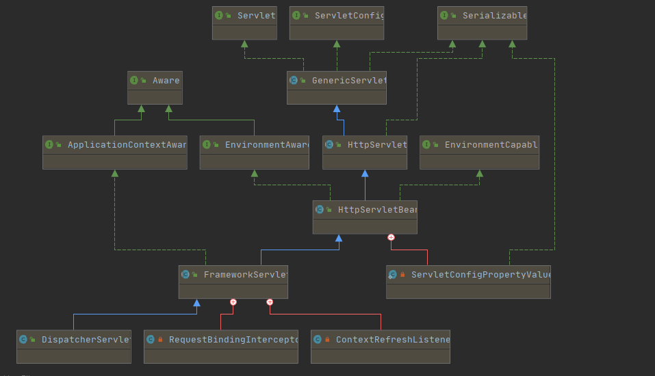
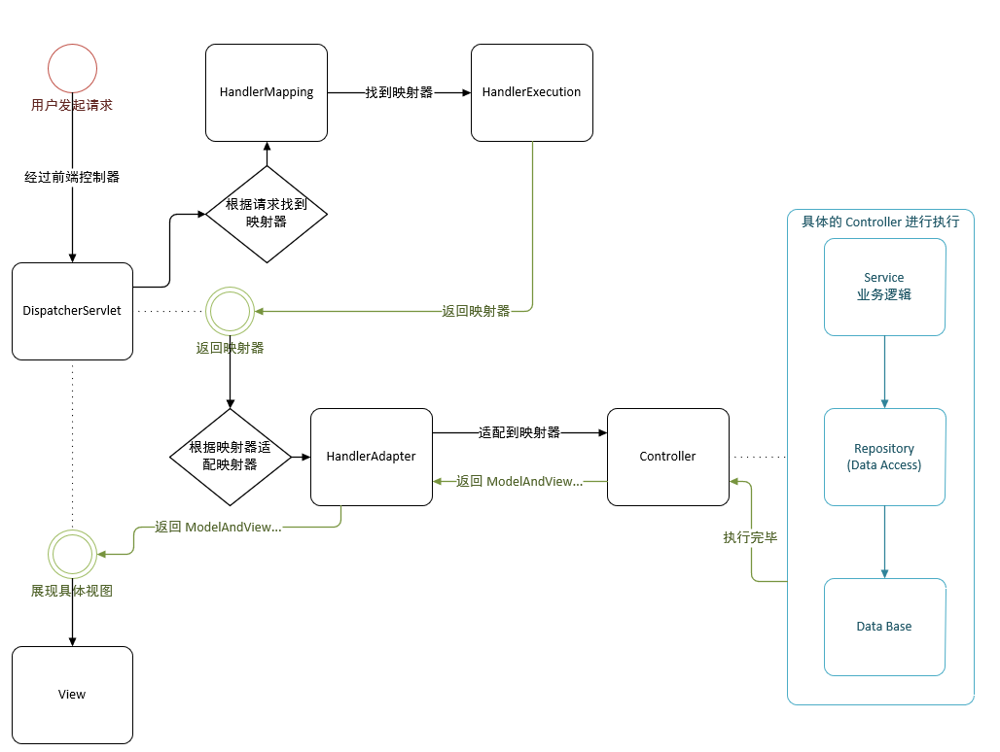

# springMVC

>   属于 spring 的一部分,为了简化 servlet 的开发而生
>
>   基于 java 的 mvc 框架,==底层还是 servlet==
>
>   高效,基于请求跟响应,与 spring 无缝结合
>
>   支持 restfull,数据验证,格式化,主题.......
>
>   ## spring mvc 底层还是 servlet
>
>   

# 1 执行原理

spring 的底层 围绕着 **中心控制器** DispatcherServlet 而设计,作用是请求分发到不同的处理器,**所有请求都会经过 DispatcherServlet**,然后委托请求给处理器1

1.  DispatcherServlet 表示前置控制器,用户发情请求, DispatcherServlet **接收兵拦截请求**

>   假设一段请求 : https://www.baidu.com/springmvc/hello
>
>   http://www.baidu.com 为服务器域名
>
>   springmvc 为部署在服务器上的 web 站点
>
>   hello 为控制器

2.  **HandlerMapping** 为处理器映射,DispatcherServlet 调用
    1.  HandlerMapping 跟根据请求 url 查找 handler
3.  **HandlerExecution** 表示具体的 handler,其主要总用是查找控制器
    1.  如上 url 会被查找为 hello
4.  **HandlerExecution** 解析后的信息传递给 **DispatcherServlet** ,如解析控制器映射等......
5.  **HandlerAdapter** 表示 **处理器适配器** , 其按照特定规则执行 handler
6.  Handler 让具体的 Controller 执行
7.  Controller 具体执行信息传递给 **HandlerAdapter** 
    1.  如 : ModelAndView...
8.  HandlerAdapter 将视图逻辑名 或模型 传递给 DispatcherServlet
9.  DispatcherServlet 调用视图解析器(ViewResolver),解析 **HandlerAdapter** (传递的逻辑视图名)
10.  视图解析器将解析的逻辑视图名,传递给 DispatcherServlet
11.  DispatcherServlet 根据视图名解析的视图结果,调用具体的视图
12.  最终视图展现给用户



# 2 测试环境

1.  书写 web.xml

>   **/ 与 /*  在 springmvc 中的区别**
>   		/  只会匹配请求,不会匹配 jsp 页面
>   		/* 匹配所有请求,包括 jsp

```xml
<?xml version="1.0" encoding="UTF-8"?>
<web-app xmlns="http://xmlns.jcp.org/xml/ns/javaee"
         xmlns:xsi="http://www.w3.org/2001/XMLSchema-instance"
         xsi:schemaLocation="http://xmlns.jcp.org/xml/ns/javaee http://xmlns.jcp.org/xml/ns/javaee/web-app_4_0.xsd"
         version="4.0">
    <!--1. 配置 DispatcherServlet,spring核心,请求分发器.官方:(前端控制器)-->
    <!--name可以自定义-->
    <servlet>
        <servlet-name>springmvc</servlet-name>
        <servlet-class>org.springframework.web.servlet.DispatcherServlet</servlet-class>
        <!--绑定 sprignmvc 的配置文件-->
        <init-param>
            <param-name>contextConfigLocation</param-name>
            <param-value>classpath:springmvc-servlet.xml</param-value>
        </init-param>
        <!--设置请求级别,与服务器一并启动-->
        <load-on-startup>1</load-on-startup>
    </servlet>

    <!--
    / 与 /*  在 springmvc 中的区别
    /  只会匹配请求,不会匹配 jsp 页面
    /* 匹配所有请求,包括 jsp
    -->
    <servlet-mapping>
        <servlet-name>springmvc</servlet-name>
        <url-pattern>/</url-pattern>
    </servlet-mapping>
</web-app>
```

2.  编写个前端页面

```jsp
<%--
    Created by IntelliJ IDEA.
    User: TrueNine
        Date: 2020/7/8
            Time: 18:47
                To change this template use File | Settings | File Templates.
                --%>
<%@ page contentType="text/html;charset=UTF-8" language="java" %>
<html>
    <head>
        <title>$Title$</title>
    </head>
    <body>
        <h1 style="color: blue; text-align: center;">${msg}</h1>
    </body>
</html>
```

3.  编写 mvc 配置文件

```xml
<?xml version="1.0" encoding="UTF-8" ?>
<beans xmlns="http://www.springframework.org/schema/beans"
       xmlns:xsi="http://www.w3.org/2001/XMLSchema-instance"
       xsi:schemaLocation="http://www.springframework.org/schema/beans
                           http://www.springframework.org/schema/beans/spring-beans.xsd">

    <!--处理器映射器-->
    <!--此处理映射器,会根据 bean id 查找-->
    <bean class="org.springframework.web.servlet.handler.BeanNameUrlHandlerMapping"/>
    <!--处理器适配器-->
    <bean class="org.springframework.web.servlet.mvc.SimpleControllerHandlerAdapter"/>
    <!--视图解析器  : 模板引擎: thymeleaf,freemarker...此处为 spring 解析器-->
    <!--id不能随意修改-->
    <bean id="internalResourceViewResolver" class="org.springframework.web.servlet.view.InternalResourceViewResolver">
        <!--前缀-->
        <property name="prefix" value="/WEB-INF/jsp/"/>
        <!--后缀-->
        <property name="suffix" value=".jsp"/>
    </bean>
    <!--配置 bean-->
    <bean id="/hello" class="com.truenine.controller.MyController"/>
</beans>
```

4.  编写一个 Controller

```java
package com.truenine.controller;

import org.springframework.web.servlet.ModelAndView;
import org.springframework.web.servlet.mvc.Controller;

import javax.servlet.http.HttpServletRequest;
import javax.servlet.http.HttpServletResponse;

/**
 * @author TrueNine
 * @version 1.0
 * @date 2020/7/8
 */
public class MyController implements Controller {

    @Override
    public ModelAndView handleRequest(HttpServletRequest request, HttpServletResponse response) throws Exception {
        ModelAndView modelAndView = new ModelAndView();
        // 业务代码
        String result = "Hello SpringMVC";
        modelAndView.addObject("msg", result);

        // 视图跳转
        modelAndView.setViewName("index");

        // 处理结束并返回
        return modelAndView;
    }
}

```

5.  配置 tomcat 运行

>   重点配合 执行流程 理解其原理

# 3 使用注解

>   web.xml ==版本必须4.0==

## 配置 ApplicationContext.xml

>   让mvc 为注解驱动
>           在 spring 中,一般采用 @RequestMapping 注解来完成 映射关系
>           要想使 @RequestMapping 注解生效
>           必须向上下文中注册 DefaultAnnotationHandlerMapping
>           和一个 AnnotationMethodHandlerAdapter 实例
>           而 annotation-driven 配置帮助我们自动生成上述两个实例的注入

```xml
<?xml version="1.0" encoding="UTF-8" ?>
<beans xmlns="http://www.springframework.org/schema/beans"
       xmlns:xsi="http://www.w3.org/2001/XMLSchema-instance"
       xmlns:context="http://www.springframework.org/schema/context"
       xmlns:mvc="http://www.springframework.org/schema/mvc"
       xsi:schemaLocation="http://www.springframework.org/schema/beans
                           http://www.springframework.org/schema/beans/spring-beans.xsd
                           http://www.springframework.org/schema/context
                           http://www.springframework.org/schema/context/spring-context.xsd
                           http://www.springframework.org/schema/mvc
                           http://www.springframework.org/schema/mvc/spring-mvc.xsd">

    <!--自动扫描包-->
    <context:component-scan base-package="com.truenine.controller"/>

    <!--让springmvc处理静态资源-->
    <mvc:default-servlet-handler/>

    <!--让mvc 为注解驱动
        在 spring 中,一般采用 @RequestMapping 注解来完成 映射关系
        要想使 @RequestMapping 注解生效
        必须向上下文中注册 DefaultAnnotationHandlerMapping
        和一个 AnnotationMethodHandlerAdapter 实例
        而 annotation-driven 配置帮助我们自动生成上述两个实例的注入
    -->
    <mvc:annotation-driven/>

    <!--视图解析器-->
    <bean class="org.springframework.web.servlet.view.InternalResourceViewResolver"
          id="internalResourceViewResolver">
        <property name="prefix" value="/WEB-INF/jsp/"/>
        <property name="suffix" value=".jsp"/>
    </bean>
</beans>
```

## 照常配置 web.xml

```xml
<?xml version="1.0" encoding="UTF-8"?>
<web-app xmlns="http://xmlns.jcp.org/xml/ns/javaee"
         xmlns:xsi="http://www.w3.org/2001/XMLSchema-instance"
         xsi:schemaLocation="http://xmlns.jcp.org/xml/ns/javaee http://xmlns.jcp.org/xml/ns/javaee/web-app_4_0.xsd"
         version="4.0">
    <servlet>
        <servlet-name>springmvc</servlet-name>
        <servlet-class>org.springframework.web.servlet.DispatcherServlet</servlet-class>
        <init-param>
            <param-name>contextConfigLocation</param-name>
            <param-value>classpath:com/truenine/controller/springmvc-servlet.xml</param-value>
        </init-param>
        <load-on-startup>1</load-on-startup>
    </servlet>
    <servlet-mapping>
        <servlet-name>springmvc</servlet-name>
        <url-pattern>/</url-pattern>
    </servlet-mapping>
</web-app>
```

## 在 spring 扫描的包内编写 Controller

>   @RequestMapping 注解可在类上声明,这样 **其类中的方法会被归于此参数的自参数???**
>
>   

```java
package com.truenine.controller;

import org.springframework.stereotype.Controller;
import org.springframework.ui.Model;
import org.springframework.web.bind.annotation.RequestMapping;

@Controller
public class MyController {

    @RequestMapping("/h1")
    public String hello(Model model) {
        // 封装数据
        model.addAttribute("msg", "hello SpringMVC For Annotation!");
        // 此结果会被视图解析器处理
        return "index";
    }
}
```

# 4 controller 配置

>   被 @Controller 注解的类,**所有的方法如果返回String,并且有相应的页面可以跳转,就会被视图解析器解析**
>
>   还拥有其他等价的注解:如: @Repository,@Service,@Component......在不同的作用域进行使用
>
>   ​		**可以所有数据都返回到同一个页面,只不过传输的数据不同,然后==驱动页面进行不同地作用,达到复用的目的==**

# 5 RequestMapping 配置

>   配置一个方法从属的 URL 参数,**如果作用于类,则该类为所有参数的子参数**

# 6 RestFull 风格

>    一个资源定位,及资源操作的风格,基于这种风格设计的软件,更简洁,更有层次感,可以实现缓存机制

1.  使用参数传递来确定传递的值,在注解使用 =={}== 进行填充

```java
 @RequestMapping(value = "/add/{a}/{b}", method = RequestMethod.POST)
public String testRestFull(@PathVariable int a, @PathVariable int b, Model model) {
    return "index";
}
```

2.  每个传递的参数,使用 ==@PathVariable== 进行标注
3.  请求方法,使用 @RequestMapping 的 method 属性,或者通过直接注解的形式

>   如 :
>
>   ​		@DeleteMapping
>
>   ​		@GetMapping
>
>   ​		@PostMapping

# 7 结果跳转方式

1.  ModelAndView

>   设置 ModelAndView 对象,根据 view名称,**和视图解析器的名称,跳转到不同的页面**
>
>   ```java
>   ModelAndView mv = new ModelAndView();
>   mv.addObject("msg","ControllerTest1");
>   mv.setViewName("test");
>   return mv;
>   ```

2.  ~~通过 ServletAPI,不需要视图解析器~~

    1、通过HttpServletResponse进行输出

    2、通过HttpServletResponse实现重定向

    3、通过HttpServletResponse实现转发

    >   ```java
    >   @Controller
    >   public class ResultGo {
    >   
    >       @RequestMapping("/result/t1")
    >       public void test1(HttpServletRequest req, HttpServletResponse rsp) throws IOException {
    >           rsp.getWriter().println("Hello,Spring BY servlet API");
    >       }
    >   
    >       @RequestMapping("/result/t2")
    >       public void test2(HttpServletRequest req, HttpServletResponse rsp) throws IOException {
    >           rsp.sendRedirect("/index.jsp");
    >       }
    >   
    >       @RequestMapping("/result/t3")
    >       public void test3(HttpServletRequest req, HttpServletResponse rsp) throws Exception {
    >           //转发
    >           req.setAttribute("msg","/result/t3");
    >           req.getRequestDispatcher("/WEB-INF/jsp/test.jsp").forward(req,rsp);
    >       }
    >   
    >   }
    >   ```

    3. **通过 springMVC** 方式来实现==转发和重定向,**有视图解析器**==

    >   *   重定向: 不需要视图解析去,重新请求另一个路径即可,**注意路径问题**
    >   *   转发: 正常返回字符串即可,(字符串为正常路径)
    >
    >   ```java
    >   @RequestMapping("/rsm2/t1")
    >   public String test1(){
    >       //转发
    >       return "test";
    >   }
    >   
    >   @RequestMapping("/rsm2/t2")
    >   public String test2(){
    >       //重定向
    >       return "redirect:/index.jsp";
    >       //return "redirect:hello.do"; //hello.do为另一个请求/
    >   }
    >   ```

    # 8 数据处理

    1.  如果提交的参数和方法参数一致

    ```java
    @RequestMapping("/hello")
    public String hello(String name){
        System.out.println(name);
        return "hello";
    }
    ```

    2.  提交的参数名和参数不一致,==使用 **@RequestParam**==

    ```java
    @RequestMapping("/hello")
    public String hello(@RequestParam("username") String name){
        System.out.println(name);
        return "hello";
    }
    ```

    3.  提交的是一个对象,要求 **表单域的名称,必须和对象属性名称一致,参数使用对象即可**

    >   前端传递的参数,必须和对象名一致,否则为 null

    ```java
    @RequestMapping("/user")
    public String user(User user){
        System.out.println(user);
        return "hello";
    }
    ```

    # 8 数据回显到前端

    1.  返回 ModelAndView
    2.  ModelMap

    ```java
    @RequestMapping("/hello")
    public String hello(@RequestParam("username") String name, ModelMap model){
        //封装要显示到视图中的数据
        //相当于req.setAttribute("name",name);
        model.addAttribute("name",name);
        System.out.println(name);
        return "hello";
    }
    ```

    3.  通过 Model

    ```java
    @RequestMapping("/ct2/hello")
    public String hello(@RequestParam("username") String name, Model model){
        //封装要显示到视图中的数据
        //相当于req.setAttribute("name",name);
        model.addAttribute("msg",name);
        System.out.println(name);
        return "test";
    }
    ```

    # 8 乱码解决方式

    1.  过滤器

    ```xml
    <filter>
        <filter-name>encoding</filter-name>
        <filter-class>org.springframework.web.filter.CharacterEncodingFilter</filter-class>
        <init-param>
            <param-name>encoding</param-name>
            <param-value>utf-8</param-value>
        </init-param>
        <!--有时可能需要加上强制编码-->
        <init-param>
            <param-name>forceEncoding</param-name>
            <param-value>true</param-value>
        </init-param>
    </filter>
<filter-mapping>
        <filter-name>encoding</filter-name>
    <url-pattern>/*</url-pattern>
    </filter-mapping>
    ```
```
    
## 极端情况解决方式
    
但是我们发现 , 有些极端情况下.这个过滤器对get的支持不好 .
    
    处理方法 :
    
    1、修改tomcat配置文件 ：设置编码！
    
​```xml
    <Connector URIEncoding="utf-8" port="8080" protocol="HTTP/1.1"
           connectionTimeout="20000"
               redirectPort="8443" />
```

    2、自定义过滤器
    
    ```java
    package com.kuang.filter;
    
    import javax.servlet.*;
    import javax.servlet.http.HttpServletRequest;
    import javax.servlet.http.HttpServletRequestWrapper;
    import javax.servlet.http.HttpServletResponse;
    import java.io.IOException;
    import java.io.UnsupportedEncodingException;
    import java.util.Map;
    
    /**
    * 解决get和post请求 全部乱码的过滤器
    */
    public class GenericEncodingFilter implements Filter {
    
        @Override
        public void destroy() {
        }
    
        @Override
        public void doFilter(ServletRequest request, ServletResponse response, FilterChain chain) throws IOException, ServletException {
            //处理response的字符编码
            HttpServletResponse myResponse=(HttpServletResponse) response;
            myResponse.setContentType("text/html;charset=UTF-8");
    
            // 转型为与协议相关对象
            HttpServletRequest httpServletRequest = (HttpServletRequest) request;
            // 对request包装增强
            HttpServletRequest myrequest = new MyRequest(httpServletRequest);
            chain.doFilter(myrequest, response);
        }
    
        @Override
        public void init(FilterConfig filterConfig) throws ServletException {
        }
    
    }
    
    //自定义request对象，HttpServletRequest的包装类
    class MyRequest extends HttpServletRequestWrapper {
    
        private HttpServletRequest request;
        //是否编码的标记
        private boolean hasEncode;
        //定义一个可以传入HttpServletRequest对象的构造函数，以便对其进行装饰
        public MyRequest(HttpServletRequest request) {
            super(request);// super必须写
            this.request = request;
        }
    
        // 对需要增强方法 进行覆盖
        @Override
        public Map getParameterMap() {
            // 先获得请求方式
            String method = request.getMethod();
            if (method.equalsIgnoreCase("post")) {
                // post请求
                try {
                    // 处理post乱码
                    request.setCharacterEncoding("utf-8");
                    return request.getParameterMap();
                } catch (UnsupportedEncodingException e) {
                    e.printStackTrace();
                }
            } else if (method.equalsIgnoreCase("get")) {
                // get请求
                Map<String, String[]> parameterMap = request.getParameterMap();
                if (!hasEncode) { // 确保get手动编码逻辑只运行一次
                    for (String parameterName : parameterMap.keySet()) {
                        String[] values = parameterMap.get(parameterName);
                        if (values != null) {
                            for (int i = 0; i < values.length; i++) {
                                try {
                                    // 处理get乱码
                                    values[i] = new String(values[i]
                                                           .getBytes("ISO-8859-1"), "utf-8");
                                } catch (UnsupportedEncodingException e) {
                                    e.printStackTrace();
                                }
                            }
                        }
                    }
                    hasEncode = true;
                }
                return parameterMap;
            }
            return super.getParameterMap();
        }
    
        //取一个值
        @Override
        public String getParameter(String name) {
            Map<String, String[]> parameterMap = getParameterMap();
            String[] values = parameterMap.get(name);
            if (values == null) {
                return null;
            }
            return values[0]; // 取回参数的第一个值
        }
    
        //取所有值
        @Override
        public String[] getParameterValues(String name) {
            Map<String, String[]> parameterMap = getParameterMap();
            String[] values = parameterMap.get(name);
            return values;
        }
    }
    ```

# 8 JSON 简单实用

# 8.1 JSON

>   ==**J**ava **S**cript **O**bject **N**otation==
>
>   ```json
>   {
>      "name" : "张三",
>      "age" : 16,
>      "sex" : "男"
>   }
>   ```
>
>   ```javascript
>   // 解析json字符串
>   JSON.parse();
>   // 将 json 字符串转换为 js 对象
>   JSON.JSON.stringify();
>   ```

1.  ==@RequestMapping 的 produces 属性,可以指定一些返回类型==

```text
application/json;charset=utf-8;
```

2.  @ResponseBody 注解于方法,注明该方法只返回字符串
3.  @RestController,注解于类上,也只会返回字符串

## jackson 与 fastJSON 的使用

```java
ObjectMapper mapper = new ObjectMapper();
mapper.writeValueAsString(obj);
```

我们可以在springmvc的配置文件上添加一段消息StringHttpMessageConverter转换配置！

```xml
<mvc:annotation-driven>
    <mvc:message-converters register-defaults="true">
        <bean class="org.springframework.http.converter.StringHttpMessageConverter">
            <constructor-arg value="UTF-8"/>
        </bean>
        <bean class="org.springframework.http.converter.json.MappingJackson2HttpMessageConverter">
            <property name="objectMapper">
                <bean class="org.springframework.http.converter.json.Jackson2ObjectMapperFactoryBean">
                    <property name="failOnEmptyBeans" value="false"/>
                </bean>
            </property>
        </bean>
    </mvc:message-converters>
</mvc:annotation-driven>

```

>   fastJSON 自行百度.......

# mvc 约束

```xml
<?xml version="1.0" encoding="UTF-8" ?>
<beans xmlns="http://www.springframework.org/schema/beans"
       xmlns:xsi="http://www.w3.org/2001/XMLSchema-instance"
       xmlns:context="http://www.springframework.org/schema/context"
       xmlns:mvc="http://www.springframework.org/schema/mvc"
       xsi:schemaLocation="http://www.springframework.org/schema/beans
                           http://www.springframework.org/schema/beans/spring-beans.xsd
                           http://www.springframework.org/schema/context
                           http://www.springframework.org/schema/context/spring-context.xsd
                           http://www.springframework.org/schema/mvc
                           http://www.springframework.org/schema/mvc/spring-mvc.xsd">
```

