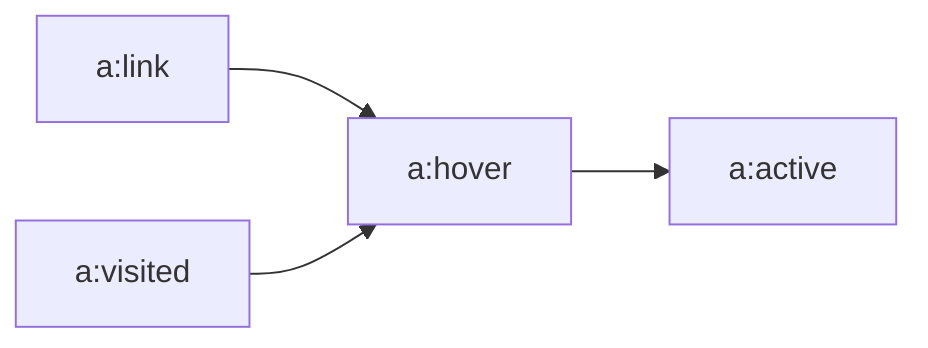

# 链接

链接类似于字体,但链接的不同之处在于,链接有状态

*   a:link - 普通的、未被访问的链接
*   a:visited - 用户已访问的链接
*   a:hover - 鼠标指针位于链接的上方
*   a:active - 链接被点击的时刻

设置的先后也有顺序

### 标示图

>   指向的源头为后

```mermaid
graph LR
	a:link --> a:hover
	a:visited --> a:hover
	a:hover --> a:active
```

