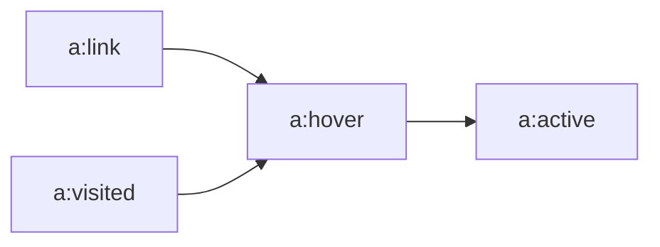

# 使用 css 来书写样式

层叠样式表: **C**ascading **S**tyle **S***heets

*   层叠样式表,可以提高工作效率
*   可以和网页结构分离
*   **多重样式表可以,层叠为一个**

## 选择优先级 倒序

1.  浏览器缺省预制	
2.  外部样式表
3.  内部样式表 (**head -> style 标签**
4.  内联样式表

## CSS语法结构

```css
选择器 {多条语句,使用分号空格间隔; 属性="值"; 属性="值:}
    /* 注释 */

/* 建议的写法 */
    h1 {
        background-color: red;
        font-size: 30px;
    }
```

## CSS 继承关系

子标签,会自动继承父标签的一些样式

## css选择器分组

说白了,就是一大堆选择器,一起使用一组样式

```css
h1,h2,h3,h4 {
    font-size: 33px;
    color: #ffffff;
}
```

## 派生选择器

说白了,指定谁家的谁是啥样式

```css
/* 指定 table 下的 th 元素为这个样式 */
table th {
    background-color: #00ff00;
    font-size: 20px;
}
```

## id 选择器

指定了此 id 的标签,会应用该样式,**每个 id 只能出现一个哦**

```css
#showmax {
    font-size: 1024px;
}
```

### 可配合 派生使用

>   以下的大概意思是: **拥有 此 id 的儿子,长成啥样**

```css
#showmax p {
    font-size: 1024px;
}
```

### 重复的id 派生

索然id 只能出现一次,**但是,可以在不同的派生情况下出现两次**

>   下的例子,h1会被特殊对待

```css
#showmax p {
    font-size: 1024px;
}
#showmax h1 {
    font-size: 1024444444px;
}
```

## 类选择器

声明了 class="谁谁谁" 的标签会运用此选择器,**同样可以和派生选择器混合搭配食用更佳**

```css
.showclass {
    font-size: 1024px;
    color: blue;
}
```

## 属性选择器

同样搭配其他选择器食用更佳,使用 []

*   拥有此属性的标签,都会应用

```css
[title] {
    color: red;
}
```

*   属性和值得选择器
    *   **值不需要引号**

```css
[type=submit] {
    backgrount-color: red;
}
```

*   指定**包含某个属性**的多值选择器
    *   **适合多值用 空格分隔 的情况**

```css
[title~=hello] {
    color: red;
}
```

*   指定包括某个值的,多值选择器
    *   适用于,使用连接字分隔的多值属性

```css
[lang|=en] {
    color: red;
}
```

#### 更多牛逼的属性选择器

| 选择器                                                       | 描述                                                         |
| :----------------------------------------------------------- | :----------------------------------------------------------- |
| [[*attribute*\]](https://www.w3school.com.cn/cssref/selector_attribute.asp) | 用于选取带有指定属性的元素。                                 |
| [[*attribute*=*value*\]](https://www.w3school.com.cn/cssref/selector_attribute_value.asp) | 用于选取带有指定属性和值的元素。                             |
| [[*attribute*~=*value*\]](https://www.w3school.com.cn/cssref/selector_attribute_value_contain.asp) | 用于选取属性值中包含指定词汇的元素。                         |
| [[*attribute*\|=*value*\]](https://www.w3school.com.cn/cssref/selector_attribute_value_start.asp) | 用于选取带有以指定值开头的属性值的元素，该值必须是整个单词。 |
| [[*attribute*^=*value*\]](https://www.w3school.com.cn/cssref/selector_attr_begin.asp) | 匹配属性值以指定值开头的每个元素。                           |
| [[*attribute*$=*value*\]](https://www.w3school.com.cn/cssref/selector_attr_end.asp) | 匹配属性值以指定值结尾的每个元素。                           |
| [[*attribute**=*value*\]](https://www.w3school.com.cn/cssref/selector_attr_contain.asp) | 匹配属性值中包含指定值的每个元素。                           |

# 使用样式表

## 外链文件

```html
<!-- 在 head 使用 linke 连接 -->
<link rel="stylesheet" type="text/css" href="css文件路径" />
```

##内部声明

```html
<!-- 在 head 使用 style 标签,然后直接书写 -->
<style>
    /* 在此处直接书写,只会应用于当前页面 */
    h1 {
        color: 1px;
    }
</style>
```

# 背景

**所有背景不能被继承**

## 背景色

使用 **background-color** 设置任何颜色的背景色

1.  可以为所有标签设置背景色
2.  **不能被继承**,默认值是 **transparen**,透明的

## 背景图像

使用 **background-image**

1.  默认值是 none
2.  **必须制定一个图像的 url**
3.  不能被继承

### 背景重复

使用 **background-repeat** 属性,设置背景图片的平铺(并非拉伸),或者向某个方向延伸

### 背景定位

使用 **background-position** 改变图像的位置,居中,左侧,或者百分比,或者像素

| 单一关键字 | 等价的关键字                   |
| :--------- | :----------------------------- |
| center     | center center                  |
| top        | top center 或 center top       |
| bottom     | bottom center 或 center bottom |
| right      | right center 或 center right   |
| left       | left center 或 center left     |

### 背景关联

如果文档较长,不想背景跟着滚动,则可以使用 **background-attachment: fixed;**

1.  背景就不会改变


# 文本

定义文本的外观,改变文本的颜色,字符间距,对齐文本,装饰文本,进行缩进等等

## 文本颜色

**color**

## 文本缩进

**text-indent** 来设置文本缩进属性,

1.  块级标签:(比如img ),不会应用
2.  可以为其设置负值,达到一定 **特殊效果??**
3.  **该属性会被继承**

## 水平对齐

**text-align** 使文本对齐

1.  值: left.....center  会使得文本向某个方向对齐

### 与 ```<CENTER>``` 标签的区别

1.  标签是让标签居中,而 text-align 只是让文本居中

## 单词间隔

**word-spacing**

1.  默认为 0,可以设置负值,让字更接近

## 字间隔

**letter-spacing** 设置字之间的间隔,与 word-spacing 类似

## 字符转换

**text-transform** **处理文本的大小写**,**这个很好玩**

*   none  不转换
*   uppercase  大写
*   lowercase  小写
*   capitalize  单词首字母大写

## 文本装饰

**text-decoration** ,**可也混合编写**

>   可以将超链接的,**下划线去除,直接设置为 none**

```css
p {
    text-decoration: none underline;
}
```

*   none  默认没有东西
*   underline  加上下划线
*   overline  上划线
*   line-through  文本中贯穿线
*   blink  文本闪烁?

## 空白符

**white-space**  处理文档中的 ,换行,tab,空格

### space 的 属性

| 值       | 空白符 | 换行符 | 自动换行 |
| :------- | :----- | :----- | :------- |
| pre-line | 合并   | 保留   | 允许     |
| normal   | 合并   | 忽略   | 允许     |
| nowrap   | 合并   | 忽略   | 不允许   |
| pre      | 保留   | 保留   | 不允许   |
| pre-wrap | 保留   | 保留   | 允许     |

## 文本书写方向

**direction** 影响文本的书写方向,比如阿拉伯语,自右向左

**注释：**对于行内元素，只有当 [unicode-bidi 属性](https://www.w3school.com.cn/cssref/pr_unicode-bidi.asp)设置为 embed  或 bidi-override 时才会应用 direction 属性。

direction 属性有两个值：ltr 和 rtl。大多数情况下，默认值是 ltr，显示从左到右的文本。如果显示从右到左的文本，应使用值 rtl。

## 文本属性

| 属性                                                         | 描述                                                        |
| :----------------------------------------------------------- | :---------------------------------------------------------- |
| [color](https://www.w3school.com.cn/cssref/pr_text_color.asp) | 设置文本颜色                                                |
| [direction](https://www.w3school.com.cn/cssref/pr_text_direction.asp) | 设置文本方向。                                              |
| [line-height](https://www.w3school.com.cn/cssref/pr_dim_line-height.asp) | 设置行高。                                                  |
| [letter-spacing](https://www.w3school.com.cn/cssref/pr_text_letter-spacing.asp) | 设置字符间距。                                              |
| [text-align](https://www.w3school.com.cn/cssref/pr_text_text-align.asp) | 对齐元素中的文本。                                          |
| [text-decoration](https://www.w3school.com.cn/cssref/pr_text_text-decoration.asp) | 向文本添加修饰。                                            |
| [text-indent](https://www.w3school.com.cn/cssref/pr_text_text-indent.asp) | 缩进元素中文本的首行。                                      |
| text-shadow                                                  | 设置文本阴影。CSS2 包含该属性，但是 CSS2.1 没有保留该属性。 |
| [text-transform](https://www.w3school.com.cn/cssref/pr_text_text-transform.asp) | 控制元素中的字母。                                          |
| unicode-bidi                                                 | 设置文本方向。                                              |
| [white-space](https://www.w3school.com.cn/cssref/pr_text_white-space.asp) | 设置元素中空白的处理方式。                                  |
| [word-spacing](https://www.w3school.com.cn/cssref/pr_text_word-spacing.asp) | 设置字间距。                                                |

# 字体

>   在 CSS 中，有两种不同类型的字体系列名称：
>
>   *   通用字体系列 - 拥有相似外观的字体系统组合（比如 "Serif" 或 "Monospace"）
>   *   特定字体系列 - 具体的字体系列（比如 "Times" 或 "Courier"）
>
>   除了各种特定的字体系列外，CSS 定义了 5 种通用字体系列：
>
>   *   Serif 字体
>   *   Sans-serif 字体
>   *   Monospace 字体
>   *   Cursive 字体
>   *   Fantasy 字体

## 指定字体系列

**font-family**,属性指定

>   如果用户没有指定字体,**可以使用通用字体代替(以下代码演示),使用 , 分割**
>
>   尽量这样写,如果没有指定字体,**可以使用通用字体代替**
>
>   **字符使用 引号 包裹,可以避免一些格式问题**

```css
h1 {
    font-family: Georgia, serif;
}
```

## 字体风格

### font-style

*   ormal - 文本正常显示
*   italic - 文本斜体显示
*   oblique - 文本倾斜显示

### 字体变形

#### font-variant

设置小型大写字母

>   小型大写字母不是一般的大写字母，也不是小写字母，这种字母采用不同大小的大写字母

### 字体加粗

#### font-weight

### 字体大小

#### font-size

*   默认大小为 16像素
*   **尽量使用相对定位**
*   建议使用 em 单位 (**1em == 16px**

##### 结合 百分比使用 EM

```css
body {font-size:100%;}
h1 {font-size:3.75em;}
h2 {font-size:2.5em;}
p {font-size:0.875em;}
```

## 字体样式

| 属性                                                         | 描述                                                         |
| :----------------------------------------------------------- | :----------------------------------------------------------- |
| [font](https://www.w3school.com.cn/cssref/pr_font_font.asp)  | 简写属性。作用是把所有针对字体的属性设置在一个声明中。       |
| [font-family](https://www.w3school.com.cn/cssref/pr_font_font-family.asp) | 设置字体系列。                                               |
| [font-size](https://www.w3school.com.cn/cssref/pr_font_font-size.asp) | 设置字体的尺寸。                                             |
| [font-size-adjust](https://www.w3school.com.cn/cssref/pr_font_font-size-adjust.asp) | 当首选字体不可用时，对替换字体进行智能缩放。（CSS2.1 已删除该属性。） |
| [font-stretch](https://www.w3school.com.cn/cssref/pr_font_font-stretch.asp) | 对字体进行水平拉伸。（CSS2.1 已删除该属性。）                |
| [font-style](https://www.w3school.com.cn/cssref/pr_font_font-style.asp) | 设置字体风格。                                               |
| [font-variant](https://www.w3school.com.cn/cssref/pr_font_font-variant.asp) | 以小型大写字体或者正常字体显示文本。                         |
| [font-weight](https://www.w3school.com.cn/cssref/pr_font_weight.asp) | 设置字体的粗细。                                             |

# 链接

链接类似于字体,但链接的不同之处在于,链接有状态

*   a:link - 普通的、未被访问的链接
*   a:visited - 用户已访问的链接
*   a:hover - 鼠标指针位于链接的上方
*   a:active - 链接被点击的时刻

设置的先后也有顺序

### 标示图

>   指向的源头为后




# 列表

允许放置,改变列表的标志,或者将图像作为标志

| 属性                                                         | 描述                                                 |
| :----------------------------------------------------------- | :--------------------------------------------------- |
| [list-style](https://www.w3school.com.cn/cssref/pr_list-style.asp) | 简写属性。用于把所有用于列表的属性设置于一个声明中。 |
| [list-style-image](https://www.w3school.com.cn/cssref/pr_list-style-image.asp) | 将图象设置为列表项标志。                             |
| [list-style-position](https://www.w3school.com.cn/cssref/pr_list-style-position.asp) | 设置列表中列表项标志的位置。                         |
| [list-style-type](https://www.w3school.com.cn/cssref/pr_list-style-type.asp) | 设置列表项标志的类型。                               |

# 表格

| 属性                                                         | 描述                                 |
| :----------------------------------------------------------- | :----------------------------------- |
| [border-collapse](https://www.w3school.com.cn/cssref/pr_tab_border-collapse.asp) | 设置是否把表格边框合并为单一的边框。 |
| [border-spacing](https://www.w3school.com.cn/cssref/pr_tab_border-spacing.asp) | 设置分隔单元格边框的距离。           |
| [caption-side](https://www.w3school.com.cn/cssref/pr_tab_caption-side.asp) | 设置表格标题的位置。                 |
| [empty-cells](https://www.w3school.com.cn/cssref/pr_tab_empty-cells.asp) | 设置是否显示表格中的空单元格。       |
| [table-layout](https://www.w3school.com.cn/cssref/pr_tab_table-layout.asp) | 设置显示单元、行和列的算法。         |

1.  设置边框,使用 border 属性
2.  通过 width 和 height 设置宽度和高度
3.  text-align 和 vertical-align 属性设置表格中文本的对齐方式。
    1.  vertical-align 设置垂直对齐方式

# 轮廓

绘制元素周围的一条线,起到突出元素的作用

| 属性                                                         | 描述                             | CSS  |
| :----------------------------------------------------------- | :------------------------------- | :--- |
| [outline](https://www.w3school.com.cn/cssref/pr_outline.asp) | 在一个声明中设置所有的轮廓属性。 | 2    |
| [outline-color](https://www.w3school.com.cn/cssref/pr_outline-color.asp) | 设置轮廓的颜色。                 | 2    |
| [outline-style](https://www.w3school.com.cn/cssref/pr_outline-style.asp) | 设置轮廓的样式。                 | 2    |
| [outline-width](https://www.w3school.com.cn/cssref/pr_outline-width.asp) | 设置轮廓的宽度。                 | 2    |

# 框模型

| 属性         | 注释         |
| ------------ | ------------ |
| border-style | 设置边框风格 |
| border-color | 设置边框颜色 |
| border-width | 设置边框宽度 |
| border       | 放置所有属性 |

>   也可以单独只给一边设置边框 border-top-style:...
>
>   **当边框交界时,会以倾斜的三角形式呈现**
>
>   块级元素,直接占用一行,而内敛元素,则不会

# 内边框

>   内容与边框之间的距离
>
>   使用 padding-top.....

# 外边框

>   使用: **margin-top.....**

# 边框模型


# 隐藏

*   display:  none;
*   visibility: hidden;

>   使用 visibility  会继续占用原有文本空间

# 绝对定位 position

>   使用绝对定位,**脱离文档流,并根据父容器进行定位**
>
>   ```css
>   p {
>      position: absolute;
>      left: 20px;
>      right 30px;
>   }
>   ```

# 层级

>   使用 ```z-index: number;``` 来控制显示的层级,**如果被覆盖住**

# 相对定位

>   与绝对定位不同的是,**不会从文档流中脱离,在原来的位置上移动一定的位置**
>
>   ```css
>   p {
>      position: relative;
>      left: 20px;
>      top: 30px;
>   }
>   ```

# 结合使用定位

如果不想相对定位占用位置,可以:

```html
<style type="text/css">
    div.r {
        position: relative;
        left: 0px;
        right: 0px;
    }
    .relative {
        positon: absolute;
        left: 40px;
        buttom: 40px;
    }
</style>
<body>
    <p>
        上方文本
    </p>
    <div class="r">
        <p class="relative">
            测试文本,使用绝对定位从文档流脱离,然后进行相对定位移动
        </p>
    </div>
    <p>
        下方文本
    </p>
</body>
```

# 浮动 float

>   *   向右浮动:  脱离文本流,并在原高度基础上,向右浮动
>   *   向左浮动:  脱离文本流,下方文本视图占有,但会跟随其后

## 文字围绕图片浮动

>   如果图片进行了浮动,**下方的文本则会将其围绕**
>
>   使用 **clear** 属性,清除前一个元素的浮动属性

## div 水平排列

>   常被应用于菜单,导航栏,**通常 div 会换行**
>
>   使用 浮动之后,div 会进行水平排列,父容器不够空间间则还会换行

# 显示方式 display

| 值           | 注释                |
| ------------ | ------------------- |
| none         | 隐藏显示            |
| block        | 显示为块级元素      |
| inline       | 显示为内联元素      |
| inline-block | 显示为块级,内联元素 |

>   内联元素不能换行,不能指定大小
>
>   块级元素可以指定大小,但会换行
>
>   **所以可以使用 inline-block 来处理**

# 居中显示

*   使用 text-align: center  使内容进行居中
*   margin: 0 auto;  可以使元素居中

>   默认情况下 div 会占用100% 的宽度,无法观察元素是否居中
>
>   **设置 div 的宽度,然后就可以使用 margin: 0 auto;  使其元素居中**
>
>   span 是内联元素,无法设置宽度,**所以不能使用 margin: 0 auto 来实现居中**
>
>   span **可以放置于 div 中,然后 div 使用 text-align  来实现居中**

# CSS 选择器

## 1 元素选择器

>   每个基本的HTML标签都是基本的选择器

## 2 选择器分组

>   举例说明:
>
>   ```css
>   h1, p {
>      background-color: red;
>   }
>   ```
>
>   上例同时选择了 h1 和  p 标签

## 3 类选择器

>   举例说明,在一个标签内使用了类
>
>   ```html
>   <h1 class="redStyle">
>      测试标签
>   </h1>
>   ```
>
>   就可以在css内书写一个类选择器,来应用到使用了 该 class 属性的文件
>
>   ```css
>   .redStyle {
>      background-color: red;
>   }
>   ```

同时也可以和别的一起嵌套使用

*   如: 只让h1 标签内的某个类应用

```css
h1.redStyle {
    background-color: red;
}
```

*   如: 同时应用多个类选择器,**可以使用 空格分隔多个类**

```html
<h1 class="redStyle blueStyle">
    测试
</h1>
```

## 4 ID选择器

>   注意: 相同的ID属性只能在 **HTML文档内只使用一次**,并且不能像 class 一样连着使用,其他与class无异?
>
>   **区分大小写**

```css
#testID {
    background-color: red;
}
```

## 5 属性选择器

>   根据标签的属性选择
>
>   举例:
>
>   ```css
>   /* 选择所有带有 title 属性的标签 */
>   *[title] {
>      color: red;
>   }
>   ```
>
>   也可选择多个属性
>
>   ```css
>   /* 选择 a 标签,带有 href 和 color 属性的a标签 */
>   a[href][color] {
>      background-color: red;
>   }
>   ```
>
>   也可以选择具体的带有指定值的属性
>
>   ```css
>   a[href="http://www.w3school.com.cn/about_us.asp"] {color: red;}
>   ```
>
>   **上属性同样可以多属性嵌套**
>
>   如果需要根据属性值中的词列表的某个词进行选择，则需要使用波浪号（~）。
>
>   假设您想选择 class 属性中**包含** important 的元素，可以用下面这个选择器做到这一点：
>
>   ```css
>   p[class~="important"] {color: red;}
>   ```

### 子串匹配属性选择器

下面为您介绍一个更高级的选择器模块，它是 CSS2 完成之后发布的，其中包含了更多的部分值属性选择器。按照规范的说法，应该称之为“子串匹配属性选择器”。

很多现代浏览器都支持这些选择器，包括 IE7。

下表是对这些选择器的简单总结：

| 类型         | 描述                                       |
| :----------- | :----------------------------------------- |
| [abc^="def"] | 选择 abc 属性值以 "def" 开头的所有元素     |
| [abc$="def"] | 选择 abc 属性值以 "def" 结尾的所有元素     |
| [abc*="def"] | 选择 abc 属性值中包含子串 "def" 的所有元素 |

可以想到，这些选择有很多用途。

举例来说，如果希望对指向 W3School 的所有链接应用样式，不必为所有这些链接指定 class，再根据这个类编写样式，而只需编写以下规则：

```css
a[href*="w3school.com.cn"] {color: red;}
```

### 特定属性选择类型

最后为您介绍特定属性选择器。请看下面的例子：

```
*[lang|="en"] {color: red;}
```

上面这个规则会选择 lang 属性等于 en 或以 en- 开头的所有元素。因此，以下示例标记中的前三个元素将被选中，而不会选择后两个元素：

```html
<p lang="en">Hello!</p>
<p lang="en-us">Greetings!</p>
<p lang="en-au">G'day!</p>
<p lang="fr">Bonjour!</p>
<p lang="cy-en">Jrooana!</p>
```

| 选择器                                                       | 描述                                                         |
| :----------------------------------------------------------- | :----------------------------------------------------------- |
| [[*attribute*\]](https://www.w3school.com.cn/cssref/selector_attribute.asp) | 用于选取带有指定属性的元素。                                 |
| [[*attribute*=*value*\]](https://www.w3school.com.cn/cssref/selector_attribute_value.asp) | 用于选取带有指定属性和值的元素。                             |
| [[*attribute*~=*value*\]](https://www.w3school.com.cn/cssref/selector_attribute_value_contain.asp) | 用于选取属性值中包含指定词汇的元素。                         |
| [[*attribute*\|=*value*\]](https://www.w3school.com.cn/cssref/selector_attribute_value_start.asp) | 用于选取带有以指定值开头的属性值的元素，该值必须是整个单词。 |
| [[*attribute*^=*value*\]](https://www.w3school.com.cn/cssref/selector_attr_begin.asp) | 匹配属性值以指定值开头的每个元素。                           |
| [[*attribute*$=*value*\]](https://www.w3school.com.cn/cssref/selector_attr_end.asp) | 匹配属性值以指定值结尾的每个元素。                           |
| [[*attribute**=*value*\]](https://www.w3school.com.cn/cssref/selector_attr_contain.asp) | 匹配属性值中包含指定值的每个元素。                           |

## 6 后代选择器

>   会选中一个元素中的所有后代,==不管嵌套多深,都会进行选择==

```css
/*选中h1 中的所有 strong 元素*/
h1 strong {
    background-color: blue;
}
```

## 7 子元素选择器

>   与后代选择器不同的是,只会选择固定范围的元素,不会去选择深层次的元素

```css
/*只选择 h1 的 strong*/
h1 > strong {
    color: red;
}
```

## 8 相邻兄弟选择器

>   选择==同一父元素==下的,某个元素的,紧贴上个元素的,第一个元素

```css
/*
h1 和 p 同处于 body
h1 之后出现的紧贴 h1 的第一个 p
*/
h1 + p {
    color: red;
}
```

## 9 伪类

>   为特定的元素添加,特殊的效果

| 属性                                                         | 描述                                     | CSS  |
| :----------------------------------------------------------- | :--------------------------------------- | :--- |
| [:active](https://www.w3school.com.cn/cssref/pr_pseudo_active.asp) | 向被激活的元素添加样式。                 | 1    |
| [:focus](https://www.w3school.com.cn/cssref/pr_pseudo_focus.asp) | 向拥有键盘输入焦点的元素添加样式。       | 2    |
| [:hover](https://www.w3school.com.cn/cssref/pr_pseudo_hover.asp) | 当鼠标悬浮在元素上方时，向元素添加样式。 | 1    |
| [:link](https://www.w3school.com.cn/cssref/pr_pseudo_link.asp) | 向未被访问的链接添加样式。               | 1    |
| [:visited](https://www.w3school.com.cn/cssref/pr_pseudo_visited.asp) | 向已被访问的链接添加样式。               | 1    |
| [:first-child](https://www.w3school.com.cn/cssref/pr_pseudo_first-child.asp) | 向元素的第一个子元素添加样式。           | 2    |
| [:lang](https://www.w3school.com.cn/cssref/pr_pseudo_lang.asp) | 向带有指定 lang 属性的元素添加样式。     | 2    |


```css
a:hover {
    color: red;
}
```

**提示：**在 CSS 定义中，a:hover 必须被置于 a:link 和 a:visited 之后，才是有效的。

**提示：**在 CSS 定义中，a:active 必须被置于 a:hover 之后，才是有效的。

**提示：**伪类名称对大小写不敏感。

## 10 伪元素

>   为某些特定元素,添加特定效果

| 属性                                                         | 描述                             | CSS  |
| :----------------------------------------------------------- | :------------------------------- | :--- |
| [:first-letter](https://www.w3school.com.cn/cssref/pr_pseudo_first-letter.asp) | 向文本的第一个字母添加特殊样式。 | 1    |
| [:first-line](https://www.w3school.com.cn/cssref/pr_pseudo_first-line.asp) | 向文本的首行添加特殊样式。       | 1    |
| [:before](https://www.w3school.com.cn/cssref/pr_pseudo_before.asp) | 在元素之前添加内容。             | 2    |
| [:after](https://www.w3school.com.cn/cssref/pr_pseudo_after.asp) | 在元素之后添加内容。             | 2    |