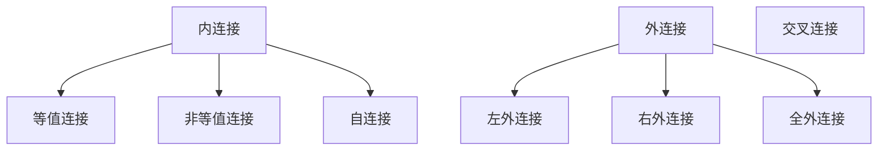

# # 连接查询

>   多个表一同查询

## 注意的点

>   1.  表名在查询时时可以取别名的

## 笛卡尔积

>   两表有n,m 行 ,笛卡尔乘积 = n * m 行
>
>   出现,因为没有连接条件
>
>   解决,加上合理的连接条件

## MySQL 的支持

>   *   SQL92: 内连接,外连接的一部分
>   *   SQL99: 所有连接,交叉连接,外连接不支持全连接

## 连接关系



## 内连接

### 等值连接

>   1.  第一章表的每一行,根据 等值条件 匹配第二张表
>   2.  多表等值连接,为多表的交集部分
>   3.  n 表连接,至少需要 n - 1 个连接条件
>   4.  多表的顺序没有要求
>   5.  在多表连接上,建议起别名
>   6.  连接可以搭配,所有查询子句使用,排序,分组,筛选
>
>   **表名的顺序无要求**
>
>   ```sql
>   -- 将 员工表 和 职位表 的职位想对应
>   SELECT
>   	*
>   FROM
>   	employees,
>   	jobs
>   WHERE
>   	employees.job_id = jobs.job_id;
>   ```
>
>   ```sql
>   -- 查询员工名和对应的部门名
>   SELECT
>   	CONCAT(last_name,first_name) AS 员工姓名,
>   	department_name AS 部门名称
>   FROM
>   	employees,departments
>   WHERE
>   	employees.department_id = departments.department_id;
>   ```
>
>   ```sql
>   -- 查询员工名,工种号,工种名
>   /*
>   如果在表内字段发生歧义,则使用 表名.字段 进行区别
>   可以为表 起别名
>   	在表名后,添加 AS 别名,建议别名简短
>   		使用了别名, 再去使用 表名.字段 就不好用了
>   */
>   SELECT
>   	last_name,
>   	employees.job_id,
>   	job_title
>   FROM
>   	employees,
>   	jobs
>   WHERE
>   	employees.job_id = jobs.job_id;
>   	
>   ```
>
>   ```sql
>   -- 查询有奖金的员工名,部门名
>   SELECT
>   	e.last_name,
>   	e.commission_pct,
>   	d.department_name
>   FROM
>   	employees AS e,
>   	departments AS d
>   WHERE
>   	d.department_id = e.department_id
>   		AND e.commission_pct IS NOT NULL;
>   ```
>
>   ```sql
>   -- 查询城市名中第二个字符为 o 的,对应的部门名和城市名
>   /*
>   添加筛选条件
>   */
>   SELECT
>   	d.department_name,
>   	l.city
>   FROM
>   	departments AS d,
>   	locations AS l
>   WHERE
>   	d.location_id = l.location_id
>   		AND l.city LIKE '_o%';
>   ```
>
>   *   可以进行分组查询
>
>   ```sql
>   -- 查询每个城市的部门个数
>   /*
>   可以添加分组
>   同时肯定可以 HAVING
>   */
>   SELECT
>   	COUNT(*) AS 个数,
>   		l.city
>   FROM
>   	locations AS l,
>   	departments AS d
>   WHERE
>   	l.location_id = d.location_id
>   GROUP BY
>   	l.city;
>   ```
>
>   ```sql
>   -- 查询出有奖金的,每个部门的,部门名和部门的领导编号,以及该部门的最低工资
>   SELECT
>   		MIN(e.salary) AS 最低工资,
>   	d.manager_id AS 领导编号,
>   	d.department_name AS 部门名称,
>   	d.department_id AS 部门编号
>   FROM
>   	employees AS e,
>   	departments AS d
>   WHERE
>   	e.department_id = d.department_id
>   		AND e.commission_pct IS NOT NULL
>   GROUP BY
>   	e.department_id;
>   ```
>
>   *   可以使用排序
>
>   ```sql
>   -- 查询每个工种的,工种名和员工个数,并且按照员工个数降序
>   /*
>   可以使用排序
>   */
>   SELECT
>   		j.job_title AS 工种名,
>   	COUNT(*) AS 员工个数
>   FROM
>   	employees AS e,
>   	jobs AS j
>   WHERE
>   	j.job_id = e.job_id
>   GROUP BY
>   	j.job_title
>   ORDER BY
>   	COUNT(*) DESC;
>   	
>   -- 查询员工名,部门名,和所在的城市
>   /*
>   可以进行多表连接
>   同时也可以继续进行排序分组
>   */
>   SELECT
>   	e.last_name AS 员工名,
>   	d.department_name AS 部门名,
>   	l.city AS 城市名
>   FROM
>   	employees AS e,
>   	departments AS d,
>   	locations AS l
>   WHERE
>   	e.department_id = d.department_id AND d.location_id = l.location_id;
>   ```

### 非等值连接

>   使用等值连接以外的其他连接条件
>
>   *   其他的逻辑运算符,作为连接条件
>
>   ```sql
>   -- 查询员工的工资,和工资级别
>   /*
>   非等值连接的连接条件不再是等于,而是其他逻辑运算符
>   */
>   SELECT
>   	e.last_name AS 员工姓名,
>   	e.salary AS 员工工资,
>   	g.grade_level AS 工资级别
>   FROM
>   	employees AS e,
>   	job_grades AS g
>   WHERE
>   	e.salary BETWEEN g.lowest_sal AND g.highest_sal
>   ORDER BY
>   	e.salary DESC,e.last_name ASC;
>   ```

### 自连接

>   自己连接自己
>
>   *   为一个表起不同的别名
>
>   ```sql
>   -- 查询员工名,员工领导的名称
>   SELECT
>   	e.employee_id AS 员工编号,
>   	e.last_name AS 员工名称,
>   	m.employee_id AS 领导员工编号,
>   	m.last_name AS 领导名称
>   FROM
>   	employees AS e,
>   	employees AS m
>   WHERE
>   	e.manager_id = m.employee_id
>   ORDER BY
>   	m.employee_id ASC,e.employee_id ASC;
>   ```


