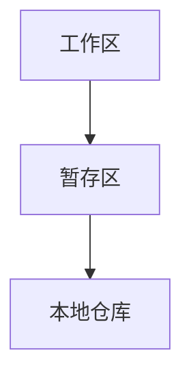

# 为何需要版本控制

## 个人开发者

* 记录历史状态

> 方便于代码版本的迭代.更自由地进行尝试操作

## 团队协作

* 有利于开发进度的展开

> 能够允许多人同时修改文件,进行并行匹配

# 版本控制工具具有的功能

## 协同修改

> 多人并行修改服务端的同一个文件,同时数据进行备份

## 版本管理

> 在保存每一个版本的同时,不保存重复的数据,节约空间

## 权限控制

> 所有人不能对所有代码拥有所有权限
>
> > 对团队外的开发者,应进行权限控制,团队外开发者贡献代码,可以进行审核

## 历史记录

> 查看修改者,修改时间,修改内容,日志信息,将本地文件恢复到历史状态

## 分支管理

> 允许开发团队在工作过程中多条生产线同时工作,进一步提高效率

# 版本控制工具

> 思想从工程思想借鉴而来

## 集中式版本控制工具

> CVS,SVN,VSS

```
每个开发人员是一个客户端,版本控制工具运行在服务器,客户端与服务器进行交互
```

> 服务器一旦损坏,所有历史数据则丢失(单点故障)

## 分布式版本控制工具

> Git

```
在本地就可以进行版本控制
本地就有完整的版本控制历史
"不建议此操作"
```

> 很好的避免了单点故障

# Git结构



* 工作区: 平时写的代码暂存的地方
* 暂存区: 打算提交但是还没有提交的暂存区域
* 本地仓库: 存储历史版本的本地仓库

```txt
	新建文件在工作区
	使用 git add 推入暂存区
	使用 git commit 将暂存区推入本地库
```

# Git和代码托管中心

## 局域网环境下可以搭建GitLab服务器

## 外网环境下

> GitHub

# 本地库和远程库

## 团队内部协作

## 跨团队协作

# 本地初始化 & 设置签名 (WIN为例)

* 在任何一个想要创建本地库的地方

```
右键点击: Git Bash Here,(在当前窗口开开)
```

* Git要求设置一个如同用户名一样的签名,(同时需要email地址(标记用,并非真正需要))

> 用以区分不用开发人员的身份,(辨析),和代码托管中心(GitHub)没有关系

>> 项目级别/仓库级别: 只是在当前项目内生效(当前本地库范围内生效)
>> 系统用户接: 登录当前操作系统的用户范围
>> 设置好的信息会保存在 用户+ 目录下的 .gitconfig (~/.gitconfig)
>>
>> > 优先级: 就近原则: 项目界别优先于系统用户级别
>> > 不允许二者都没有的情况

## 文件操作命令

| 命令             | 作用                             |
| ---------------- | -------------------------------- |
| cd filepath      | 进入目录                         |
| cd ..            | 返回上级目录                     |
| cd ~             | 进入用户 + ? 目录                |
| ll               | 查看当前文件夹内所包含的内容     |
| mkdir foldername | 新建目录                         |
| touch file       | 创建文件                         |
| ls -la           | 查看当前文件夹下的(包含隐藏文件) |
| ls -l\|less      | 分屏查看文件                     |
| cat file         | 查看当前文件的内容               |
| vim file         | 使用vim编辑器编辑文件            |
| rm file          | 删除文件                         |
| rm -r floder/    | 删除目录                         |

1. 以 . 开头的文件(或目录)为隐藏资源

### vim操作

* esc i 进入编辑模式
* esc :wq 保存退出
* esc :set nu 设置显示行号

### 多屏显示控制方式

* space 向下翻页
* b 向上翻页
* q 退出

## 初始化 & 设置签名命令

| 命令     | 作用                   |
| -------- | ---------------------- |
| git init | 在当前目录初始化本地库 |

| git config user.name name | 设置项目级别的用户名签名
| git config user.email email | 设置项目界别的用户邮箱地址签名
| git config --global user.name name | 设置系统级别的用户名签名
| git config --global user.email email | 设置系统级别的用户邮箱地址签名

> 注意: .git 目录中存放本地库的子目录和文件,不要轻易篡改删除

# Git具体操作

## 添加,提交,查看状态命令

| 命令             | 作用                                 |
| ---------------- | ------------------------------------ |
| git status       | 查看当前工作区和缓存区状态           |
| git add file     | 往暂存区推入文件                     |
| git add --all    | 往暂存区推入所有文件                 |
| git commit file  | 将暂存区推入本地库(同时进行注释编辑) |
| git commit --all | 推送所有文件                         |

| git commit -m "description" file | 直接提交(不仅如此编辑界面)
| git rm --cached file | 撤回当前的推入操作 |

# 历史版本操作

> Git每个版本都会有一个历史记录
>
> > 会有一个 HEAD 指针指向当前所处的版本

* 改变当前版本实质上就是移动 HEAD 指针

```
具体操作:
	基于索引值(hash 简写),建议使用此操作
	基于 ^
	基于 ~
```

### 操作的区别

* soft(软操作): 仅仅在本地库移动HEAD指针
* mixed(混合操作?): 在本地库移动HEAD指针,同时重置暂存区
* hard(硬操作): 暂存区和工作区都会被重置

## 历史版本命令

| 命令                             | 作用                                             |
| -------------------------------- | ------------------------------------------------ |
| git log                          | 查看所有的历史版本(分屏显示)                     |
| git log --pretty=oneline         | 以逐行的形式显示历史版本                         |
| git log --oneline                | 以更简洁的方式显示(只显示一部分哈希值,指针,描述) |
| git reflog                       | 在逐行显示历史版本的同时显示指针移动需要的步长   |
| git reset --opertion index       | 到达索引版本                                     |
| git reset --opertion HEAD^       | 向后回退指定的 ^ 步数                            |
| git reset --opertion HEAD~number | 指定回退的版本数量                               |

# 删除文件后找回

> 其本质还是利用版本回退的方式进行,(建立在有历史版本的情况下)

* 从暂存区删除: 直接恢复上个版本即可

> Git只会增加版本,很少会进行删除操作

```
	这些操作必须建立在,前版本推送到了本地库
```

# 比较文件

| 命令                | 作用                                                         |
| ------------------- | ------------------------------------------------------------ |
| git diff file       | 比较暂存区和当前文件的差异                                   |
| git diff index      | 比较多个文件                                                 |
| git diff index file | 比较本地库(或历史版本)和当前文件的差异,(index = 哈希,HEAD^,HEAD~number) |

# 分支作用

```
在版本控制过程中,同时推进多个任务
	本地库初始化之后,就会有一个 master 分支
```

* 同时推进多个功能开发,提高开发效率
* 各个分支同时开发,如果一个分支开发 失败,不会对其他分支有任何影响,失败的分支重新开始即可

# 分支操作

### 指定分支更改

1. 切换到需要修改的分支
2. 使用命令接收想就收的分支修改

| 命令              | 作用             |
| ----------------- | ---------------- |
| git branch -v     | 查看已有的分支   |
| git branch name   | 创建分支         |
| git checkout name | 切换分支         |
| git merge name    | 指定接收分支更改 |

# 分支产生冲突解决

### 为什么会产生冲突

```
对于 git ,不能顾此失彼,必须认为决定处理冲突
	假设:
		两个同事修改了一行数据
			git则会进入选择阶段,提示哪个文件发生了冲突
			对文件进行编辑
			
				<<< HEAD 
					当前文件内容
				=====
					需合并分支内容
				>>> 分支名
				
			保留需要的数据,就需要人为进行操作了
				1. 去掉特殊标记,保留想要的数据
				2. (告知是未合并路径),通过 git add file 标记为已解决
				3. 使用 git commit (不带文件) 提交到本地库,至此合并完成
```

# hash原理

```
hash 是一个系列的加密算法,各个级别的hash算法虽然加密强度不同,但有以下共同点:
	1. 将明文,经过 hash 算法加密,得到 hash 值
	2. 得到的 hash 值是一致的,绝不会出现相同数据推算出不同的 hash 值,并且得到的长度是固定的
	3. 输入的数据略有变化,则输出的 hash 值一定不同
	4. hash 算法是不可逆的
		根据密文,没有办法反推回明文
```

# Git版本管理原理简析

## SVN的保存原理

```
每次版本迭代,保留修改的部分
如果还原版本,就将历史版本和原始版本,以及修改的版本拼接
```

> 称作: 增量式版本控制

## Git(快照流)

```
git 吧文件看成是小型文件系统的一组快照
	每次版本提交时,都会对全部文件制作一个快照,并保存这个快照的索引
		为了高效,如果文件没有进行修改,Git 不再存储这个文件,而是保留一个连接指向之前的文件
			所以 Git 的工作方式称之为: 快照流
```

### Git 提交对象

* 每次提交都会创建一个提交对象

> 其中包含:
>
> 1. 文件 hash 处理之后的 hash 值(片段)
> 2. 所有文件 hash 构成一个树对象(包含每个文件以及每个文件的 hash 值) 的 hash 值
> 3. 提交对象: 包含树对象

# Git分支原理简析

* 第一次提交会最为 root commit (根提交)

> 之后提交就会以 root commit 作为父节点,

* 当创建分支的时候,(本身就会有 master 分支)

```
	在创建新的分支时,SVN会赋值整套文件
		而 Git 只会新建一个 "指针" ,指向某一个版本
```

* 如果 其它分支 需要迭代,则只会移动指针

```
	创建: 只是创建指针
	移动: 只是移动指针
```

# 操作

```
	往远程库推送,可以创建一个 以 url 为主题的别名
	从远程库克隆:
		完整地从远程库下载到本地
		创建 origin 地址别名
		初始化本地库
```

## 命令

| 命令                     | 作用                           |
| ------------------------ | ------------------------------ |
| git remote               | 查看保存的远程库地址           |
| git remote add name url  | 保存一个名为 name 的 url 地址  |
| git push name branchName | 将指定分支推送到指定别名的仓库 |
| git clone urlName/url    | 以远程库别名或 url 克隆        |

# 拉取

```
		fetch:
		并不会进行合并操作
	pull:
		同时进行 fetch 和 merge
			!!: 结果发现还是要 merge
```

## 命令

| 命令                            | 作用                                     |
| ------------------------------- | ---------------------------------------- |
| git fetch rulName urlbranchName | 从远程库的指定分支先拉取(不进行合并操作) |
| git merge urlName/urlbranch     | 从当前分支合并远程分支                   |
| git pull urlName/urlbranch      | 直接 fetch + merge ???                   |

# 解决远程冲突简析

* 如果不是基于 github 远程库的最新版远程库的修改,不能推送

> 必须先拉取,如果进入冲突装填则按照 分支冲突 解决即可

# 团队协作流程

1. 协作者找到项目并 fork
2. 协作者 clone 到本地 (此项目协作者并没有推送权限)
3. 协作者开始开发完成(进行本地合并)
4. 协作者在 Github 点击 pull Requests ,Github 列出想做的修改
5. 协作者 点击 create pull Requests ,与开发者通信接接洽,至此协作者完成
6. 开发者进入 pull Requests ,并点击协作者的请求
7. 开发者亦可以继续和协作者接洽通信,同时也可以点击 Files changed 查看协作者的修改(对代码进行审查)
8. 开发者 如果确定修改,则回到 conversation 点击 merge pull Requests 合并代码(同时添加合并信息),至此远程库代码合并完成
9. 开发者将修改后的代码拉取到本地,至此协同开发完成

# SSH免密登录

* 在 ~ 目录下 生成 ssh 文件

> 一直 enter...

* 打开 id_rsa.pub

> 复制其中的内容

* 打开 GitHub 的用户 --> ssh and GPGkeys --> New ssh key

> 将内容粘贴到 key, title 填写随意

* 点击 add ssh key
* 使用 git remote add 添加远程地址别名

> 从 github 点击 clone or download , 选择 SSH,并复制地址,粘贴到别名

* 提交时 yes

## 命令

| 命令                                  | 作用          |
| ------------------------------------- | ------------- |
| ssh-keygen -t rsa -C GitHubEmailIndex | 生成 ssh 文件 |