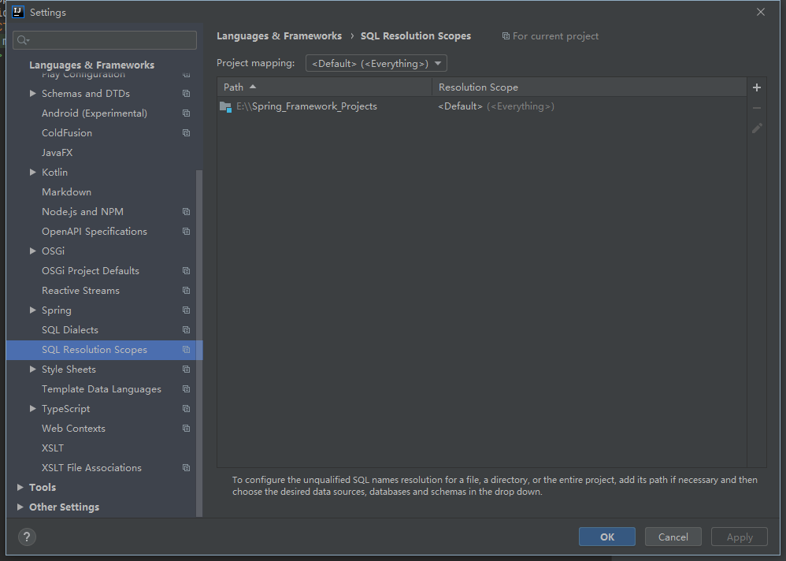
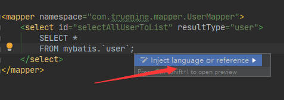

# IDEA 常规设置

> 基于 2019-3-4 版本的 IDEA

## 外观设置

* Appearance & Behavior -> Appearance ->| Theme: 设置一些默认主题
* Editor -> Color Scheme ->|  Scheme: 设置编辑区主题
* File -> import Settings -> 选择 -> 一路确认

## 字体相关设置

* Editor -> General ->| Mouse ^ Change font size(Zoom) with Ctrl + Mourse Wheel: 勾选 设置 ctrl + 鼠标滚轮设置字体大小
* Editor -> Font ->| : 设置字体

> - Font 设置字体样式
> - Size 设置字体大小
> - Line spacing 设置行间距
>
> > 可以在: Editor -> Color Scheme -> Color scheme Font ->| 设置单独样式

* Editor -> Color scheme -> Language Defaults ->| Comments -> : 设置各种注释颜色

## 代码相关设置

* Editor -> General -> Auto Import ->| Java ^ insert imports on paste -> ALL | 设置为 ALL 自动导包

> 下面两个: Add unambiguous imports on the fly: 勾选 |
>
> > Optimize imports on the fly(for currnet project): 勾选 |

* Editor -> General ->| Other ^ Show quick documents on mourse move: 勾选 鼠标悬浮提示

 > Tooltip delay: 输入 显示的延迟时间

* Editor -> General -> Appearance ->| Show line numbers: 勾选 显示行号
* Editor -> General -> Appearance ->| Show method separators: 显示方法线
* Editor -> Genera -> Code Completion ->| Match case: 不勾选 设置为 ALL letter 忽略大小写提示代码
* Editor -> General -> Editor Tabs ->| Appearance ^ Show tabs in one row: 不勾选 不隐藏类分页
* Editor -> File And Templates ->| Includes ^ File Header: 设置 java 文件头部信息
* Editor -> File Encodings ->| : 设置当前工程编码

## 编译相关设置

* Build,Execution,Deployment -> Compiler ->| : 设置自动编译

> * Build project automatically: 勾选
> * Compile independent modules in parallel 勾选

# 版本控制相关配置

> Git,必须在本地安装

* version Control -> Git ->|: 配置 /bin/git.exe 路径,Test
* version Control -> GitHub ->| 登录 GitHub 账号,设定连接超时(非必要),Test

# 创建类文件

> 在创建类文件的时候遇到的一些问题

## 问题描述

```text
如果创建一个空的,很深层级的类文件
    例如:
        cn.xxx.xxx.xxx
   
    会在你再次创建文件的时候很不方便
```

## 解决

```text
在 IDEA 的工具栏下方有一条文件目录

直接右键相应的目录,创建即可
```

# 如何生成带 javadoc的工具类jar

> 只是暂时解决,建议使用 maven

***IDEA版本: 2019.3.2***

## 遇到问题

```text
在想生成工具类 jar 包时
只生成了 class 文件(编译后的)
	导致问题: 鼠标悬停在类,对象,方法上时,不会显示写的 javadoc 注释
推测可能原因:
	编译后的 class 文件打开,是 idea 反编译后的结果
		因此无法查看注释,(编译时编译器忽略)
```

## 暂时解决方式

> 在生成 jar 结构时,添加源码到 jar 内

```text
按照正常步骤:
	File -> project Structure -> Artifacts
	左侧 + 添加: JAR -> From modules with dependencies (此处可以什么都不写)
	选择添加项目: 中间 Output Layout(左侧) -> + -> 加入: Modules cources
	应用 -> 确定
build:
	Build Artifacts -> 选择需要的 -> build
```

## 存在问题

1. 会将源码和 class 放在一起
2. 这样会导致文件结构复杂
3. 但问题不大

# 关于IDEA git 进行 pull 操作

```text
idea 中进行 pull 好像没有反应
    目前的解决方式是;
        新建项目,版本控制,"从git clone",就可以解决
```

# 使用idea 连接数据库驱动下载失败的解决方式

>   idea版本: 2020.1
>
>   失败原因: 不明......
>
>   解决思路: 自己手动添加驱动

1.  首先添加数据库


2.  自己想办法弄个一样的驱动过来

>   我采用的方式是: 首先在 maven里建立依赖,自动下载后删除依赖,让本地仓库有一个现成的驱动

3.  照上图,添加一个jar,从本地仓库取即可,**注意不要添加源码**
4.  设置好 Driver 的 Class 路径 ,然后再去连接数据库即可

参考链接 https://blog.csdn.net/PSY_God/article/details/105815546

>   此处为项目路径



>   此处也要设置为当前项目,**如果发现提示范围不精确,则可以去掉此限制**



>   选择SQL,==提示SQL的高亮==

# 插件目录

>   这里记录一些比较常用的插件,以便忘记,或者重新安装环境后遗弃

| 插件名                             | 作者               | 现使用状态:在用/弃用 | 描述                              | 弃用原因 | 代替插件 |
| ---------------------------------- | ------------------ | -------------------- | --------------------------------- | -------- | -------- |
| Grep Console                       | VojtechKrasa       | 在用                 | 控制台输出彩色日志                |          |          |
| CodeGlance                         | Vektah             | 在用                 | 代码地图                          |          |          |
| leetcode editor                    | shuzijun           | 在用                 | leetcode刷题使用                  |          |          |
| lombok                             | Michail Plushnikov | 在用                 | 偷懒插件                          |          |          |
| Rainbow Brackets                   | izhangzhihao       | 在用                 | 彩虹括号插件                      |          |          |
| Translation                        | Yii.Guxing         | 在用                 | 翻译插件                          |          |          |
| vue.js                             | jetbrains          | 在用                 | vue支持插件                       |          |          |
| Alibaba Java Coding Guidelines     | alibaba            | 在用                 | 阿里规约插件                      |          |          |
| Visual Studio Code Dark Plus theme | jetbrains          | 在用                 | vscode 主题扩展,换该主题即可      |          |          |
| Free Mybatis plugin                | wuzhizhan          | 在用                 | 在 mapper.xml 和 接口之间直接跳转 |          |          |

