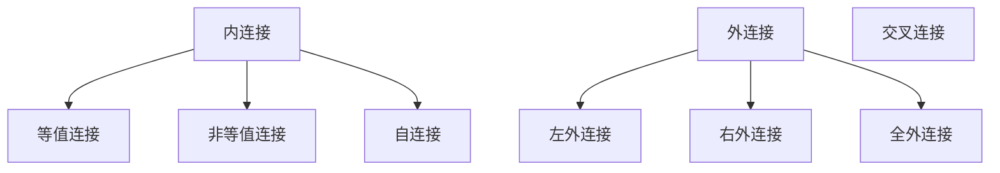
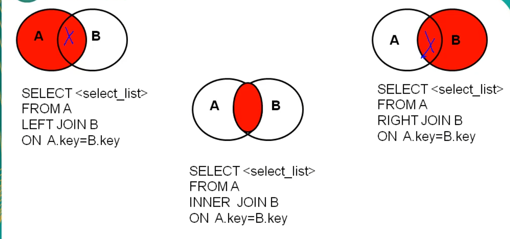
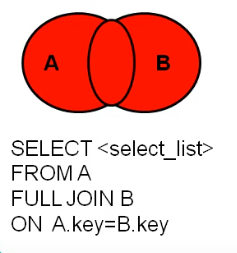

# 一些前言

1.  MySQL的安装配置: [博客](博客)
2.  MySQL 最好下载使用 zip 进行安装

# MySQL的安装与配置

>   基于win10的环境进行,还是有不少坑的,防止连接挂掉,重新补充

## 1. MySQL的下载

>   进入: [官网]() 下载最新版,或者[下载5.7](mysql5.7)

## 下载注意

1.  我建议使用zip包,虽然需要自己配置
2.  根据自己的电脑下载对应的版本

## 配置安装

1.  将下载的zip包解压,放置到想要的文件

>   

2.  在根目录创建并配置 my.ini

>   ```ini
>   [client] 
>   # 设置mysql客户端默认字符集
>   default-character-set=utf8 
>   [mysqld]
>   #设置3306端口
>   port = 3306 
>   # 设置mysql的安装目录 这块换成自己解压的路径
>   basedir=D:\\softnew\\MYSQL\\mysql-5.7.20-winx64
>   # 允许最大连接数
>   max_connections=200
>   # 服务端使用的字符集默认为8比特编码的latin1字符集
>   character-set-server=utf8
>   # 创建新表时将使用的默认存储引擎
>   default-storage-engine=INNODB
>   ```
>
>   ## 设置关于 Bolb 的大小
>
>   ```ini
>   # 在最后一行追加
>   max_allowed_packet=16M
>   ```
>
>   ## 在 my.ini 设置默认时区
>
>   ```ini
>   # 设置默认时区为 +8 区
>   default-time-zone='+08:00'
>   ```
>

3.  初始化 mysql

>   1.  以```管理员身份打开cmd```,进入MySQL/bin目录,进行初始化
>
>       >   ```cmd
>       >   # 进入目录
>       >   cd D:\mysql根目录\MySQLbin
>       >   
>       >   # 运行 mysql initialize,帮助创建 data 文件
>       >   mysqld --initialize
>       >   
>       >   # 安装 mysql 服务
>       >   mysqld --install
>       >   
>       >   # 启动服务
>       >   net start mysql
>       >   
>       >   ```

4.  环境变量,登录,登录密码

>   1.  环境变量: 在 系统的 Path 下添加 mysql 的 bin 目录
>   2.  root 密码: 会在 mysqld --initialize 初始化时,给予密码
>
>   >   *   密码在: ```data/任意名称.err内```,搜索 password

5.  登录并修改密码

>   1.  登录
>
>   >   ```cmd
>   >   mysql -u root -p
>   >   # 输入密码
>   >   ```
>
>   2.  修改 root 密码
>
>   >   ```cmd
>   >   ALERT USER 'root'@'localhost' IDENTIFIED BY '新密码';
>   >   ```

###### 如果没问题就可以退出了

>   ```my
>   quit
>   ```

[mysql官网]:https://www.mysql.com/
[mysql5.7]:https://dev.mysql.com/download/5.7.html

# MySQL 登录操作

1.  直接进入 MySQL自带的终端,输入密码即可

>   但具有局限性,```只能root用户使用```

2.  使用 cmd:

```cmd
# 简单的登录方式
mysql -u name -p;
# -u 用户 -p,然后输入密码

# 连接远程登录方式
mysql -h loaclhost -P 3306 -u name -p
# -h host主机; -P 端口 -u 用户名 -p,然后输入密码
```

>   可以在 -p 之后直接追加密码

## 退出 MySQL

>   建议在 cmd 下执行

```cmd
# 在 MySQL 中输入
exit
# 或者 quit
```

## 创建用户/给予权限

```mysql
-- 创建用户
create user xxx identified by '*****';

-- 赋予xxx网络登录权限,对所有库,所有表修改的全部权限,密码为 ******
grant all privileges on *.* to xxx@'%' identified by '******';

-- 赋予xxx使用本地命令行方式赋予oooo这个库下的所有表的增删查改权限,密码为******
grant select,insert,delete,update on oooo.* to xxxx@localhost identified by '*******';
```

# 

MySQL的常用命令

>   就是一些常用的命令

| 命令/函数             | 作用                 | 注释                                                         |
| --------------------- | -------------------- | ------------------------------------------------------------ |
| SHOW DATABASE;        | 查看当前存在的库     | 其中一些原生的库,不能动                                      |
| SHOW TABLES;          | 查看当前库中的表     |                                                              |
| SHOW TABLES FROM name | 查看指定名称库的表   | 仅仅是在当前库,查看别的库                                    |
| USE name;             | 进入指定库名的库     | 提示 ```database changed```,表示进入了该库                   |
| SELECT database()     | 查看当前所在的库     | ```调用函数```                                               |
| DESC name;            | 查看表名的表结构     |                                                              |
| SELECT version()      | 查看当前数据库的版本 | 调用函数,```也可在 cmd ,中输入:  mysql --version  或者 mysql -V``` |

# MySQL 语法规范

>   书写SQL 或者命令的一些规范

## MySQL 的一些特性

1.  不区分大小写,```平时书写: 关键字大写,表名,列名小写```
2.  每条命令使用 ```;``` 结尾,平时书写: ```也必须写 ;```
3.  平时书写: ```非常长,可以进行缩进,换行操作```
4.  注释:

>   *   单行注射室: # 注释内容 or -- 注释内容
>   *   多行注释: /* 注释内容 */


# MySQL 基础查询

>   语法: ```SELECT 列表数据 FROM 表名;
>
>   顺序: 先查看是哪个表 FROM,再进行查询 SELECT

```text
查询的列表可以是: 表中的字段,常量值,表达式,函数
查询出来的是一个虚拟的表格
```

## 注意

1.  ***注意: 必须先进入库进行查询: ```USE name;```***
2.  使用 ``` ` ` ``` 括住字段,以```区分关键字```
3.  在可视化界面操作,可以使用选中执行
4.  MySQL不区分字符串,```统一使用 ' '```
5.  别名碰到关键字,MySQL建议使用 ```" "```,而非```' '```

## 查询单个数据

```SQL
SELECT
	ename
FROM
	emp;
```

>   显示单个数据

## 查询显示表中的多个字段

```SQL
-- 在 select 后 写多个字段,查询这些字段
SELECT
	ename,
	ejob,
	esalary
FROM
	emp;
```

## 查询表中的所有字段

1.  可以所有的表字段,逐个拼接
2.  ```使用 * 代替```,但是```不能自定义显示顺序,只能按照库内的表```

```sql
-- 使用 * 查询所有字段
SELECT
	*
FROM
	emp;
```

## 查询表中的 常量值,函数,表达式

*   查询常量值

>   ```sql
>   -- 查询 100 的常量
>   SELECT 100;
>   -- 查询 '字符串' 的常量值
>   SELECT '字符串';
>   ```

*   查询表达式

>   ```sql
>   -- 查询表达式
>   SELECT 1 + 1;
>   SELECT 12 % 100;
>   ```

*   查询函数

>   ```sql
>   -- version() 函数返回当前 MySQL的 版本号
>   SELECT VERSION();
>   ```

## 字段别名

>   使用 ```AS``` 关键字

1.  方便查看显示
2.  查询字段重名,可以使用别名代替

```sql
-- 测试别名
SELECT
	last_name AS 姓,
	first_name AS 名,
	salary AS 工资
FROM
	employees;
```

### 可以直接省略 AS

```sql
-- 不使用 AS 关键字,有时有关键字,使用 ""
SELECT
	last_name 姓,
	first_name 名,
	salary 工资
FROM
	employees;
```

## 字段拼接

>   使用 函数: CONCAT()

```sql
-- 使用 CONCAT() 函数,并赋予别名
SELECT
	CONCAT(last_name,first_name) AS 姓名,
FROM
	employees;
```


## 去除重复 DISTINCT

>   显示不重复的数据

```sql
SELECT
	DISTINCT last_name
FROM
	employees;
```

## 运算符 +

>   MySQL 中,只有一种作用, 进行运算

1.  双方是数值,进行运算
2.  双方其中一方是字符型,尝试转换为数值型进行运算

>   *   转换成功: 计算转换后的数值
>   *   转换失败: 转换方则作为 0 进行运算

3.  双方其中一方为 NULL,则结果为 NULL

# 练习

>   因为 sql 文件丢失,所以保存在笔记
>
>   统一写在 SQL 文件

## 测试

1.  下面的语句是否可以执行成功   

```sql
select last_name , job_id , salary as sal from employees 
```

>   可以

2.  下面的语句是否可以执行成功

```sql
select * from employees;
```

>   可以

3.  找出下列语句的错误

```sql
select employee_id , last_name， salary * 12  “ANNUAL  SALARY” from employees; 
```

>   salary * 12  “ANNUAL  SALARY” 之间没有  AS (可以省略)
>
>   使用了 中文 逗号 

4.  显示表 departments 的结构，并查询其中的全部数据 

```sql
# 用于测试
-- 进入数据库
USE myemployees;

# 列出表结构
-- DESC employees;

# 查询该表的所有数据
SELECT * FROM employees;
```

5.  显示出表 employees 中的全部 job_id（不能重复）

```sql
# 用于测试
-- 进入数据库
USE myemployees;

SELECT
	DISTINCT job_id
FROM
	employees;
```

6.  显示出表 employees 的全部列，各个列之间用逗号连接，列头显示成 OUT_PUT 

```sql
USE myemployees;

SELECT
	CONCAT(last_name,',',first_name) AS "OUT_PUT"
FROM
	employees;
```

# IFNULL 函数

>   ifnull(判断的参数,为 null 显示的数据)  判断是否为 null,如果weinull,显示指定数据

# 条件查询

>   语法: ```SELECT 列表数据 FORM 表名 WHERE 筛选条件;
>
>   顺序: 先 FROM 是哪张表,WHERE 进行筛选,SELECT 查询

## 扩展

1.  条件可使用 () 包含

## 分类

1.  条件表达式

>   *   < 小于
>   *   <= 小于等于
>   *   = 等于
>   *   \> 大于
>   *   \>= 大于等于
>   *   <> 不等于

2.  逻辑表达式

>   *   AND 与
>   *   OR 或
>   *   ONT 非

3.  模糊查询

>   *   LIKE
>   *   BETWEEN AND
>   *   IN
>   *   IS NULL
>   *   IS NOT NULL

## 条件表达式和逻辑表达式

>   一些对比条件

### 示例

```sql
USE myemployees;

-- 查询员工工资 大于 12000 的员工
SELECT
 	CONCAT(last_name,first_name) AS 姓名,
	salary AS 工资
FROM
	employees
WHERE
	salary > 12000;
	
-- 查询部门编号不等于 90 的员工名
SELECT
	CONCAT(last_name,first_name) AS 姓名,
	department_id AS 部门编号
FROM
	employees
WHERE
	department_id <> 90;
	


-- 按逻辑表达式筛选,用于连接条件表达式

-- 查询工资在 一万到 两万之间的员工名,工资,以及奖金
SELECT
	CONCAT(last_name,first_name) AS 姓名,
	salary AS 工资,
	commission_pct AS 奖金
FROM
	employees
WHERE
	salary >= 10000
		AND salary <= 20000;
		
-- 部门编号不是在 90 到 110 之间的 或者 工资高于 15000 的员工信息
SELECT
	CONCAT(last_name,',',first_name) AS 姓名,
	salary AS 工资,
	department_id AS 部门编号
FROM
	employees
WHERE	
	NOT (department_id > 90 AND department_id < 110)
	OR salary >= 15000;
```

##  模糊查找

1.  LIKE 模糊条件查找

>   ```sql
>   -- 模糊查询
>   -- 查找员工名中包含 a 的员工名
>   SELECT
>   	last_name
>   FROM
>   	employees
>   WHERE
>   	last_name LIKE '%a%';
>   ```
>
>   ```text
>   1. % 任意多个字符,包括 0 个字符
>   2. _ 任意单个字符
>   3. ESCAPE '任意字符' 定义转义字符
>   ```

2.  BETWEEN AND 处于两个值之间

>   ```sql
>   -- 查询员工编号 100 到 120 之间的员工信息
>   SELECT
>   	CONCAT(last_name,',',first_name),
>   	employee_id AS 员工编号
>   FROM
>   	employees
>   WHERE
>   	employee_id BETWEEN 100 AND 120;
>   ```
>
>   ```text
>   1. 可以提高可读性
>   2. between and 包含 临界值
>   3. and 之间的条件是: 值 >= and <= 值,不要尝试调换两边的值,否则结果不一样
>   ```

3.  IN 是否包含其中一个值

>   ```sql
>   -- 查询员工工种编号是: IT_PROG , AD_VP , AD_PRES 中其中一种的员工名
>   SELECT
>   	last_name,
>   	job_id
>   FROM
>   	employees
>   WHERE
>   	job_id IN ('IT_PROG','AD_VP','AD_PRES');
>   ```
>
>   ```text
>   1. 比 OR... 提高简介度
>   2. in 中的值,必须为同一种类型
>   3. 底层使用 = 判断 , 不可使用 通配符
>   ```

4.  IS NULL & IS NOT NULL

>   ```sql
>   -- 查询没有奖金的员工名,和奖金率
>   SELECT
>   	last_name AS 员工名,
>   	commission_pct AS 奖金率
>   FROM
>   	employees
>   WHERE
>   	commission_pct IS NULL;
>   	
>   -- 查询拥有奖金的员工名,奖金率
>   SELECT
>   	last_name AS 员工名,
>   	commission_pct AS 奖金率
>   FROM
>   	employees
>   WHERE
>   	commission_pct IS NOT NULL;
>   ```
>
>   ```text
>   1. <> 不能使用于处理 NULL 值
>   2. IS 不能单独使用
>   ```

# <=> 判断是否 等于

>   这是一个特殊的符号,安全的等于

1.  可用于判断 NULL
2.  可用于判断 普通类型的值
3.  但是可读性差

# 扩展补充

>   补充一些前面的知识

## ISNULL()

>   这个函数用于返回,该字段是否为NULL,为NULL则返回 1,不为 NULL 则返回 0
>
>   ```sql
>   -- ISNULL 函数
>   /*
>   如果为 NULL返回 1,不为 NULL则返回 0
>   */
>   USE myemployees;
>   
>   SELECT
>   	ISNULL(commission_pct),
>   	commission_pct
>   FROM
>   	employees;
>   ```

## 5.5 以上版本判断数值型

>   使用 LIKE
>
>   ```sql
>   
>   ```
>

# 排序查询

>   使用 SQL 语句,实现对 查询结果的排序
>
>   语法: 
>
>   ```sql
>   SELECT
>   	查询列表
>   FROM
>   	表
>   -- 根据需要添加 WHERE
>   WHERE
>   	筛选条件
>   ORDER BY 需排序列表 降/升序
>   ```

## 概括

>   1.  可以排序单个,也可同时排序多个
>   2.  ORDER BY 总是出现在语句最后,```但 limit 子句除外```

## 升序/降序

>   如果不写升降序,则默认降序

1.  降序

>   ```sql
>   -- 查询员工信息,要求工资从高到低(使用降序)
>   SELECT
>   	*
>   FROM
>   	employees
>   ORDER BY salary	 DESC;
>   ```

2.  升序

>   ```sql
>   -- 同上相反
>   SELECT
>   	*
>   FROM
>   	employees
>   ORDER BY salary ASC;
>   ```

	3. 测试

>   ```sql
>   -- 测试排序查询
>   USE myemployees;
>   -- 查询员工信息,要求工资从高到低(使用降序)
>   SELECT
>   	*
>   FROM
>   	employees
>   ORDER BY salary	 DESC;
>   
>   -- 同上相反
>   SELECT
>   	*
>   FROM
>   	employees
>   ORDER BY salary ASC;
>   ```

## 可排序的列表

1.  可添加筛选条件

>   ```sql
>   -- 查询部门编号 大于等于 90 的员工信息,按入职时间先后进行排序
>   /*
>   1. 可以添加筛选条件
>   2. 可以对时间进行排序
>   */
>   SELECT
>   	*
>   FROM
>   	employees
>   WHERE
>   	department_id >= 90;	
>   ORDER BY hiredata ASC;
>   ```

2.  可使用表达式

>   ```sql
>   -- 查询员工信息,按年薪高低显示员工信息
>   /*
>   可以按照表达式进行排序
>   */
>   SELECT
>   	CONCAT(last_name,first_name) AS 姓名,
>   	salary * 12 * (1 + IFNULL(commission_pct,0)) AS 年薪
>   FROM
>   	employees
>   ORDER BY
>   	salary * 12 * (1 + IFNULL(commission_pct,0)) DESC;
>   ```

3.  可按照别名进行排序

>   ```sql
>   -- 同上题目,按照别名进行排序
>   /*
>   可以实现使用年薪进行排序
>   */
>   SELECT
>   	CONCAT(last_name,first_name) AS 姓名,
>   	salary * 12 * (1 + IFNULL(commission_pct,0)) AS 年薪
>   FROM
>   	employees
>   ORDER BY
>   	年薪 DESC;
>   ```

4.  按照函数进行排序

>   ```sql
>   -- 按照姓名的长度进行排序(按照函数排序)
>   /*
>   按照函数进行排序,使用 LENGTH() 函数,返回长度
>   */
>   SELECT
>   	CONCAT(last_name,first_name) AS 姓名,
>   	employee_id,	
>   	LENGTH(CONCAT(last_name,first_name)) AS 姓名长度
>   FROM
>   	employees
>   ORDER BY
>   	LENGTH(CONCAT(last_name,first_name)) DESC;
>   ```

5.  可同时按照多张方式,多个排序进行

>   ```sql
>   -- 查询员工信息,先按照工资排序,再按照员工编号排序
>   /*
>   可以同时按照多种方式进行排序
>   优先使用最前面的,依次向后
>   同样可以使用函数,别名,....
>   */
>   SELECT
>   	salary AS 工资,
>   	employee_id AS 员工编号
>   FROM
>   	employees
>   ORDER BY
>   	salary ASC,employee_id DESC;
>   ```
>

# MySQL 常见函数

>   类似于 Java 中的方法
>
>   调用函数语法:
>
>   ```sql
>   SELECT
>   	函数名(实体字段)
>   -- 根据需要添加 FROM 表,函数使用到了 FROM 字段
>   FROM
>   	表名
>   ```

## 分类

*   单行函数

>   比如: ```CONCAT(),LENGTH()```

*   分组函数

>   主要用于作统计使用```(传入一组值,返回一个值)```,又称为: ```统计函数,聚合函数,组函数```

# 单行函数

>   *   字符函数
>   *   数学函数
>   *   日期函数
>   *   流程控制函数
>   *   其他函数

## 要点

1.  函数是可以嵌套使用的,函数的返回值,可以充当另一个函数的参数
2.  sql 中,索引从 1 开始


## 字符函数

1.  length() 

>   返回指定字符串的```字节长度```,根据```字符集```返回
>
>   ```sql
>   SELECT LENGTH('size');
>   SELECT LENGTH('我很快乐');
>   ```

2.  concat()

>   拼接字符串
>
>   ```sql
>   SELECT 
>   	CONCAT(last_name,'_',first_name) AS 姓名
>   FROM
>   	employees;
>   ```
>
>   ```sql
>   -- 将姓大写,名小写
>   SELECT
>   	CONCAT(UPPER(last_name),'_',LOWER(first_name)) AS 姓名
>   FROM
>   	employees;
>   ```
>
>   ```sql
>   -- 将姓变成大写,将名变成小写
>   SELECT
>   	CONCAT(UPPER(last_name),'_',LOWER(first_name)) AS 姓名
>   FROM
>   	employees;
>   ```

3.  upper() & lower()

>   转换大小写
>
>   ```sql
>   SELECT UPPER('test');
>   SELECT LOWER('TEST');
>   ```

4.  substr()

>   截取字符串
>
>   ```sql
>   -- 1. 传入字符索引,截取往后的字符串
>   SELECT SUBSTRING('测试索引查询',5);
>   -- 2. 传入两个字符索引和长度,截取之间的字符串
>   SELECT SUBSTRING('测试索引查询',3,2);
>   ```

5.  instr()

>   查找子串在字符串中第一次出现的位置,如果没有返回 0
>
>   ```sql
>   SELECT INSTR('测试字符串','字符串') AS out_put;
>   ```

6.  trim()

>   去除字符串中指定的首位字符,如果没有指定,则默认去除空格
>
>   ```sql
>   SELECT TRIM('      测试字符串    ') AS out_put;
>   ```
>
>   *   使用 from 指定去除字符串中的首尾字符
>
>   ```sql
>   SELECT TRIM('a' FROM 'aaaaaaaaaaaaaaa测试aaa字符串aaaaaaa') AS out_put;
>   ```

7.  lpad() & rpad()

>   左右填充,不够补充字符
>
>   ```如果传入得长度不够,```则只显示该长度的字符串```
>
>   ```sql
>   -- lpad 左填充,用指定的字符,填充指定的长度
>   SELECT LPAD('测试字符串',10,'*') AS out_put;
>   
>   -- rpad 右填充,同上,实现右填充
>   SELECT RPAD('测试字符串',10,'*');
>   ```

8.  replace()

>   替换子串,将字符串内所有的子串替换
>
>   ```sql
>   SELECT REPLACE(
>   	'测试字符串,字符串',
>   	'字符串',
>   	'数值型'
>   ) AS out_put;
>   ```

## 数学函数

1.  round()

>   四舍五入
>
>   ```sql
>   -- 对小数进行四舍五入
>   SELECT ROUND(1.65);
>   
>   -- 传入一个位数,小数点后保留的位数
>   SELECT ROUND(1.567,2);
>   ```

2.  ceil()

>   向上取整,返回 >= 该参数的最小整数
>
>   ```sql
>   SELECT CEIL(1.000002);
>   ```

3.  floor()

>   向下取整
>
>   ```sql
>   SELECT FLOOR(1.3);
>   ```

4.  truncate()

>   截断指定位数的小数
>
>   ```sql
>   SELECT TRUNCATE(3.1415926535,2);
>   ```

5.  mod()

>   取模
>
>   ```sql
>   SELECT MOD(10,3);
>   ```

6.  rand

>   返回一个 0 - 1 的随机数
>
>   ```sql
>   SELECT RAND();
>   ```
>
>   

## 日期函数

1.  now()

>   返回一个系统当前时间
>
>   ```sql
>   -- 返回一个当前系统时间
>   SELECT NOW();
>   ```

2.  curdate()

>   返回一个系统当前日期,不包括时分秒
>
>   ```sql
>   SELECT CURDATE();
>   ```

3.  curtime()

>   返回当前系统时间,不包括日期
>
>   ```sql
>   SELECT CURTIME();
>   ```

4.  获取指定的日期时间

>   ```sql
>   -- 年
>   SELECT YEAR(NOW());
>   -- 月 数字
>   SELECT MONTH(NOW());
>   -- 月 英文名称
>   SELECT MONTHNAME(NOW());
>   -- 当前为星期几,0 - 6
>   SELECT WEEKDAY(NOW());
>   -- 当前月的天数
>   SELECT DAY(NOW());
>   -- 小时
>   SELECT HOUR(NOW());
>   -- 分钟
>   SELECT MINUTE(NOW());
>   -- 秒
>   SELECT SECOND(NOW());
>   ```

5.  str_to_date()

>   将格式化字符转换为时间
>
>   ```sql
>   -- 将格式字符串转换为时间
>   SELECT STR_TO_DATE('2020/03/04/12:13:45','%Y/%m/%d/%H:%i:%s');
>   ```
>
>   ## 格式转换表
>
>   | 字符 | 作用    |
>   | ---- | ------- |
>   | %Y   | 4 位年  |
>   | %y   | 2 位年  |
>   | %m   | 2 位月  |
>   | %c   | 1 位月  |
>   | %d   | 日      |
>   | %H   | 24 小时 |
>   | %h   | 12 小时 |
>   | %i   | 分钟    |
>   | %s   | 秒      |

7.  date_format()

>   将日期转换为格式字符串
>
>   ```sql
>   SELECT DATE_FORMAT(now(),'%Y,%m,%d/%H:%i:%s');
>   ```

8.  datediff()

>   返回两个日期相差的天数

### 日期函数示例

```sql
-- 查询有奖金的员工名,和入职日期(月/日/年)
SELECT
	CONCAT(last_name,first_name) AS 姓名,
	commission_pct as 奖金,
	DATE_FORMAT(hiredate,'%m/%d/%Y') AS 入职日期
FROM
	employees
WHERE
	commission_pct IS NOT NULL
		AND commission_pct <> 0
ORDER BY
	commission_pct DESC,hiredate ASC;
```

## 其他函数

1.  version()

>   返回当前 MySQL 的版本
>
>   ```sql
>   SELECT VERSION();
>   ```

2.  database()

>   返回当前的所在的库
>
>   ```sql
>   SELECT DATABASE();
>   ```

3.  user()

>   返回当前用户
>
>   ```sql
>   SELECT USER();
>   ```

4.  password()

>   将字符加密
>
>   ```sql
>   SELECT PASSWORD('测试加密');
>   ```

6.  md5

>   将字段进行 md5加密


## 流程控制函数

1.  if()

>   判断函数,如果为真,返回第一个值,如果为假,返回第二个值
>
>   类似于 Java 的三元表达式
>
>   ```sql
>   SELECT IF(1 > 2,'大','小');
>   ```
>
>   ```sql
>   -- 查询是否有奖金
>   SELECT
>   	CONCAT(last_name,first_name) as 员工姓名,
>   	IFNULL(commission_pct,0) as 奖金,
>   	IF(commission_pct IS NOT NULL,'有','无') AS 是否拥有奖金
>   FROM
>   	employees
>   ORDER BY
>   	员工姓名 ASC,奖金 DESC;
>   ```

2.  case()

>   类似于 Java 的 switch case break default
>
>   格式为 case 判断值 when 值 then 执行 else 都不成立执行 end 结束
>
>   ```sql
>   -- 查询员工的工资
>   /*
>   如果部门号 = 30 显示工资为 1.1倍
>   如果部门号 = 40 显示工资为 1.2倍
>   如果部门号 = 50 显示工资为 1.3倍
>   其他部门显示为原工资
>   */
>   SELECT
>   	salary AS 原工资,
>   	department_id AS 部门编号,
>   	CASE department_id
>   		WHEN 30 
>   			THEN salary * 1.1
>   		WHEN 40 
>   			THEN salary * 1.2
>   		WHEN 50 
>   			THEN salary * 1.3
>   		ELSE 
>   			salary
>   	END AS 现工资
>   FROM
>   	employees;
>   ```
>
>   ### if else 使用方法
>
>   语法:
>
>   ```sql
>   CASE
>   	WHEN 条件1
>   		THEN 执行
>   	WHEN 条件2
>   		THEN 执行
>   	ELSE 执行
>   END
>   ```
>
>   ```sql
>   -- 查询员工的新工资情况
>   /*
>   工资 > 20000 显示 A 级别
>   工资 > 15000 显示 B 级别
>   工资 > 10000 显示 C 级别
>   否则 显示 D 级别
>   */
>   SELECT
>   	CONCAT(last_name,first_name) AS 姓名,
>   	salary AS 工资,
>   	CASE
>   		WHEN salary > 20000
>   			THEN 'A'
>   		WHEN salary > 15000
>   			THEN 'B'
>   		WHEN salary > 10000
>   			THEN 'C'
>   		ELSE 'D'
>   	END AS 工资级别
>   FROM
>   	employees
>   ORDER BY
>   	工资级别 ASC,salary DESC;
>   ```

# 分组函数

>   用作统计,又称为: 聚合函数,统计函数,组函数
>
>   ​	传入一组值,进行处理,得到一个数据

## 要点

1.  分组函数的参数类型可以是任意类型,但还是不能乱来,否则数据没有意义

>   SUM,AVG:```只能是数值```
>
>   MAX,MIN: ```可以使用别的类型,只要能排序```
>
>   COUNT:```只是计算非空值的数量```

2.  此处列出的分组函数,都不会计算 NULL 值
3.  ```可以和 distenct 搭配使用,实现去重计算```

>   ```sql
>   SELECT COUNT(DISTENCT salary) FROM employees;
>   ```

4.  和分组函数一同查询的字段,```要求是: group by  后的字段,或者分组函数```

## 常见的分组函数

| 函数    | 作用         |
| ------- | ------------ |
| SUM()   | 计算总和     |
| AVG()   | 计算平均值   |
| MAX()   | 取最大值     |
| MIN()   | 取最小值     |
| COUNT() | 计算非空个数 |

>   测试简单的分组函数
>
>   ```sql
>   -- 测试分组函数
>   SELECT
>   	SUM(salary) AS 工资总和,
>   	AVG(salary) AS 工资平均值,
>   	MAX(salary) AS 工资最大值,
>   	MIN(salary) AS 工资最小值,
>   	COUNT(salary) AS 拥有工资的人数
>   FROM
>   	employees;
>   ```

## 嵌套分组函数

>   ```sql
>   -- 测试嵌套分组函数
>   SELECT
>   	SUM(salary) AS 工资总和,
>   	TRUNCATE(AVG(salary),2) AS 工资平均值,
>   	MAX(salary) AS 工资最大值,
>   	MIN(salary) AS 工资最小值,
>   	COUNT(salary) AS 拥有工资的人数
>   FROM
>   	employees;
>   ```

## count() 统计行数的技巧

>   ```sql
>   -- 测试嵌套分组函数
>   SELECT
>   	SUM(salary) AS 工资总和,
>   	TRUNCATE(AVG(salary),2) AS 工资平均值,
>   	MAX(salary) AS 工资最大值,
>   	MIN(salary) AS 工资最小值,
>   	COUNT(salary) AS 拥有工资的人数
>   FROM
>   	employees;
>   ```
>
>   以上建议使用第一种

# 分组查询

>   语法:
>
>   ```sql
>   SELECT
>   	分组函数,
>   		列... (要求出现在 GROUP BY 后面)
>   FROM
>      表名
>   WHERE
>      筛选条件
>   GROUP BY
>      分组列表
>   ORDER BY
>      排序
>   ```
>
>   **注意: 列的内容必须出现在```GROUP BY```后面**

## 要点

1.  分组查询的筛选条件

>   *   分组前筛选
>
>   >   筛选原始表,放在 GROUP BY 前面,使用 WHERE
>
>   *   分组后筛选
>
>   >   筛选分组后结果集,放在 GROUP BY 后面,使用 HAVING
>
>   **尽量使用分组前筛选**

2.  GROUP BY 支持单字段筛选,也支持多字段筛选```(使用 , 相隔,没有顺序要求)```

>   同时也支持:```函数 / 表达式```,别名```MySQL可以使用,但别的数据库貌似不支持,不建议使用```

3.  也可以添加排序,```放在整个分组函数后```

## 分组查询特点示例

1.  不使用任何条件

>   ```sql
>   -- 1. 查询每个工种的最高工资
>   SELECT
>   	MAX(salary) AS 工资,
>   		job_id AS 职位
>   FROM
>   	employees
>   GROUP BY
>   	job_id
>   ORDER BY
>   	工资 DESC,部门 ASC;
>   ```
>
>   ```sql
>   -- 2. 查询每个位置的部门个数
>   SELECT
>   	COUNT(*),
>   	location_id
>   FROM
>   	departments
>   GROUP BY
>   	location_id;
>   ```

2.  可以添加 WHERE 筛选条件

>   ```sql
>   -- 1. 查询邮箱中包含 a 字符的每个部门的平均工资
>   SELECT
>   	AVG(salary) AS 部门平均工资,
>   		department_id AS 部门编号
>   FROM
>   	employees
>   WHERE
>   	email LIKE '%a%'
>   GROUP BY
>   	department_id
>   ORDER BY
>   	部门编号 ASC;
>   ```
>
>   ```sql
>   -- 2. 查询有奖金的每个领导手下员工的最高工资
>   SELECT
>   	MAX(salary),
>   		manager_id
>   FROM
>   	employees
>   WHERE
>   	commission_pct IS NOT NULL
>   GROUP BY
>   	manager_id
>   ORDER BY
>   	manager_id ASC;
>   ```

3.  使用 HAVING 进行 分组后筛选

>   ```sql
>   -- 1. 查询哪个部门的员工个数 > 2
>   SELECT
>   	COUNT(*),
>   		department_id
>   FROM
>   	employees
>   GROUP BY
>   	department_id
>   HAVING
>   	department_id IS NOT NULL
>   		AND COUNT(*) > 2;
>   ```
>
>   ```sql
>   -- 2. 查询每个工种,有奖金的员工的最高工资,并且最高工资大于12000的工种编号和最高工资
>   SELECT
>   	MAX(salary),
>   		job_id
>   FROM
>   	employees
>   WHERE
>   	commission_pct IS NOT NULL
>   		AND commission_pct >= 0
>   GROUP BY
>   	job_id
>   HAVING
>   	MAX(salary) > 12000;
>   ```

4.  可以同时使用 WHERE 和 HAVING

>   ```sql
>   -- 3. 查询领导编号 > 102 的每个领导手下的最低工资>5000的领导编号是哪个
>   SELECT
>   	MIN(salary) AS 最低工资,
>   		manager_id AS 领导编号
>   FROM
>   	employees
>   WHERE
>   	manager_id > 102
>   GROUP BY
>   	manager_id
>   HAVING
>   	MIN(salary) > 5000;
>   ```

5.  分组查询```支持表达式 / 函数```

>   ```sql
>   -- 按员工姓名的长度分组,查询每一组员工的个数 > 5 的有哪些
>   SELECT
>   	COUNT(*) AS 总数,
>   		LENGTH(last_name) AS 姓长度
>   FROM
>   	employees
>   GROUP BY
>   	LENGTH(last_name)
>   HAVING
>   	COUNT(*) > 5;
>   ```

6.  可以多字段分组

>   ```sql
>   -- 查询每个部门,每个工种的员工平均工资
>   SELECT
>   	TRUNCATE(AVG(salary),2) AS 平均工资,
>   		department_id AS 部门编号,
>   		job_id AS 工种编号
>   FROM
>   	employees
>   GROUP BY
>   	department_id,
>   	job_id;
>   ```

7.  支持排序 ORDER BY

>   ```sql
>   -- 查询每个部门,每个工种的平均工资,并且按照平均工资高低进行排序
>   SELECT
>   	TRUNCATE(AVG(salary),2),
>   		department_id,
>   		job_id
>   FROM
>   	employees
>   WHERE
>   	department_id IS NOT NULL
>   GROUP BY
>   	department_id,
>   	job_id
>   ORDER BY
>   	AVG(salary) DESC,department_id ASC;
>   ```

# 连接查询

>   多个表一同查询

## 注意的点

>   1.  表名在查询时时可以取别名的

## 笛卡尔积

>   两表有n,m 行 ,笛卡尔乘积 = n * m 行
>
>   出现,因为没有连接条件
>
>   解决,加上合理的连接条件

## MySQL 的支持

>   *   SQL92: 内连接,外连接的一部分
>   *   SQL99: 所有连接,交叉连接,外连接不支持全连接

## 连接关系



## 内连接

### 等值连接

>   1.  第一章表的每一行,根据 等值条件 匹配第二张表
>   2.  多表等值连接,为多表的交集部分
>   3.  n 表连接,至少需要 n - 1 个连接条件
>   4.  多表的顺序没有要求
>   5.  在多表连接上,建议起别名
>   6.  连接可以搭配,所有查询子句使用,排序,分组,筛选
>
>   **表名的顺序无要求**
>
>   ```sql
>   -- 将 员工表 和 职位表 的职位想对应
>   SELECT
>   	*
>   FROM
>   	employees,
>   	jobs
>   WHERE
>   	employees.job_id = jobs.job_id;
>   ```
>
>   ```sql
>   -- 查询员工名和对应的部门名
>   SELECT
>   	CONCAT(last_name,first_name) AS 员工姓名,
>   	department_name AS 部门名称
>   FROM
>   	employees,departments
>   WHERE
>   	employees.department_id = departments.department_id;
>   ```
>
>   ```sql
>   -- 查询员工名,工种号,工种名
>   /*
>   如果在表内字段发生歧义,则使用 表名.字段 进行区别
>   可以为表 起别名
>   	在表名后,添加 AS 别名,建议别名简短
>   		使用了别名, 再去使用 表名.字段 就不好用了
>   */
>   SELECT
>   	last_name,
>   	employees.job_id,
>   	job_title
>   FROM
>   	employees,
>   	jobs
>   WHERE
>   	employees.job_id = jobs.job_id;
>   	
>   ```
>
>   ```sql
>   -- 查询有奖金的员工名,部门名
>   SELECT
>   	e.last_name,
>   	e.commission_pct,
>   	d.department_name
>   FROM
>   	employees AS e,
>   	departments AS d
>   WHERE
>   	d.department_id = e.department_id
>   		AND e.commission_pct IS NOT NULL;
>   ```
>
>   ```sql
>   -- 查询城市名中第二个字符为 o 的,对应的部门名和城市名
>   /*
>   添加筛选条件
>   */
>   SELECT
>   	d.department_name,
>   	l.city
>   FROM
>   	departments AS d,
>   	locations AS l
>   WHERE
>   	d.location_id = l.location_id
>   		AND l.city LIKE '_o%';
>   ```
>
>   *   可以进行分组查询
>
>   ```sql
>   -- 查询每个城市的部门个数
>   /*
>   可以添加分组
>   同时肯定可以 HAVING
>   */
>   SELECT
>   	COUNT(*) AS 个数,
>   		l.city
>   FROM
>   	locations AS l,
>   	departments AS d
>   WHERE
>   	l.location_id = d.location_id
>   GROUP BY
>   	l.city;
>   ```
>
>   ```sql
>   -- 查询出有奖金的,每个部门的,部门名和部门的领导编号,以及该部门的最低工资
>   SELECT
>   		MIN(e.salary) AS 最低工资,
>   	d.manager_id AS 领导编号,
>   	d.department_name AS 部门名称,
>   	d.department_id AS 部门编号
>   FROM
>   	employees AS e,
>   	departments AS d
>   WHERE
>   	e.department_id = d.department_id
>   		AND e.commission_pct IS NOT NULL
>   GROUP BY
>   	e.department_id;
>   ```
>
>   *   可以使用排序
>
>   ```sql
>   -- 查询每个工种的,工种名和员工个数,并且按照员工个数降序
>   /*
>   可以使用排序
>   */
>   SELECT
>   		j.job_title AS 工种名,
>   	COUNT(*) AS 员工个数
>   FROM
>   	employees AS e,
>   	jobs AS j
>   WHERE
>   	j.job_id = e.job_id
>   GROUP BY
>   	j.job_title
>   ORDER BY
>   	COUNT(*) DESC;
>   	
>   -- 查询员工名,部门名,和所在的城市
>   /*
>   可以进行多表连接
>   同时也可以继续进行排序分组
>   */
>   SELECT
>   	e.last_name AS 员工名,
>   	d.department_name AS 部门名,
>   	l.city AS 城市名
>   FROM
>   	employees AS e,
>   	departments AS d,
>   	locations AS l
>   WHERE
>   	e.department_id = d.department_id AND d.location_id = l.location_id;
>   ```

### 非等值连接

>   使用等值连接以外的其他连接条件
>
>   *   其他的逻辑运算符,作为连接条件
>
>   ```sql
>   -- 查询员工的工资,和工资级别
>   /*
>   非等值连接的连接条件不再是等于,而是其他逻辑运算符
>   */
>   SELECT
>   	e.last_name AS 员工姓名,
>   	e.salary AS 员工工资,
>   	g.grade_level AS 工资级别
>   FROM
>   	employees AS e,
>   	job_grades AS g
>   WHERE
>   	e.salary BETWEEN g.lowest_sal AND g.highest_sal
>   ORDER BY
>   	e.salary DESC,e.last_name ASC;
>   ```

### 自连接

>   自己连接自己
>
>   *   为一个表起不同的别名
>
>   ```sql
>   -- 查询员工名,员工领导的名称
>   SELECT
>   	e.employee_id AS 员工编号,
>   	e.last_name AS 员工名称,
>   	m.employee_id AS 领导员工编号,
>   	m.last_name AS 领导名称
>   FROM
>   	employees AS e,
>   	employees AS m
>   WHERE
>   	e.manager_id = m.employee_id
>   ORDER BY
>   	m.employee_id ASC,e.employee_id ASC;
>   ```


# SQL 99 连接查询

>   语法
>
>   ```sql
>   SELECT
>   	查询列表...
>   FROM
>   	表1 AS 别名 连接类型
>   		JOIN 表2 AS 别名 
>   	ON 连接条件
>   WHERE
>   	筛选条件
>   GROUP BY
>   	分组列表
>   HAVING
>   	分组后筛选
>   ORDER BY
>   	排序;
>   ```
>
>   ### 连接类型
>
>   	* 内连接 INNER
>   	* 左外连接 LETF OUTER
>   	* 右外连接 RIGHT OUTER
>   	* 全外连接 FULL OUTER ***MySQL不支持***
>   	* 交叉连接  CROSS

## 内连接

>   语法:
>
>   ```sql
>   SELECT
>   	字段
>   FROM
>   	表1 AS 别名
>   		INNER JOIN 表2 AS 别名
>   			ON 连接条件
>   ```
>
>   分为等值连接,非等值连接,自连接
>
>   *   同样可以添加,筛选,分组,排序
>   *   筛选条件放在 where , 连接条件放在 on ,提高可读性

### 等值连接

>   *   和sql92的等值连接效果一样,都是查询多表交集部分
>
>   ```text
>   连接是有一定顺序的
>   		连接条件之间,必须能够 "条件串联"
>   			如: a.a_id = b.b_id | b.b_id = c.c_id
>   				不能进行跨区连接
>   ```
>
>   *   可添加筛选条件
>
>   ```sql
>   -- 查询名字中包含 e 的员工名和工种名
>   /*
>   添加筛选条件
>   */
>   SELECT
>   	e.last_name,
>   	j.job_title
>   FROM
>   	employees AS e
>   		INNER JOIN jobs AS j
>   			ON e.job_id = j.job_id
>   WHERE
>   	e.last_name LIKE '%e%';
>   ```
>
>   *   可添加分组
>
>   ```sql
>   -- 查询部门个数 > 3 的城市名和部门个数
>   /*
>   添加分组筛选
>   */
>   SELECT
>   	l.city,
>   	COUNT(*) AS 部门个数
>   FROM
>   	departments AS d
>   		INNER JOIN locations AS l
>   			ON d.location_id = l.location_id
>   GROUP BY
>   	l.city
>   HAVING
>   	COUNT(*) > 3;
>   ```
>
>   *   可添加排序
>
>   ```sql
>   -- 查询哪个部门的员工个数 > 3 的部门名和员工个数,并按个数降序
>   /*
>   排序
>   */
>   SELECT
>   	COUNT(*) AS 员工个数,
>   	d.department_name AS 部门名称
>   FROM
>   	employees AS e
>   		INNER JOIN departments AS d
>   			ON e.department_id = d.department_id
>   GROUP BY
>   	d.department_name
>   HAVING
>   	COUNT(*) > 3
>   ORDER BY
>   	COUNT(*) DESC;
>   ```
>
>   *   可三表查询
>
>   ```sql
>   -- 查询员工名,部门名,工种名,并按部门名排序
>   /*
>   三标查询
>   */
>   SELECT
>   	e.last_name,
>   	j.job_title,
>   	d.department_name
>   FROM
>   	employees AS e
>   		INNER JOIN departments AS d
>   			ON e.department_id = d.department_id
>   		INNER JOIN jobs j
>   			ON e.job_id = j.job_id
>   ORDER BY
>   	d.department_id DESC;
>   ```

### 非等值连接

>   *   与sql 92 相差无几
>
>   ```sql
>   -- 查询员工对应的工资级别
>   /*
>   非等值连接
>   */
>   SELECT
>   	e.last_name,
>   	e.salary,
>   	g.grade_level
>   FROM
>   	employees AS e
>   		INNER JOIN job_grades AS g
>   			ON e.salary BETWEEN g.lowest_sal AND g.highest_sal;
>   ```
>
>   *   可进行,排序,分组,筛选
>
>   ```sql
>   -- 查询每个工资级别的员工个数 > 2 的,并且按照个数降序
>   SELECT
>   	g.grade_level,
>   	COUNT(*)
>   FROM
>   	employees AS e
>   		INNER JOIN job_grades AS g
>   			ON e.salary BETWEEN g.lowest_sal AND g.highest_sal
>   GROUP BY
>   	g.grade_level
>   HAVING
>   	COUNT(*) > 2
>   ORDER BY
>   	COUNT(*) DESC,g.grade_level ASC;
>   ```

### 自连接

>   差别不大
>
>   ```sql
>   -- 自连接
>   
>   -- 查询姓名包含字符 k 的员工的名称,上级的名称
>   SELECT
>   	e.last_name,
>   	m.last_name
>   FROM
>   	employees AS e
>   		INNER JOIN employees AS m
>   			ON e.manager_id = m.employee_id
>   WHERE
>   	e.last_name LIKE '%k%';
>   ```

## 外连接

>   查询主表中的所有,去跟从表匹配
>
>   *   条件匹配则为值,没有匹配的值则为 null
>
>   ### 关键字
>
>   *   LEFT OUTER JOIN
>   *   RIGHT OUTER JOIN
>   *   FULL OUTER JOIN  不支持
>   *   CROSS OUTER JOIN

### 左外连接,右外连接

>   *   顺序可以随意替换
>
>   ```text
>   主表和从表的区别
>   		左(右)外连接: 左(右)主
>   			如果交换顺序,可以实现同样的效果
>   		左(右)外连接查询结果 = 内连接结果 + 主表中有,从表中没有的记录
>   ```
>
>   ```sql
>   -- 查询男朋友不在女神表中的女神有哪些
>   SELECT
>   	b.`name`,
>   	bo.boyName
>   FROm
>   	beauty AS b
>   		LEFT OUTER JOIN boys AS bo
>   			ON b.boyfriend_id = bo.id
>   WHERE
>   	bo.id IS NULL;
>   ```
>
>   ```sql
>   -- 查询哪个部门没有员工
>   USE myemployees;
>   
>   -- 左外连接
>   SELECT
>   	d.*,
>   	e.employee_id
>   FROM
>   	departments AS d
>   		LEFT OUTER JOIN employees AS e
>   			ON 	e.department_id = d.department_id
>   WHERE
>   	e.employee_id IS NULL;
>   
>   -- 右外连接
>   SELECT
>   	d.department_id,
>   	d.department_name,
>   	e.employee_id
>   FROM
>   	employees AS e
>   		RIGHT OUTER JOIN departments AS d
>   			ON e.department_id = d.department_id
>   WHERE
>   	e.employee_id IS NULL;
>   ```
>
>   

### 全外连接

>   内连接的结果 + 表1无+表2有 + 表2有表1无的
>
>   **MySQL不支持**
>
>   ```sql
>   -- 全外连接
>   /*
>   MySQL 不支持
>   */
>   
>   USE girls;
>   -- 测试语法
>   SELECT
>   	b.*,
>   	bo.id
>   FROM
>   	beauty AS b
>   		FULL OUTER JOIN boys AS bo
>   			ON b.boyfriend_id = bo.id
>   WHERE
>   	bo.id IS NULL;
>   ```

## 交叉连接

>   使用关键字: **```CROSS OUTER JOIN```**
>
>   使用 SQL99 语法 实现的笛卡尔乘积
>
>   ```sql
>   -- 交叉连接
>   /*
>   使用关键字 CROSS OUTER JOIN
>   
>   	使用 99 语法实现的 笛卡尔乘积
>   */
>   
>   SELECt
>   	b.*,
>   	bo.*
>   FROM
>   	beauty AS b
>   		CROSS OUTER JOIN boys AS bo;
>   ```

## 总结

| SQL92    | SQL99                 |
| -------- | --------------------- |
| 功能更少 | 功能更多              |
| 可读性差 | 可读性强,实现语法分离 |

*   两表的交集部分,使用 INNER JOIN
*   主从表: 主表全部,与从表交集部分,使用 左(右)外连接




### 全外连接



# 子查询 

>   出现再其他语句中的select语句


